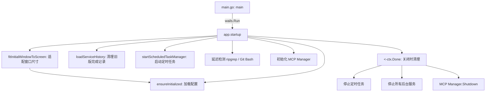
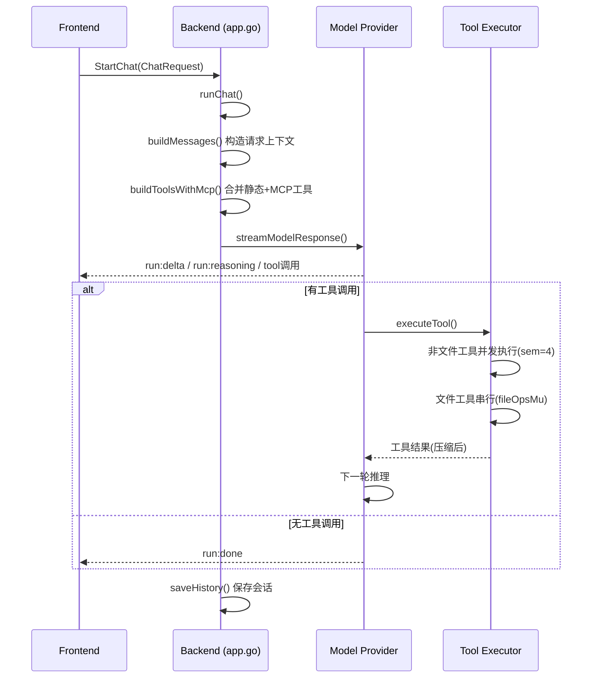
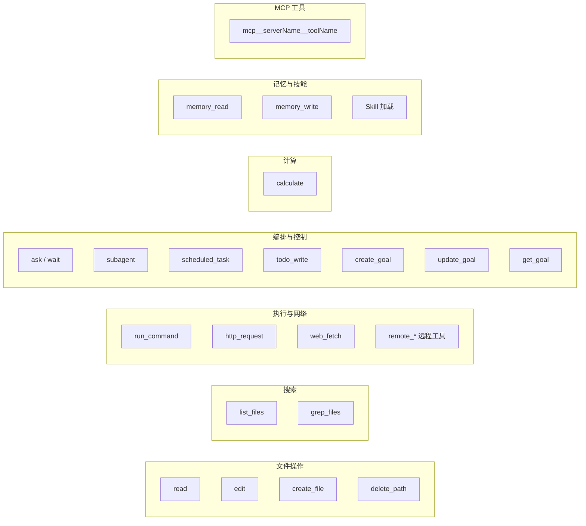
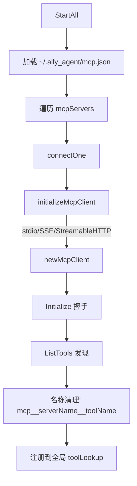

# Ally — Code Graph

Ally 是一个基于 Wails v2 的桌面 AI 编码助手。后端 Go 通过 Wails 绑定暴露给前端 Vue 3 桌面应用。

---

## 目录结构

```
├── app.go                    # 主 App 结构体：配置、聊天循环、工具、会话、技能、上下文统计
├── main.go                   # Wails 入口点，窗口选项，App 绑定
├── model_provider.go         # 模型提供者适配层：OpenAI Chat / OpenAI Responses / Anthropic Messages
├── mcp.go                    # MCP 管理器：配置加载、进程生命周期、工具发现、工具分发
├── scheduler.go              # 进程内定时任务管理器（基于 robfig/cron）
├── services.go               # 后台进程管理（启动/停止/列表/输出读取）
├── proxy.go                  # 统一代理解析、传输层、子进程环境、状态/测试 API
├── proxy_windows.go          # Windows WinINET 固定代理检测
├── proxy_other.go            # 非 Windows 环境变量代理回退
├── edit_helpers.go           # 读范围、变更行、Diff 预览辅助函数
├── procattr_windows.go       # Windows 隐藏窗口进程属性
├── procattr_other.go         # 非 Windows 进程属性空实现
├── service_process_windows.go # Windows 进程树终止
├── service_process_other.go   # 非 Windows 进程终止空实现
├── taskbar_progress_windows.go # Windows 任务栏进度条
├── taskbar_progress_other.go   # 非 Windows 进度条空实现
│
├── go.mod                    # Go 模块定义
├── go.sum                    # Go 依赖校验
├── wails.json                # Wails 项目配置
├── AGENTS.md                 # 项目/用户级 Agent 指令
├── README.md                 # 英文 README
├── README_zh-CN.md           # 中文 README
├── LICENSE                   # GPLv3 许可证
├── *.go                      # Go 源文件与测试文件
│
├── frontend/
│   ├── src/
│   │   ├── App.vue           # 主 Vue 应用：布局、设置、会话、命令处理、运行时事件
│   │   ├── main.js           # Vue 挂载入口
│   │   ├── style.css         # 全局暗色主题样式
│   │   ├── i18n.mjs          # 中英文国际化
│   │   ├── app.css           # 应用入口 CSS
│   │   ├── components/       # 24 个组件
│   │   ├── data/             # 模型目录数据
│   │   ├── assets/           # 静态资源
│   │   └── utils/            # 工具函数
│   └── package.json
│
├── scripts/
│   └── generate-model-catalog.mjs # 生成前端模型预设目录
├── docs/
│   ├── model_api.json        # 已知模型 API 配置
│   ├── img.jpg               # 欢迎页/文档配图
│   └── welcome.jpeg          # 欢迎页图片
└── third_party/ripgrep/       # 捆绑的 ripgrep 二进制许可
```

---

## 应用入口与生命周期



`main.go` 创建 `App` 实例并通过 `wails.Run()` 启动，绑定 `App` 上的所有导出方法供前端调用。

---

## 聊天循环核心流程



---

## 核心数据流

### 1. 配置管理 (`app.go`)

```
ConfigState (~/.ally_agent/config.json)
├── provider: providerName, apiFormat, baseUrl, apiKey, model
├── runtime: workspace, temperature, maxTokens, contextWindow
├── network: proxyMode(off/system/manual), proxyUrl, proxyNoProxy
├── prompt: systemPrompt, customPrompt
├── models: 模型预设列表
└── disabledSkills: 禁用技能列表
```

- `mergeConfig()` 保留已有配置，零值/空值不做覆盖
- 配置保存到 `~/.ally_agent/config.json`
- 前端通过 Wails 绑定 `GetConfig()` / `SaveConfig()` 读写

### 2. 模型提供者层 (`model_provider.go`)

支持的 API 格式：

| API 格式 | 适配器 | 默认 Base URL |
|----------|--------|---------------|
| `openai_chat` | `streamOpenAIChat()` | app 默认兼容 URL |
| `openai_responses` | `streamOpenAIResponses()` | `https://api.openai.com/v1` |
| `anthropic_messages` | `streamAnthropicMessages()` | `https://api.anthropic.com` |

`streamModelResponse()` 是统一入口，根据 `apiFormat` 分发：
- **OpenAI Chat**: 使用 `go-openai` 库，流式合并 tool call delta，自动处理 `stream_options` 兼容性
- **OpenAI Responses**: 使用 `openai-go` 库，系统消息转 `instructions`，工具结果转 `function_call_output`
- **Anthropic Messages**: 使用 `anthropic-sdk-go`，系统消息分离，连续 tool result 合并为一个 user 消息

### 3. 工具架构 (`app.go`)

内置工具在 `chatTools()` 中声明为 OpenAI function tools：



关键规则：
- 非文件工具并发执行（信号量上限 4）
- 文件工具（edit/create/delete）在 `fileOpsMu` 下串行
- 本地 `edit` 会把同版本、解析到同一物理路径的重复文件项合并为一个原始快照编辑计划
- 批量 `read` 保留逐文件部分失败，并为已知错误返回 `errorCode`（不存在路径为 `E_PATH_NOT_FOUND`）
- `edit` 的精确多匹配错误返回有界匹配行号；多行整行文本仅可在唯一候选时忽略前导缩进并安全重基新文本
- 批量编辑忽略并警告 no-op change；全部为 no-op 时不写盘
- 工具结果经过 `compactToolResultForModel()` 压缩后送入模型上下文

### 4. MCP 管理器 (`mcp.go`)



- 网络传输使用 Ally 的代理感知 HTTP 客户端
- Stdio 传输继承归一化的代理环境变量
- 保存代理设置变更后自动重连 MCP 服务器

### 5. 后台服务 (`services.go`)

- 最多 8 个并发活动进程
- 每个进程 512KB 滚动输出缓冲
- 服务停止或退出后立即移除记录，不持久化完成历史
- model 可通过 `background_process` 工具（start/stop/list/read）管理

### 6. 定时任务 (`scheduler.go`)

- 进程内存在，关闭 Ally 后清除
- 支持 RFC3339 时间 / Go duration / cron 表达式
- 每次执行使用独立上下文
- 最多 100 个任务，全局串行执行（不重叠）

### 7. 代理解析 (`proxy.go`)

三种模式：
| 模式 | 行为 |
|------|------|
| `off` | 忽略所有代理变量 |
| `system` | 检测 WinINET 固定代理 + 环境变量回退 |
| `manual` | 手动 HTTP/HTTPS/SOCKS5 URL |

- `proxyHTTPClient()` 提供代理感知 HTTP 客户端
- `httpClientWithUserAgent()` 注入自定义 User-Agent
- 传输层通过 `proxyTransportCache` 缓存（最多 6 个）复用 HTTP/2 连接池

---

## 系统提示词管线

```
defaultSystemPrompt() → buildSystemPromptParts()
├── 核心 Agent 规则 + 工具使用策略
├── 已启用的技能元数据（名称 + 描述）
├── 全局记忆索引（~/.ally_agent/memories/*.md）
├── 项目/用户指令（AGENTS.md / CLAUDE.md 文件）
│   ├── 用户级: ~/.agents/AGENTS.md
│   └── 工作区级: <workspace>/AGENTS.md / CLAUDE.md
└── 自定义提示词（来自设置）
```

---

## 技能体系

- 扫描路径：`~/.agents/skills/` / `<workspace>/.agents/skills/` / `<workspace>/.kimi-code/skills/`
- 默认全部启用，通过 `disabledSkills` 控制禁用
- 完整技能内容只在 Model 调用 `skill` 工具或用户输入 `/<skillname>` 时加载

---

## 前端架构

### 主要组件

| 组件 | 职责 |
|------|------|
| `App.vue` | 主布局、会话管理、事件路由、起草框 |
| `ChatMessages.vue` | 消息列表渲染（Markdown/代码/工具卡片/Mermaid） |
| `SettingsModal.vue` | 设置弹窗（通用/模型/技能/MCP/代理/关于） |
| `ComposerInfoBar.vue` | 底部状态栏（模型/上下文/Git/运行模式/任务中心） |
| `ToolCallCard.vue` | 工具调用卡片渲染 |
| `SubagentInlineCard.vue` | 子 Agent 进度行 |
| `TaskCenterPanel.vue` | 任务中心面板（定时任务 + 后台服务） |
| `CommandMenu.vue` | `/` 命令菜单 |
| `FileMentionMenu.vue` | `@` 文件引用菜单 |
| `SplashScreen.vue` | 启动欢迎屏 |
| `AppHeader.vue` | 顶栏（工作区标签/历史/GitHub/窗口控件） |
| `AskToolCard.vue` | 提问组件（多标签页，多选） |
| `GitDiffModal.vue` | Git 改动弹窗 |
| `HtmlRenderCard.vue` | `render_html` 沙箱 iframe 渲染 |
| `DiffView.vue` | 文件 Diff 视图 |
| `ReadGroupCard.vue` | 批量读取文件卡片 |
| `AllyAvatar.vue` | Ally 头像组件 |
| `AllyWordmark.vue` | Ally 文字标识 |
| `CodeView.vue` | 代码高亮渲染组件 |
| `ContextUsageInline.vue` | 内联上下文用量显示 |
| `McpStatusPopover.vue` | MCP 连接状态弹窗 |
| `MessageAttachments.vue` | 消息附件显示 |
| `RenderBoundary.vue` | 渲染边界容器 |
| `ToolsPopover.vue` | 工具列表弹窗 |
| `WelcomeMessage.vue` | 欢迎消息组件 |

### 前端状态管理

- Vue 3 `<script setup>` + `ref()` / `reactive()`
- 无 Vuex/Pinia
- 会话和提示历史持久化到 `localStorage`

### 国际化

`frontend/src/i18n.mjs` — 仅支持 `zh-CN` 和 `en-US`，通过 `navigator.languages` 自动检测。

---

## 会话与上下文

- 前端会话：`localStorage` 中的 UI 记录，最多保留 400 条消息 / 30 个未固定会话
- 首次启动不默认绑定可执行文件或进程目录；用户首次发送普通任务时选择工作区，后端拒绝空工作区
- 后端历史：`map[sessionID][]ChatCompletionMessage`，已保存会话最多 40 条
- 上下文统计：`GetContextBreakdown()` 报告系统提示词/历史/当前会话/工具/工作区各部分
- 自动压缩：当上下文接近限制时自动压缩历史消息

### 性能优化

| 区域 | 策略 |
|------|------|
| 流渲染 | ~20 FPS 批量 delta，缓存已完成的非流式渲染块 |
| Mermaid | 视口附近渲染，超出区域卸载，16项LRU恢复 |
| diff | 精确LCS限于25万行矩阵上限，大替换用前缀/后缀回退 |
| 媒体预览 | revocable Blob URL，Base64仅在需要模型输入时保留 |
| localStorage | 单会话240KB预算，大tool预览在序列化前截断 |
| 工具事件 | 后端200ms/2048B节流，前端120ms rAF批量 flush |

---

## 关键常量

| 常量 | 值 | 用途 |
|------|-----|------|
| `maxAgentSteps` | 9999 | 单次聊天最大 Agent 步数 |
| `maxToolOutput` | 128 KB | 工具输出上限 |
| `maxModelToolOutput` | 12 KB | 模型看到的工具输出上限 |
| `maxModelWebOutput` | 96 KB | 模型看到的网页抓取上限 |
| `maxReadFileBytes` | 10 MB | 单文件读取上限 |
| `defaultHTTPTimeout` | 60s | HTTP 请求超时 |
| `defaultGrepTimeout` | 30s | grep 搜索超时 |
| `maxActiveServices` | 8 | 活动后台服务上限 |
| `serviceOutputLimit` | 512 KB | 单个服务活动期间的输出缓冲上限 |
| `maxScheduledTasks` | 100 | 定时任务上限 |
| `workspaceMapDepth` | 3 | 工作区文件树扫描深度 |
| `workspaceMapLimit` | 320 | 工作区文件树条目上限 |

---

## 安全机制

- 工作区写操作限定在配置的工作区内 + `~/.ally_agent`
- 工作区必须由用户明确选择；空工作区不会回退到进程当前目录
- `run_command` 前台执行时通过节流的 `tool:update` 推送累计 stdout/stderr；命令卡固定高度、可滚动并默认跟随最新行，最终 `tool:result` 仍携带完整受限输出
- `run_command` / `background_process` 后端输出均有界，前者单次最多 128KB，后者每个活动进程滚动保留 512KB
- `readTextFile` 通过 NUL 字节与 UTF-8 有效性检测拒绝二进制和非 UTF-8 文件
- HTTP 工具有响应大小/超时/重定向限制
- API Key 明文存储在 OS 用户配置目录，无加密
- Windows 只接受 Git for Windows 的 bash，拒绝 WSL bash
