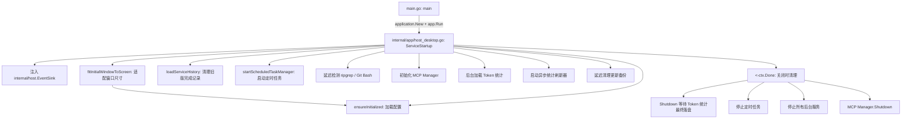
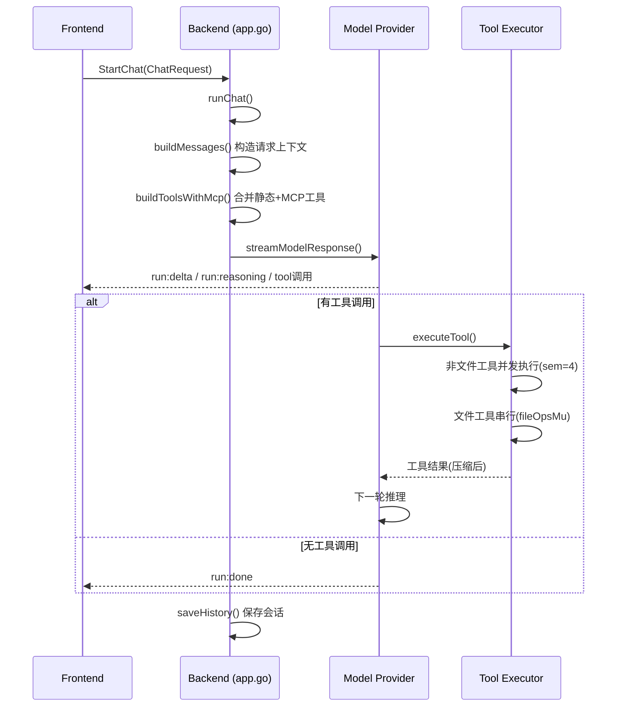
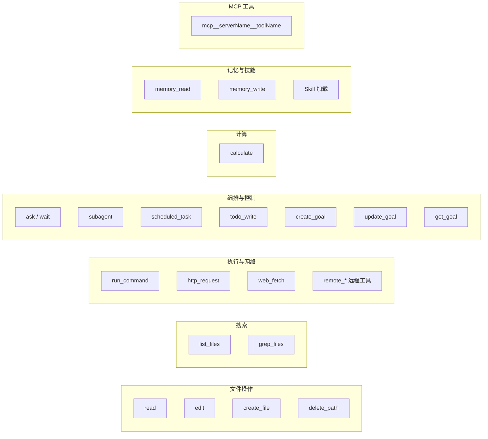
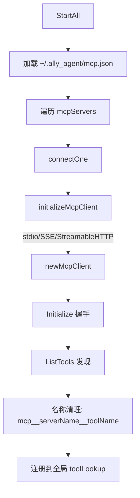
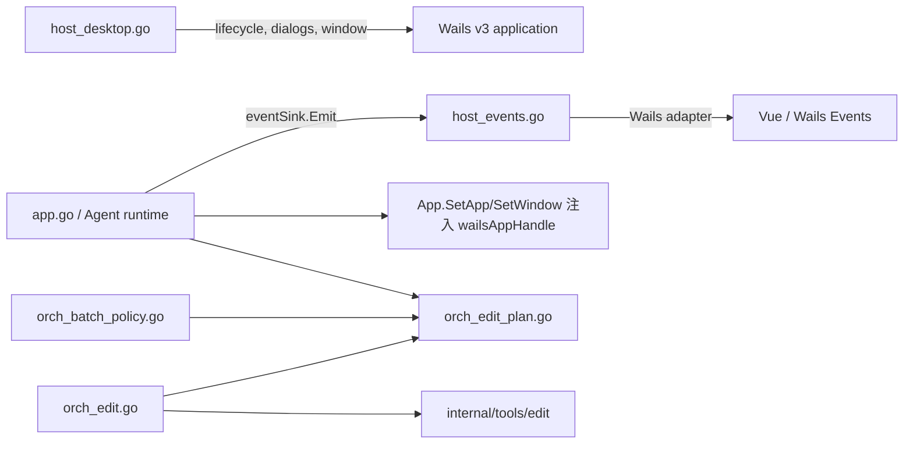

# Ally — Code Graph

Ally 是一个基于 Wails v3 的桌面 AI 编码助手。后端 Go 通过 Wails 绑定暴露给前端 Vue 3 桌面应用。

---

## 目录结构

```
├── main.go                    # Wails v3 入口和 App 绑定
├── Taskfile.yml               # wails3 构建任务入口
├── internal/
│   ├── app/                   # Agent 核心与编排（按层级前缀命名，见下方约定）
│   ├── builtin_skills/        # 内置 skill 嵌入资源（go:embed）
│   ├── host/                  # 宿主事件适配（eventSink → Wails v3）
│   ├── provider/              # Provider 格式和默认值归一化
│   ├── platform/process/      # 跨平台进程控制
│   └── tools/                 # 工具纯算法层（无 *App / ConfigState 依赖）
├── frontend/                  # Vue 3 前端、@wailsio/runtime 和生成的 bindings
├── scripts/                   # 构建与打包脚本
├── docs/                      # 文档与模型目录源数据
└── third_party/               # 第三方许可证文件
```

### `internal/app/` 文件命名约定

文件按层级前缀命名，前缀直接表明职责归属：

| 前缀 | 层级 | 职责 |
|------|------|------|
| 无 | 核心 | `app.go` 持有 chat loop、`*App` 状态和 `executeTool()` dispatch |
| `prov_` | Provider 适配 | OpenAI/Anthropic 流式适配、代理配置 |
| `host_` | Host 桥接 | Wails 生命周期、窗口、对话框、eventSink、系统托盘、子进程与任务栏 |
| `orch_` | 工具编排 | 绑定 `internal/tools/` 纯算法到 `*App` 状态 |
| `infra_` | 工具基础设施 | 跨编排共享：命令环境、结果信封、流式节流、DTO 归一化 |
| `biz_` | 业务模块 | skills、prompt、mcp、update、project_context、token_stats |

`orch_<name>.go` 对应 `internal/tools/<name>/` 纯算法，两者构成一个工具的完整实现。

---

## 应用入口与生命周期



`main.go` 创建 `App` 实例，通过 `application.New(Options{...})` 启动，将 `App` 注册为 Service 并创建主窗口，绑定 `App` 上的所有导出方法供前端调用。

---

## 聊天循环核心流程



---

## 核心数据流

### 1. 配置管理 (`app.go`)

```
ConfigState (~/.ally_agent/config.json)
├── provider: providerName, apiFormat, baseUrl, apiKey, apiKeys(有序多 key 池), model, reasoningEffort(思考强度, auto=不传)
├── runtime: workspace, temperature, maxTokens, contextWindow
├── network: proxyMode(off/system/manual), proxyUrl, proxyNoProxy
├── prompt: systemPrompt, customPrompt
├── models: 模型预设列表
└── disabledSkills: 禁用技能列表
```

- `mergeConfig()` 保留已有配置，零值/空值不做覆盖；`apiKeys` 非空时整体替换，旧前端仅发 `apiKey` 时退化为单 key 池
- `apiKey` 与 `apiKeys` 保持同步：池为准，`apiKey` 镜像首个条目；旧配置仅有 `apiKey` 时自动构造单 key 池
- 多 key 请求采用严格优先级故障转移：始终优先第一个可用（不在冷却）key；认证/配额错误后该 key 进入 60s 进程内冷却，瞬时错误 10s，然后顺延到下一个；总尝试次数有上限（`maxMultiKeyAttempts`），多 key 模式下关闭适配器内退避重试避免次数组合爆炸；仅在尚未输出任何流事件时切换；冷却状态不持久化
- 配置保存到 `~/.ally_agent/config.json`
- 前端通过 Wails 绑定 `GetConfig()` / `SaveConfig()` 读写
- `reasoningEffort` 默认 `auto`（不发送思考强度参数）；用户选择的 low/medium/high/xhigh/max 会由各适配器原样发送到对应的 reasoning 参数，Anthropic 使用 `output_config.effort` 且不启用 thinking 块；不支持的值由 Provider 返回错误，不静默降级

### 2. 模型提供者层 (`prov_model.go`)

支持的 API 格式：

| API 格式 | 适配器 | 默认 Base URL |
|----------|--------|---------------|
| `openai_chat` | `streamOpenAIChat()` | app 默认兼容 URL |
| `openai_responses` | `streamOpenAIResponses()` | `https://api.openai.com/v1` |
| `anthropic_messages` | `streamAnthropicMessages()` | `https://api.anthropic.com` |

`streamModelResponse()` 是统一入口，根据 `apiFormat` 分发：
- **OpenAI Chat**: 使用 `go-openai` 库，流式合并 tool call delta，自动处理 `stream_options` 兼容性
- **OpenAI Responses**: 使用 `openai-go` 库，系统消息转 `instructions`，工具结果转 `function_call_output`
- **Anthropic Messages**: 使用 `anthropic-sdk-go`，系统消息分离，连续 tool result 合并为一个 user 消息

### 3. 工具架构（编排在 `app.go`，契约按领域拆分）

内置工具在 `chatTools()` 中声明为 OpenAI function tools：



关键规则：
- 非文件工具并发执行（信号量上限 4）
- 文件工具在 `fileOpsMu` 下按 `toolCallIndex` 串行
- `planLocalEditBatch()` 是本地 `edit` 的唯一规范化入口；`orch_batch_policy.go` 和 `orch_edit.go` 共享其 targets/files，不得重复解析路径与别名
- `internal/tools/edit` 持有纯 Diff/变更范围算法，`orch_edit.go` 是 app 层的编辑执行边界
- 同版本且解析到同一物理路径的重复文件项合并为一个原始快照编辑计划
- 批量 `read` 静默省略不存在路径和目录目标（全部省略时成功返回空 `files`），其他逐文件失败仍返回已知 `errorCode`；纯文本范围预览使用有界内存线性扫描，不为百万行文件建立逐行切片，超长单行按 UTF-8/字节预算截断
- `edit` 精确多匹配通过错误 envelope 的可选 `details` 返回最多 3 个原始候选片段、行范围与截断标记，详情 JSON 总计不超过 4 KiB；多行整行文本仅可在唯一候选时忽略前导缩进并安全重基，缩进扫描不建立全文件行索引
- 批量编辑忽略并警告 no-op；全部为 no-op 时不写盘
- `infra_result.go` 是结果 envelope、错误码和模型侧压缩的唯一边界
- `infra_shell_env.go` 负责 POSIX login-shell PATH 探测与环境复用；只导入绝对 PATH 条目，不把完整 shell 配置注入命令进程
- `infra_stream.go` 集中 `run:delta` / `run:reasoning` / `tool:update` 节流

### 4. MCP 管理器 (`mcp.go`)



- 网络传输使用 Ally 的代理感知 HTTP 客户端
- Stdio 传输继承归一化的代理环境变量
- 保存代理设置变更后自动重连 MCP 服务器

### 5. 后台服务 (`orch_services.go`)

- 最多 8 个并发活动进程
- 每个进程 512KB 滚动输出缓冲
- 服务停止或退出后立即移除记录，不持久化完成历史
- model 可通过 `background_process` 工具（start/stop/list/read）管理

### 6. 定时任务 (`orch_scheduler.go`)

- 进程内存在，关闭 Ally 后清除
- 支持 RFC3339 时间 / Go duration / cron 表达式
- 每次执行使用独立上下文
- 最多 100 个任务，全局串行执行（不重叠）

### 7. 代理解析 (`proxy.go`)

三种模式：
| 模式 | 行为 |
|------|------|
| `off` | 忽略所有代理变量 |
| `system` | 检测 WinINET 固定代理 + 环境变量回退 |
| `manual` | 手动 HTTP/HTTPS/SOCKS5 URL |

- `proxyHTTPClient()` 提供代理感知 HTTP 客户端
- `httpClientWithUserAgent()` 注入自定义 User-Agent
- 传输层通过 `proxyTransportCache` 缓存（最多 6 个）复用 HTTP/2 连接池

---

## 系统提示词管线

```
defaultSystemPrompt() → buildSystemPromptParts()
├── 核心 Agent 规则 + 工具使用策略
├── 已启用的技能元数据（名称 + 描述）
├── 全局记忆索引（~/.ally_agent/memories/*.md）
├── 项目/用户指令（AGENTS.md / CLAUDE.md 文件）
│   ├── 用户级: ~/.agents/AGENTS.md
│   └── 工作区级: <workspace>/AGENTS.md / CLAUDE.md
└── 自定义提示词（来自设置）
```

---

## 技能体系

- 扫描路径：`~/.agents/skills/` / `<workspace>/.agents/skills/` / `<workspace>/.kimi-code/skills/`
- 默认全部启用，通过 `disabledSkills` 控制禁用
- 完整技能内容只在 Model 调用 `skill` 工具或用户输入 `/<skillname>` 时加载

---

## 前端架构

### 主要组件

| 组件 | 职责 |
|------|------|
| `App.vue` | 主布局、会话管理、事件路由、起草框 |
| `ChatMessages.vue` | 消息列表渲染（Markdown/代码/工具卡片/Mermaid） |
| `SettingsModal.vue` | 设置弹窗（通用/模型/技能/MCP/代理/关于） |
| `ComposerInfoBar.vue` | 底部状态栏（模型/上下文/Git/运行模式/任务中心） |
| `ToolCallCard.vue` | 工具调用卡片渲染 |
| `SubagentInlineCard.vue` | 子 Agent 进度行 |
| `TaskCenterPanel.vue` | 任务中心面板（定时任务 + 后台服务） |
| `TokenStatsModal.vue` | Token 统计面板（Provider/模型/来源/工作区/日期/时段/缓存） |
| `CommandMenu.vue` | `/` 命令菜单 |
| `FileMentionMenu.vue` | `@` 文件引用菜单 |
| `SplashScreen.vue` | 启动欢迎屏 |
| `AppHeader.vue` | 顶栏（工作区标签/历史/GitHub/窗口控件） |
| `AskToolCard.vue` | 提问组件（多标签页，多选） |
| `GitDiffModal.vue` | Git 改动弹窗 |
| `HtmlRenderCard.vue` | `render_html` 沙箱 iframe 渲染 |
| `DiffView.vue` | 文件 Diff 视图 |
| `ReadGroupCard.vue` | 批量读取文件卡片 |
| `AllyAvatar.vue` | Ally 头像组件 |
| `AllyWordmark.vue` | Ally 文字标识 |
| `CodeView.vue` | 代码高亮渲染组件 |
| `ContextUsageInline.vue` | 内联上下文用量显示 |
| `McpStatusPopover.vue` | MCP 连接状态弹窗 |
| `MessageAttachments.vue` | 消息附件显示 |
| `RenderBoundary.vue` | 渲染边界容器 |
| `ToolsPopover.vue` | 工具列表弹窗 |
| `WelcomeMessage.vue` | 欢迎消息组件 |

### 前端状态管理

- Vue 3 `<script setup>` + `ref()` / `reactive()`
- 无 Vuex/Pinia
- 提示历史保存在 `localStorage`；会话索引和 UI 快照由后端写入 `~/.ally_agent/sessions/` 本地文件

### 国际化

`frontend/src/i18n.mjs` — 仅支持 `zh-CN` 和 `en-US`，通过 `navigator.languages` 自动检测。

---

## 会话与上下文

- 前端会话：启动只从后端 `~/.ally_agent/sessions/index.json` 读取轻量索引；点击会话后通过 `LoadSession` 按需加载单个 gzip 快照，非活动会话消息从前端内存释放
- 关闭窗口不采集当前会话，只等待 `SaveSession`/`SaveSessionIndex` 已排队的本地文件写入完成；旧 `localStorage`/IndexedDB 会话数据只做一次迁移并清理
- 首次启动不默认绑定可执行文件或进程目录；用户首次发送普通任务时选择工作区，后端拒绝空工作区
- 后端历史：`map[sessionID][]ChatCompletionMessage`，磁盘使用 gzip JSON，并按约 256k token 预算从完整 user 边界裁剪，不再固定为 40 条
- 前后端恢复对齐：匹配后端可见历史尾部与前端连续区间的最大重叠；后端压缩导致零重叠时仅追加最新请求
- 上下文统计：`GetContextBreakdown()` 报告系统提示词/历史/当前会话/工具/工作区各部分；运行失败后回退到最后一次成功保存的真实模型历史
- Token 统计：`GetTokenStats(rangeDays)` 按 Provider、模型、来源、工作区、日期、小时、会话数、活跃天数和缓存命中率聚合；通过有界非阻塞队列异步落盘到 `~/.ally_agent/stats/<date>.json`，启动读取限制文件大小、解码记录数和单条数值，关闭时由 `Shutdown` 等待最终 drain/flush
- 自动压缩：当上下文接近限制时自动压缩历史消息，并同步保存压缩后的 gzip 历史

### 性能优化

| 区域 | 策略 |
|------|------|
| 流渲染 | ~20 FPS 批量 delta，缓存已完成的非流式渲染块 |
| Mermaid | 视口附近渲染，超出区域卸载，16项LRU恢复 |
| diff | 精确LCS限于25万行矩阵上限，大替换用前缀/后缀回退 |
| 媒体预览 | revocable Blob URL，Base64仅在需要模型输入时保留 |
| 会话持久化 | 后端 `sessions/index.json` 保存索引、每会话 gzip JSON 保存 UI 快照；前端仅保留当前/运行中消息，大 tool 预览在写盘前截断 |
| 工具事件 | 后端200ms/2048B节流，前端120ms rAF批量 flush |

---

## 关键常量

| 常量 | 值 | 用途 |
|------|-----|------|
| `maxAgentSteps` | 9999 | 单次聊天最大 Agent 步数 |
| `maxToolOutput` | 128 KB | 工具输出上限 |
| `maxModelToolOutput` | 12 KB | 模型看到的工具输出上限 |
| `maxModelWebOutput` | 96 KB | 模型看到的网页抓取上限 |
| `maxReadFileBytes` | 10 MB | 单文件读取上限 |
| `defaultHTTPTimeout` | 60s | HTTP 请求超时 |
| `defaultGrepTimeout` | 30s | grep 搜索超时 |
| `maxActiveServices` | 8 | 活动后台服务上限 |
| `serviceOutputLimit` | 512 KB | 单个服务活动期间的输出缓冲上限 |
| `maxScheduledTasks` | 100 | 定时任务上限 |
| `workspaceMapDepth` | 3 | 工作区文件树扫描深度 |
| `workspaceMapLimit` | 320 | 工作区文件树条目上限 |
| `maxSavedHistoryTokens` | 256k | 后端持久化模型历史估算 token 预算 |
| `maxSavedHistoryJSONBytes` | 8 MB | gzip 解压后的历史 JSON 读取上限 |
| `statsRetentionDays` | 90 | Token 统计保留天数 |
| `statsQueueSize` | 2048 | Token 统计非阻塞队列容量 |
| `statsMaxRecordsPerDay` | 10000 | 单日 Token 统计内存保留上限（读取旧文件时保留最新记录） |
| `statsMaxTotalRecords` | 20000 | 全部 Token 统计内存记录上限 |
| `statsMaxDecodedPerDay` | 100000 | 单日 Token 统计文件最大解码记录数 |

---

## Agent 核心与宿主边界



- `app.go` 不导入 Wails runtime；未来抽离 Agent 时可替换 `eventSink` 和宿主生命周期。
- 所有后端 UI 事件必须经过 `App.emit()`；Wails `app.Event.Emit` 只允许出现在 `host_desktop.go` 的 `wailsEventSink`。
- Wails 启动、窗口、目录选择、系统托盘（`host_tray.go`）和系统文件管理器只允许放在 `host_desktop.go`/`host_tray.go`；自更新退出例外保留在 `biz_update.go`，macOS 的无 shell 重启 helper 放在 `host_update_relaunch_darwin.go`。
- 文件 mutation 冲突检测与本地编辑执行共享 `planLocalEditBatch()`，避免两层契约漂移。

### 修改入口与跨层变更顺序

按功能变更进入唯一负责模块，不要在 `app.go` 中复制领域逻辑：

| 变更内容 | 首选修改入口 | 必须联动检查 |
|---|---|---|
| Agent 编排、聊天循环、运行/会话状态 | `app.go` | `host_events.go`、运行事件测试 |
| Wails 启动、窗口、目录选择、系统托盘、系统文件管理器 | `host_desktop.go` + `host_tray.go` | Wails 生命周期、平台构建 |
| UI/runtime 事件与宿主转发 | `host_events.go` | 事件名、payload、session/run 路由、终止事件 |
| Provider 请求/响应适配 | `prov_model.go` | provider 流事件、工具调用、usage、错误处理 |
| 内置工具 schema | `internal/tools/shared/builtins.go` | 严格解码、执行分支、结果卡片、工具测试 |
| 工具参数严格解码与执行分发 | `executeTool()`（当前位于 Agent 编排域） | 批次策略、结果 envelope、前端工具卡片 |
| 编辑 Diff、变更范围纯算法 | `internal/tools/edit` | `orch_edit.go`、编辑回归测试 |
| 本地 edit 路径/别名/重复项/版本归一化 | `orch_edit_plan.go` | `orch_batch_policy.go`、`orch_edit.go`、跨层测试 |
| 文件编辑匹配、校验、原子提交、回滚 | `orch_edit.go` | 共享编辑计划、版本和重叠保护 |
| 批次屏障、写冲突、工具去重 | `orch_batch_policy.go` | 规范化计划、工具调用顺序、并发限制 |
| 工具结果 envelope、错误码、模型侧压缩 | `infra_result.go` | 前端 `tool:result/tool:error`、provider 工具结果 |
| 流式事件节流与 flush | `infra_stream.go` | 前端缓冲、终端事件、流式回归测试 |
| 命令删除/重定向/越界安全 | `internal/tools/command` + `orch_command_safety.go` | `internal/tools/command` 是轻量 shell 调用解析、嵌套命令识别、风险分类和写目标提取的唯一纯语义边界；`orch_command_safety.go` 只负责工作区根、路径存在性、错误码和提示文本；联动检查 Windows/MSYS 路径及命令安全测试 |
| git porcelain/unified-diff 解析纯算法 | `internal/tools/git` | `orch_git.go` 调用，diff/status 解析回归测试 |
| 记忆 Markdown frontmatter 解析纯算法 | `internal/tools/memory` | `orch_memory.go` 调用，frontmatter 解析回归测试 |
| DOCX/PPTX/XLSX/PDF 文本抽取纯算法 | `internal/tools/read` | `orch_read.go` 文档分支、抽取回归测试 |
| ripgrep 封装与结果归一化 | `internal/tools/grep` | `orch_grep.go` 调用、缺失检测、超时与错误归一化 |
| 后台进程 rolling buffer 与长命令检测 | `internal/tools/service` | `orch_services.go` 调用、输出快照、活动上限 |
| 计划任务调度解析、校验与下次执行计算 | `internal/tools/scheduler` | `orch_scheduler.go` 调用、cron/interval/once 校验、steps/timeout 归一化 |
| `read`、grep、提示词、技能、记忆、Git 等领域逻辑 | 对应 `orch_read.go`、`orch_grep.go`、`biz_prompt.go`、`biz_skills.go`、`orch_memory.go`、`orch_git.go` | 领域测试及模型上下文行为 |

跨层工具或事件变更按以下顺序检查：

```text
schema → strict decoder → batch policy → executor → result envelope → provider/UI rendering → boundary test → docs
```

同一次本地 `edit` 调用中的重复文件项必须先进入 `planLocalEditBatch()`，再由批次冲突检查和执行层共同消费该计划；不同 mutation 工具调用指向同一规范化路径仍必须冲突。任何新增的归一化、去重或错误推断都应放在唯一规范化边界，禁止在上游策略或下游执行层重新实现。

新增或移动模块时，优先保持同一 Go package 的机械拆分；只有依赖方向清晰、Wails 绑定影响已验证，并且有宿主无关测试覆盖后，才引入新的 package 边界。

---

## 安全机制

- 工作区写操作限定在配置的工作区内 + `~/.ally_agent`
- `run_command` 的安全分析先在 `internal/tools/command` 将复合 shell 文本解析为实际调用，递归检查 shell `-c`、命令替换、`eval`、`xargs`、`find -exec` 等嵌套执行，再按命令语义识别删除、高危参数和明确写入目标；引号内数据、搜索词和只读源路径不会被当成写操作。
- `orch_command_safety.go` 使用上述语义结果结合工作区根和目标存在性做最终决策：外部只读与创建不存在的新外部路径仍允许，已有外部写目标、无法解析的动态写目标和裸文件删除仍拒绝。
- 工作区必须由用户明确选择；空工作区不会回退到进程当前目录
- `run_command` 前台执行时通过节流的 `tool:update` 推送累计 stdout/stderr；命令卡固定高度、可滚动并默认跟随最新行，最终 `tool:result` 仍携带完整受限输出
- `run_command` / `background_process` 后端输出均有界，前者单次最多 128KB，后者每个活动进程滚动保留 512KB
- macOS/Linux 在启动时异步执行一次 `$SHELL -l -c /usr/bin/env`，将 login-shell 中缺失的绝对 PATH 条目追加到共享命令环境；实际命令仍使用非交互 `bash -c`，失败时保留原环境
- `readTextFile` 通过 NUL 字节与 UTF-8 有效性检测拒绝二进制和非 UTF-8 文件
- HTTP 工具有响应大小/超时/重定向限制
- API Key 明文存储在 OS 用户配置目录，无加密
- Windows 只接受 Git for Windows 的 bash，拒绝 WSL bash
