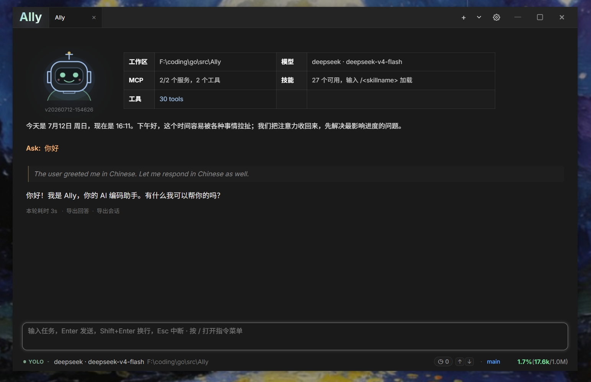

# Ally

[English](README.md) | [简体中文](README_zh-CN.md)

A desktop AI coding assistant that works with your local projects. Ally helps you understand code, edit files, search a workspace, manage tasks, and complete development work through conversation.

<p>
  <a href="https://github.com/Bronya0/ally-agent/releases">
    
  </a>
</p>

Download packages for Windows, macOS, and Linux from the [Releases page](https://github.com/Bronya0/ally-agent/releases).



## Features

- Work with local projects through natural-language conversations, attachments, and persistent sessions
- Read, search, create, edit, and safely delete files with workspace boundaries and optimistic concurrency checks
- Review bounded visual diffs, multi-file edits, command output, and detailed tool failure reasons directly in chat
- Use OpenAI Chat Completions, OpenAI Responses, Anthropic Messages, and compatible model services
- Capture provider reasoning fields or configurable reasoning tags such as `reasoning_content`, `think`, and `sink`
- Render sandboxed interactive HTML results in chat for small tools, previews, and widgets
- Delegate substantial work to parallel sub-agents with live steps, tool activity, token usage, and inline final summaries
- Connect MCP servers through stdio, SSE, or Streamable HTTP using either a form editor or raw JSON
- Extend workflows with discoverable Skills and durable cross-project memory
- Manage multiple workspaces, chat sessions, todos, goal mode, and process-local scheduled tasks
- Switch between execution, planning, and interview/grill modes
- Run short shell commands and tracked background processes with a task-center log viewer; Windows automatically discovers Git Bash and falls back to PowerShell when necessary
- Optionally follow the Windows system proxy or use a manual HTTP/HTTPS/SOCKS5 proxy consistently across models, HTTP tools, MCP, commands, and background services
- Use localized Chinese or English UI, startup warnings, settings, and tool status messages
- Search code with bundled ripgrep—no separate installation required in release packages

## Getting started

1. Download the package for your platform from [GitHub Releases](https://github.com/Bronya0/ally-agent/releases).
2. Start Ally and select a project directory.
3. Open Settings and configure your model provider, model, API URL, and API key.
4. Start chatting about your project.

## Local build

```bash
wails build
```

## License

Copyright (C) 2026 Bronya0.

Ally is free software licensed under the [GNU General Public License v3.0 only](LICENSE) (`GPL-3.0-only`). You may use, study, modify, and redistribute it under those terms. Distributions of Ally or modified versions must provide the corresponding source code and retain the GPLv3 license notices.

Release packages include [ripgrep](https://github.com/BurntSushi/ripgrep) under its own MIT/Unlicense terms. Other third-party resources retain their respective licenses; see [THIRD_PARTY_NOTICES.md](THIRD_PARTY_NOTICES.md).
