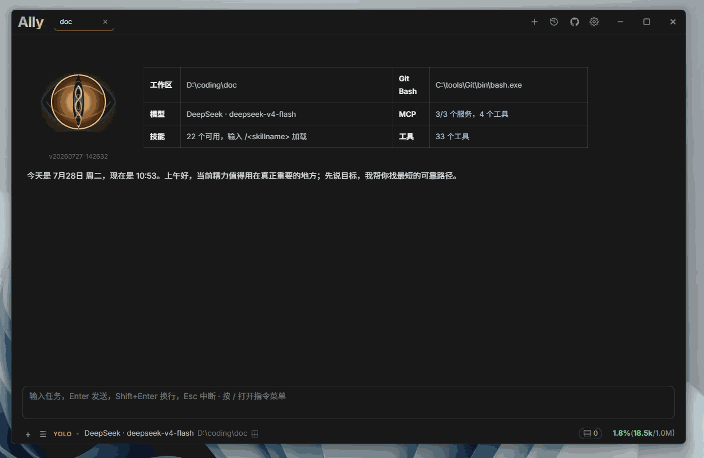
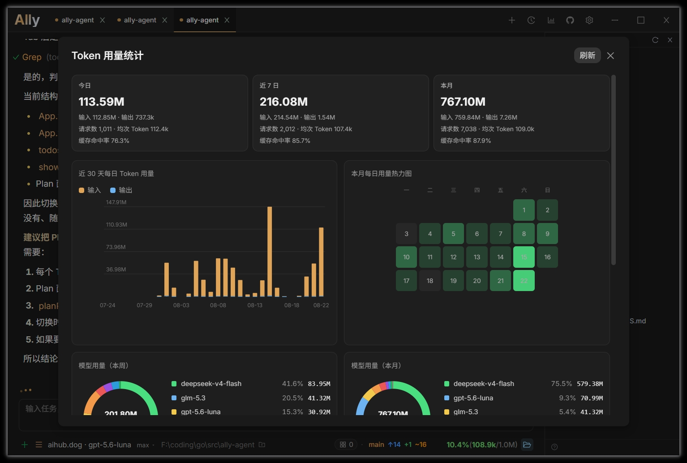
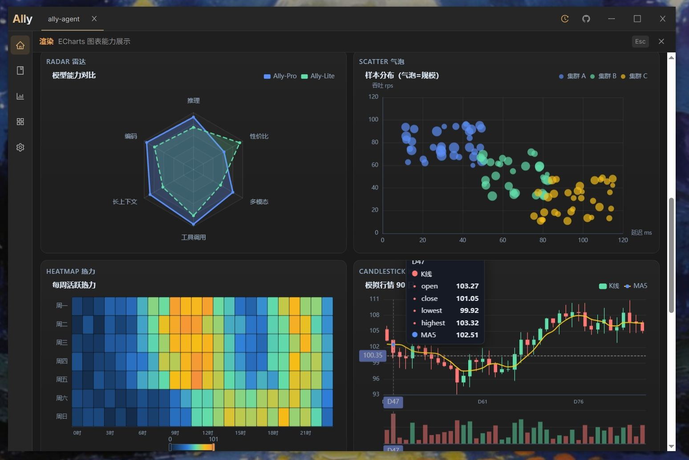

# Ally

[English](README.md) | [简体中文](README_zh-CN.md)

A desktop AI coding assistant that works with your local projects. Ally helps you understand code, edit files, search a workspace, manage tasks, and complete development work through conversation.

⭐ If Ally helps you, please give it a Star on GitHub — it keeps the project going. Thanks!

<p>
  <a href="https://github.com/Bronya0/ally-agent/releases">
    
  </a>
</p>

Download packages for Windows, macOS, and Linux from the [Releases page](https://github.com/Bronya0/ally-agent/releases).







## Features

- Work with local projects through natural-language conversations, attachments, and persistent sessions
- Read, search, create, edit, and safely delete files with workspace boundaries and optimistic concurrency checks
- Read, edit, create, delete, run commands, and transfer files or directories on remote SSH workspaces, reusing your existing `ssh` login
- Review bounded visual diffs, multi-file edits, command output, and detailed tool failure reasons directly in chat
- Use OpenAI Chat Completions, OpenAI Responses, Anthropic Messages, and compatible model services
- Capture provider reasoning fields or configurable reasoning tags such as `reasoning_content`, `think`, and `sink`
- Configure per-workspace model selection so each project keeps its own model preference
- Tune reasoning depth with configurable thinking strength (reasoningEffort) per model
- Configure multiple API keys with automatic priority failover and cooldown recovery for high availability
- Speed up model setup with a bundled provider/model preset catalog that pre-fills API format, base URL, and context window
- Render sandboxed interactive HTML results in chat for small tools, previews, and widgets
- Render Mermaid diagrams inline with wheel zoom, drag panning, and double-click reset, plus KaTeX math and highlighted code blocks
- Attach images for vision-capable models and preview model-generated images in chat
- Delegate substantial work to parallel sub-agents with live steps, tool activity, token usage, and inline final summaries
- Extend Ally with plugins: one zip package adds a full sidebar page, written in plain JS/TS with HTTP, storage, and workspace access declared in the manifest
- Connect MCP servers through stdio, SSE, or Streamable HTTP using either a form editor or raw JSON
- Extend workflows with discoverable Skills and durable cross-project memory; built-in skills include `codegraph`, `playwright-cli`, and `anydoc` (Office/PDF to Markdown)
- Manage multiple workspaces, chat sessions, todos, and scheduled tasks that persist across restarts, with a built-in workspace explorer and file editor
- Run short shell commands and tracked background processes with a task-center log viewer; Windows automatically discovers Git Bash and falls back to PowerShell when necessary
- Fetch web pages and call HTTP APIs with bounded response sizes, timeouts, redirect limits, and per-host rate limits
- Visualize token usage trends with an asynchronous token statistics dashboard
- Personalize the chat with a custom background image and adjustable opacity
- Auto-update on Windows and macOS (DMG replace flow), with staged directory rollback on failure
- Follow the Windows or macOS system proxy, or set a manual HTTP/HTTPS/SOCKS5 proxy applied consistently across models, HTTP tools, MCP, commands, and background services
- Use localized Chinese or English UI, startup warnings, settings, and tool status messages
- Search code with bundled ripgrep—no separate installation required in release packages

## Getting started

1. Download the package for your platform from [GitHub Releases](https://github.com/Bronya0/ally-agent/releases).
2. Start Ally and select a project directory.
3. Open Settings and configure your model provider, model, API URL, and API key.
4. Start chatting about your project.

macOS: the package is not signed, so drag `Ally.app` into Applications first, then double-click `免签名启动Ally.command` from the DMG once — it clears the quarantine flag and launches Ally.

## Plugin system

A plugin is a single zip package that adds a full page to Ally's sidebar. Pages are plain JavaScript/TypeScript: no Go code, no bundler, and no restart. Pages get backend features through the injected `host` object (HTTP, per-plugin storage, read-only workspace access, events, and theme).

Manage plugins on the **Plugins** page: import a zip (or drag it in), install from an unpacked directory, export (optionally with plugin data), enable or disable, and delete.

A minimal `plugin.json`:

```json
{
  "id": "my-helper",
  "name": "Ticket Helper",
  "version": "1.0.0",
  "entry": "index.js",
  "menu": [{ "key": "helper", "title": "Tickets", "icon": "ApiOutlined" }],
  "permissions": { "http": ["api.example.com"], "workspace": "read" }
}
```

The entry module exports `mount(element, host)`, which returns a cleanup function.

- The manifest accepts only the documented keys; unknown keys are rejected at import.
- HTTP requests are denied unless the host is listed in `permissions.http`.
- Re-importing a plugin with the same `id` upgrades it and keeps its `host.store` data.
- Plugin code runs in the main page context and is not a sandbox: it can call backend bindings directly, and installing shows no permission prompt. Only install plugins you trust.

For the full guide (the `host` API, styling rules, and common pitfalls), see [docs/plugin-system.md](docs/plugin-system.md). You can also give that link to an AI assistant and ask it to write a plugin.

## Local build

```bash
wails3 build
```

The binary is written to `bin/`. Development mode with hot reload: `wails3 dev`.

## License

Copyright (C) 2026 Bronya0.

Ally is free software licensed under the [GNU General Public License v3.0 only](LICENSE) (`GPL-3.0-only`). You may use, study, modify, and redistribute it under those terms. Distributions of Ally or modified versions must provide the corresponding source code and retain the GPLv3 license notices.

Release packages include [ripgrep](https://github.com/BurntSushi/ripgrep) under its own MIT/Unlicense terms. Other third-party resources retain their respective licenses; see [THIRD_PARTY_NOTICES.md](THIRD_PARTY_NOTICES.md).

## Contact

Questions, bug reports, or feedback: [tangssst@qq.com](mailto:tangssst@qq.com)

## Reference projects

Ally picked up a few implementation details from these projects and engineering articles — credits to their authors. Each follows its own license, and Ally is not affiliated with any of them.

- [Anthropic — Building Effective Agents](https://www.anthropic.com/engineering/building-effective-agents)
- [DeepSeek Harness](https://github.com/deepseek-ai/deepseek-harness)
- [Anthropic — Managed Agents](https://www.anthropic.com/engineering/managed-agents)
- [Kimi Code CLI (kimicode)](https://github.com/MoonshotAI/kimi-code) — light-theme palette, image token estimation, interruption reminders
- [Codex CLI](https://github.com/openai/codex) — Responses session cache key and usage field handling
- [pi](https://github.com/earendil-works/pi) — fuzzy edit matching, context estimation, reasoning capability checks, overflow-recovery compaction
- [OpenCode](https://github.com/sst/opencode) — request header and User-Agent compatibility conventions
