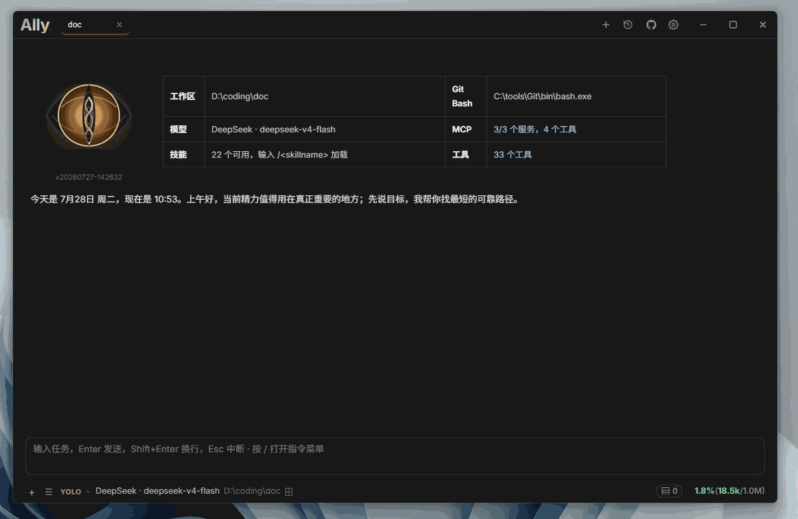

# Ally

[English](README.md) | [简体中文](README_zh-CN.md)

一个面向本地项目的桌面 AI 编程助手。Ally 可以通过对话帮助你理解代码、编辑文件、搜索项目、管理任务并完成开发工作。

<p>
  <a href="https://github.com/Bronya0/ally-agent/releases">
    
  </a>
</p>

前往 [Releases 页面](https://github.com/Bronya0/ally-agent/releases)下载 Windows、macOS 或 Linux 安装包。



## 主要功能

- 通过自然语言对话、附件和持久化会话处理本地项目
- 在工作区安全边界和版本校验保护下读取、搜索、创建、编辑及删除文件
- 在聊天中直接查看可视化 Diff、多文件修改、命令输出和完整的工具失败原因
- 支持 OpenAI Chat Completions、OpenAI Responses、Anthropic Messages 及兼容模型服务
- 支持读取服务商推理字段，也可配置 `reasoning_content`、`think`、`sink` 等推理标签
- 支持在聊天中安全渲染沙箱 HTML，用于小工具、交互预览和组件展示
- 可将复杂任务委派给并行子代理，实时查看步骤、工具活动、Token 用量和最终摘要
- MCP 支持 stdio、SSE 和 Streamable HTTP，可使用表单或原始 JSON 配置
- 使用可发现的 Skills 扩展工作流程，并通过全局记忆保存跨项目知识
- 管理多个工作区、聊天会话、Todo、目标模式和仅当前进程有效的定时任务
- 支持执行、计划和访谈/Grill 模式
- 支持短时命令和带任务中心日志查看的后台进程；Windows 会自动发现 Git Bash，必要时回退到 PowerShell
- 可跟随 Windows 系统代理，或手动配置 HTTP/HTTPS/SOCKS5 代理，并统一应用到模型、HTTP 工具、MCP、命令和后台服务
- 提供中文和英文界面，包括启动警告、设置与工具状态信息
- 发行包已内置 ripgrep，无需单独安装即可搜索代码

## 开始使用

1. 从 [GitHub Releases](https://github.com/Bronya0/ally-agent/releases) 下载对应平台的软件包。
2. 启动 Ally 并选择项目目录。
3. 打开设置，填写模型服务、模型名称、API 地址和 API Key。
4. 开始与 Ally 对话。

## 本地构建

```bash
wails build
```

## 许可证

Copyright (C) 2026 Bronya0。

Ally 是采用 [GNU General Public License v3.0 only](LICENSE)（`GPL-3.0-only`）发布的自由软件。你可以依照该许可证使用、研究、修改和重新分发本项目。分发 Ally 或其修改版本时，必须提供对应源代码并保留 GPLv3 许可证声明。

发行包包含采用自身 MIT/Unlicense 条款的 [ripgrep](https://github.com/BurntSushi/ripgrep)。其他第三方资源保留各自的许可证，详见 [THIRD_PARTY_NOTICES.md](THIRD_PARTY_NOTICES.md)。
