# Ally 架构详解 —— 写给想学 Agent 开发的你

> 这份文档把 Ally（一个桌面 AI 编程助手）从里到外拆开讲清楚：它如何思考、如何动手、如何记忆、如何在出错后爬起来。
> 文章刻意**少写变量名和函数名**，用平实的语言描述机制，配大量流程图。看完你应当能回答：一个能真正干活的 AI Agent，是由哪些部件咬合起来的？
> 想把概念对应到具体代码时，翻根目录的 `CODEGRAPH.md`（功能→文件速查表）和 `AGENTS.md`（行为规范）。

---

## 目录

1. [全景：一次对话的一生](#1-全景一次对话的一生)
2. [核心循环：Agent 的心跳](#2-核心循环agent-的心跳)
3. [上下文是怎么拼出来的](#3-上下文是怎么拼出来的)
4. [工具体系：Agent 的手和脚](#4-工具体系agent-的手和脚)
5. [并发与批次：一次让模型许多个愿](#5-并发与批次一次让模型许多个愿)
6. [失败是常态：重试与自愈](#6-失败是常态重试与自愈)
7. [缓存与成本：让重复请求变便宜](#7-缓存与成本让重复请求变便宜)
8. [上下文压缩：给记忆做减法](#8-上下文压缩给记忆做减法)
9. [会话持久化：三份档案](#9-会话持久化三份档案)
10. [Skill 机制：先递名片，再掏手册](#10-skill-机制先递名片再掏手册)
11. [MCP 机制：外接设备的通用插口](#11-mcp-机制外接设备的通用插口)
12. [子代理与计划任务：分身与闹钟](#12-子代理与计划任务分身与闹钟)
13. [安全边界：给实习生立规矩](#13-安全边界给实习生立规矩)
14. [前端与事件流：只把重要的事说出来](#14-前端与事件流只把重要的事说出来)
15. [外围设施速览](#15-外围设施速览)
16. [对照与反思：Ally 的选择 vs 业界共识](#16-对照与反思ally-的选择-vs-业界共识)
17. [参考资料](#17-参考资料)

---

## 1. 全景：一次对话的一生

先把整个系统想象成一家**一人设计工作室**：

- **你（用户）** 是甲方，坐在前台（聊天界面）提需求；
- **AI 模型** 是设计师本人，负责想方案；
- **工具箱**（读文件、写文件、跑命令、上网查资料……）是设计师的手和脚；
- **管家**（Go 后端的核心循环）在设计师和工具之间传话、记账、看表、把关；
- **档案室**（会话持久化）把每个项目的来龙去脉存好，下次开门就能接着干。

从分层上看，Ally 是一个桌面应用：外壳（窗口、界面）负责展示，中间是 Agent 核心（循环、上下文、工具、会话），外圈是各种能力供应方（模型供应商、MCP 外接工具、Skill 手册、本地 API）。

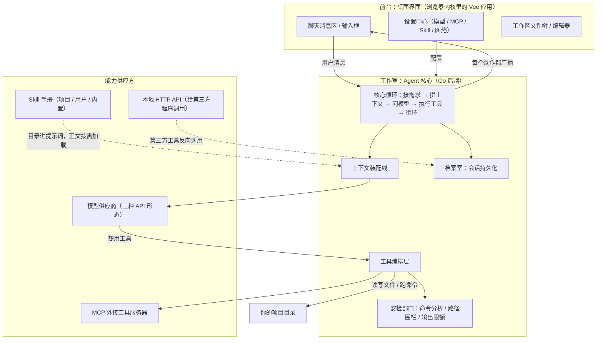

一次对话的一生是这样的：用户输入一句话 → 界面把它交给后端，后端为这轮对话开一个**可随时取消的任务**（称之为一次「运行」）→ 核心循环开始转（见第 2 章）→ 循环结束，对话记录落盘 → 界面收到完成广播。

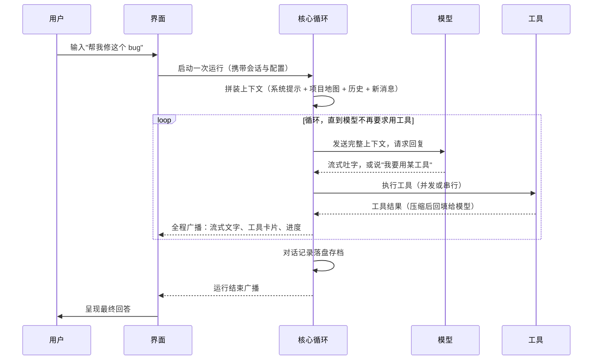

有个容易忽略的细节：**同一个会话同一时刻只允许一个运行**。如果模型正在干活你又发消息，这条消息不会立刻触发新一轮，而是被塞进一个「传话队列」，等当前这一步干完再注入。这是刻意的：两个运行同时改同一份对话记录会互相踩脚，聊天记录的顺序就乱了。界面上运行中追问的体验就是这么实现的。

> **延伸思考**：很多 Agent 框架允许多任务并行，Ally 选择「每会话串行 + 用子代理补并行」。串行换来了历史记录的绝对一致（这是提示词缓存和回放正确性的根基），并行需求则被引导到第 12 章的子代理机制——那里有隔离的独立上下文，不会互相污染。

---

## 2. 核心循环：Agent 的心跳

把所有外壳拆掉，Agent 的本质其实朴素得惊人：**一个 while 循环**——把上下文发给模型，模型要么直接回答，要么说「帮我调一下某个工具」，循环就执行工具、把结果贴回上下文、再问一遍，如此往复，直到模型给出不含工具请求的最终回答。业界的共识也是如此：Agent 就是「LLM 根据环境反馈在循环里使用工具」，没有更神秘的内核（见参考资料 Anthropic《Building Effective Agents》）。

Ally 的核心循环多了几件**工程上的必需品**，它们才是真功夫所在：

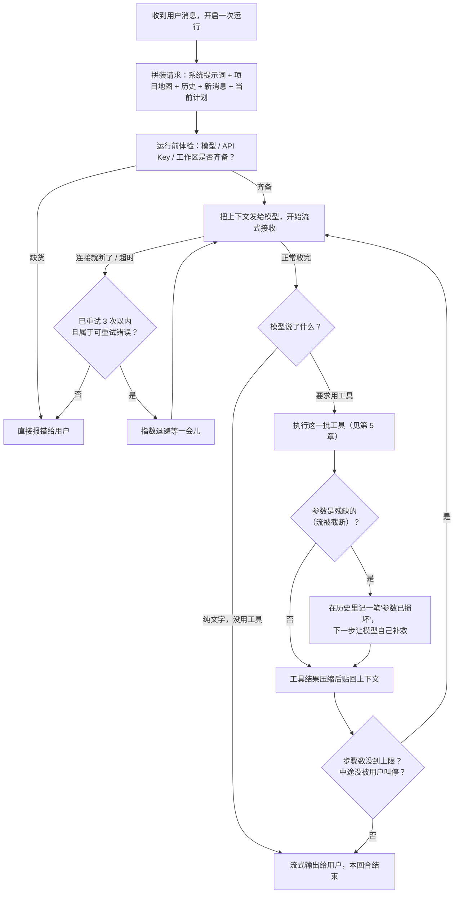

几个值得停下来琢磨的设计：

**循环的上限被故意放到极大（近万步）。** 通用建议是给 Agent 设一个「够用就好的小预算」，防止模型陷入原地打转的死循环烧钱。Ally 反其道而行，靠三样东西兜底：计划工具让模型自己列清单对照进度、用户随时可以叫停（每一步之间都有检查点）、以及 suggest 工具——模型认为自己做完了会主动「交卷」，交卷即结束循环。这是一种「上限不设防、机制引导收敛」的思路：把停止的决策交给模型和用户，而不是一个武断的数字。学习时两种思路都值得了解：预算制更好预测，机制制更流畅。

**每一步之间都是检查点。** 用户按下 ESC 不是「凭空消失」：循环会把已经完成的工具调用和结果保存下来，再往历史里塞一张「上一条提问已被用户取消」的字条。下一轮模型读历史时就知道：这里发生过一次人工中断，不是它自己失败。这条字条对模型区分「我干砸了」和「用户不要了」非常重要——否则模型经常会对着中断的任务道歉重试。

**工具请求的参数可能是残缺的。** 模型是流式输出的，如果网络在它念到一半时断掉，工具参数就是半截 JSON。与其冒险执行（拿半截参数写文件等于赌博），循环会在历史里给这个调用盖上「参数已损坏」的印章。下一条请求模型看到印章，自己决定重发完整调用。这个「不猜、不编、明确标注」的原则在 Agent 工程里反复出现——后面第 9 章的历史修复还会再见到它。

**一句话的旅行不止一个通道。** 模型每次工具调用会产生两个版本的结果：**给界面看的完整版**（原样 JSON，前端渲染成卡片、diff、命令输出）和**给模型看的压缩版**（剥掉展示性字段，只留决策需要的信息）。同一个事实，两种受众，两种裁剪。这是上下文工程里「信息分层」的标准实践——模型的注意力是稀缺资源，界面的保真度也是刚需，混在一起两头受损。

---

## 3. 上下文是怎么拼出来的

模型没有记忆，每一次请求都要把「它需要知道的一切」重新讲一遍。所以「拼请求」是 Agent 工程里最像厨师配菜的环节：料要全，盘要小，摆盘顺序还要照顾另一个隐形食客——**提示词缓存**（第 7 章细讲）。

Ally 每次请求的上下文，从上到下依次是：

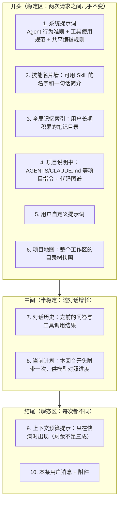

几道配菜的做法值得细看：

**项目地图（workspace map）是「环境预填」。** 编程 Agent 的第一难点是模型对项目一无所知。Ally 在每轮请求里带上一份目录树（用全文搜索引擎 ripgrep 快速扫描生成，超时则退化为普通遍历），让模型「开局就有一张地图」，减少大量盲目探索。地图有严格预算：总条目封顶三百出头，单个目录下最多展开五十个文件，超出部分折叠成一行「还有 N 个文件」。这份地图还有一个特殊待遇——**它在一个会话的第一次请求时被冻结成快照，之后整个会话都用这同一份**。为什么？见第 7 章。信息会过期怎么办？工具箱里的「列目录」工具随时可以看实时状态。

**说明书分用户级和项目级。** 全局的用户说明书放在用户主目录，项目说明书放在项目根目录（兼容 AGENTS.md / CLAUDE.md 等社区约定的文件名），拼接时打上去重标记。这是「约定优于配置」：用户把经验写进说明书，Agent 每次都自动带着它干活，不用任何人改代码。

**技能只递名片不掏手册。** 系统提示词里只有每个 Skill 的名字和一句话简介；完整手册（可能几千字）只在模型主动调用「加载技能」工具、或用户敲 `/技能名` 时才注入。这叫**渐进式披露**，是控制上下文体积的关键手法——十几个技能的全文若常驻提示词，等于每一步都背着几十 KB 的死重。

**预算提示是「快满才响的警报」。** 上下文窗口剩余不足三成时，请求尾部会追加一条提示：提醒模型少整篇读文件、多用搜索、别重复读已读过的内容。余量充足时这条提示完全不存在——对一百万 token 的窗口，大部分时候这个数字没有任何决策价值，只会成为噪音。

> **延伸思考**：上下文工程的行话叫「Write / Select / Compress / Isolate」——把值得记的写下来（项目说明书、记忆）、按需挑选注入（skill 名片）、压缩旧内容（第 8 章）、隔离到独立空间（第 12 章子代理）。Ally 的装配线四样俱全，可以当上下文工程的教学样本。

---

## 4. 工具体系：Agent 的手和脚

模型本身只会写字。它之所以能「读文件」「跑命令」，是因为循环把一组**工具说明书**（函数名、参数格式、用途描述）随请求一起发送，模型按格式「点单」，循环负责真正执行。工具说明书的质量直接决定 Agent 的上限——业界经验是：宁少而精，不多而乱；描述写给模型看而不是写给人看；把容易合并的动作合并、容易出错的地方把坑先填了。

Ally 内置工具按「危险程度」大致分四档：

| 档位 | 工具 | 特点 |
|------|------|------|
| 只读 | 列目录、读文件、搜索、看 git 状态 | 放心批量执行，部分可在工作区外读 |
| 幂等/无害 | 数学计算、网页抓取、HTTP 请求、沙箱渲染 HTML 片段 | 有界：限速、限时、限响应大小 |
| 改状态 | 创建/编辑/删除文件、跑命令、SSH 管理远程机器 | 严格安检：见第 13 章；远程机器靠向对方注入一段自带的辅助脚本完成读写，编辑契约与本地完全一致 |
| 交互与流程 | 提问、列计划、加载技能、交卷建议、暂停等待 | 改变循环本身：见第 5 章的「单调用屏障」 |

几个工具的实现细节里藏着通用经验：

**读文件是「带行号的预览」，写文件要「对暗号」。** 模型读到的文本每一行都带着行号前缀。编辑时它必须先报出上次读取时文件内容的「版本指纹」（由内容哈希生成的短码），指纹对不上就拒绝执行——说明文件在读取之后被（别的调用、别的程序、用户自己）改过了，模型必须重新读再改。这叫**乐观并发控制**，和程序员熟悉的版本冲突提醒是同一个思想。没有它，模型基于过期认知的编辑会静默覆盖别人的改动。指纹校验失败时后端绝不「自动重读再试」——那会把冲突掩盖掉，正确姿势就是打回让模型自己重来。

**写完之后顺手做「低成本体检」。** 每次文件写入成功，后端会按语言跑一遍极便宜的语法检查（编译器前端级别的检查，几秒钟内完成），把警告作为一条备注附在工具结果里回给模型。模型立刻知道「我刚写的这行有语法错误」，下一轮就自己修了。这是把「快速反馈回路」做进工具层——比起等用户发现错误，反馈链路短了一个数量级。

**拒绝也是服务。** 读到 Office 文档、PDF 这类二进制格式，读文件工具不硬解，而是明确报「我不支持这个，请用 anydoc 技能转换」。一次清晰的拒绝 + 指路，好过一次含糊的错误。

**输出必须限量。** 所有工具结果都有大小上限（约 128KB）。命令输出超限时，完整输出存到临时文件，返回给模型的是「前 128KB + 提示：完整内容在某某文件，可用读工具分段查看」。工具结果直接进模型上下文，没有上限的输出等于让模型用金子打印小说。

---

## 5. 并发与批次：一次让模型许多个愿

模型一次回复里可以同时请求**多个**工具调用（比如「同时读这三个文件」）。怎么执行这一批，直接决定速度和安全：

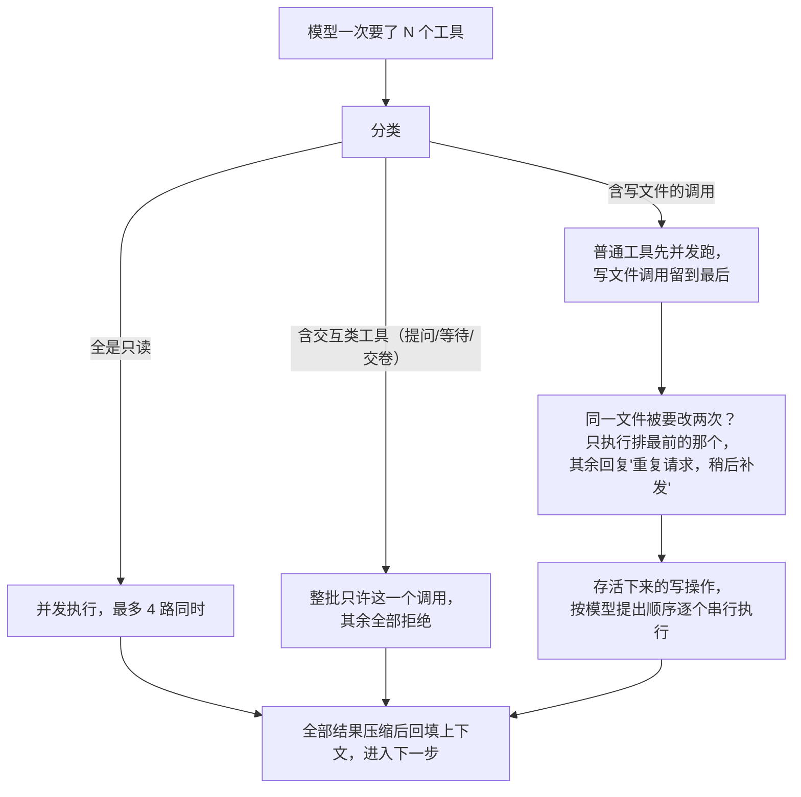

三条规则各有道理：

**交互工具必须独占一批。** 「提问」会暂停整个会话等用户回答，「等待」会挂起计时——它们和别的工具混在一起执行，时序就乱了。硬性屏障：这一批里出现它们，就只能有它们。

**读可以并发，写必须串行。** 四路并发读文件很安全，收益也大；但两个写操作并发执行，谁先谁后、中间状态给谁看，都是灾难。Ally 把文件写入留到批次末尾按顺序执行，并且对「同一次回复里改同一个文件两次」直接判后者违规（各自本来就是按顺序提出的，重复说明模型没想清楚）。这与 Anthropic 多代理系统的经验一致：**并行读、串行写、显式去重**。

**一批之内先全员安检再动手。** 所有写操作在真正写盘之前会整体过一遍校验（路径、指纹、重叠区间、语法），任何一个不合格，整批取消、一个字节都不落盘。批量操作的经典纪律：要么全成，要么全不动。

---

## 6. 失败是常态：重试与自愈

长跑的 Agent 必然撞上：网络抖一下、模型服务 5xx、流断在半句话、对话历史被上一次的故障污染……Ally 把「失败」分成三类，各有各的治愈方案：

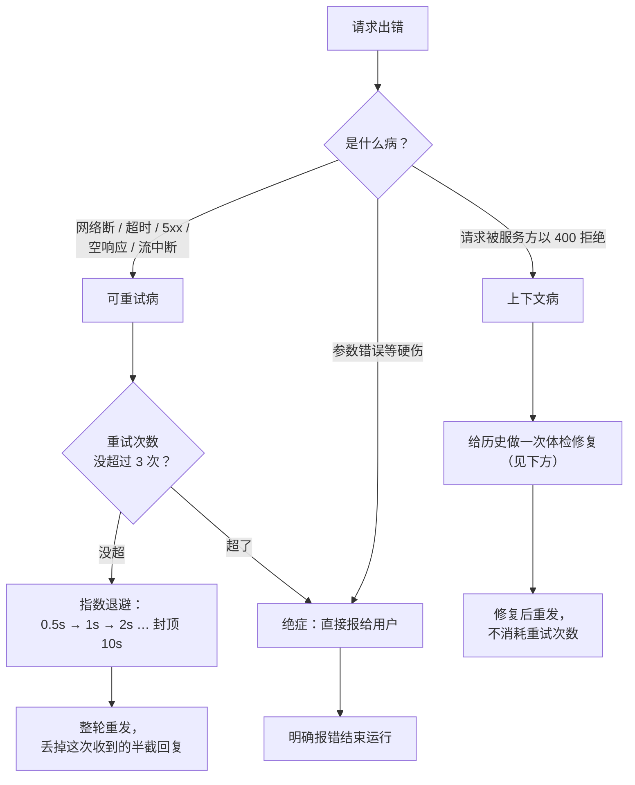

**「整轮重发」时为什么丢掉半截回复？** 因为流式回复断了就没意义——半篇文字接不上。但有个精细的例外：如果断之前模型已经把话说完了、只是收尾信号没到，已流出的文字会保留。细节不展开，原则是：**丢可以丢的（未完成），保必须保的（已完成）**。

**「上下文病」的自愈最有趣。** 400 意味着服务方认为你发的请求本身不合法，常见根源是历史记录里藏着毒：比如某次故障让一次工具调用没有对应的结果消息（提问没有回答，模型方会认为协议被破坏，之后每一笔请求都被拒——整个会话报废）。修复器做四件事：给「没有回答的提问」补一条标记或直接删掉问题；删掉「凭空出现的回答」；把残缺的参数盖上「已损坏」印章；把被重复复读的函数名折叠回正常形态。修完重发，这个会话就救回来了。**会话级自愈是桌面 Agent 的刚需**——用户的对话一挂就是一整天的工作量，不能动不动报废。

**还有两类容易踩的坑也被提前拦下了。** 一是模型明确表示「写到上限被截断」或「被内容过滤拦下」的回复，绝不会被当成正常完成——那样用户会看到一篇被腰斩的文章却没有任何提示。二是「多把钥匙」的机制：一个模型可以配一串 API Key，第一把用到坏为止，坏了自动换下一把（换下的会冷却观察，恢复后再回岗）。钥匙切换和重试的关系被小心地协调过：单把钥匙的快速重试发生在最内层；一旦配了多把钥匙，内层重试关闭，由外层统一负责「先换钥匙、再重试」，否则「每把钥匙各试三遍」的组合会让等待时间爆炸。

**崩溃也要优雅。** 执行工具的代码如果意外崩溃（写代码的人总有想不到），循环会把它捕获、包装成一条普通的工具错误返回给模型，而不是让整个程序倒下。模型看到错误还能换个办法继续。Agent 是长跑者，任何单点异常都不该结束整场比赛。

---

## 7. 缓存与成本：让重复请求变便宜

这是全文最「值钱」的一章。Agent 的请求有个天然特点：**下一步请求 = 上一步请求 + 一点点新增**。对话循环几十步，每一步都把几乎相同的一大坨上下文重发一遍。主流模型厂商为此提供了**提示词缓存**：请求前缀若与近期某次请求逐字节相同，命中部分按一折左右计费、且响应更快。

这解释了 Ally 一系列看似古怪的设计：

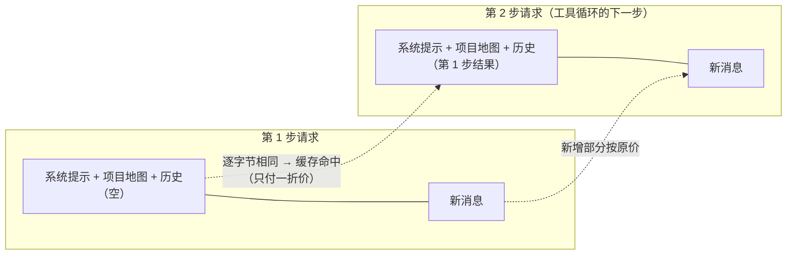

**为什么项目地图要在会话开始时冻结？** 如果每一步都重新扫描目录生成地图，文件系统任何风吹草动（编辑器保存个文件）都会让地图变一个字节——前缀缓存瞬间全部失效，每一步都付全价。冻结换稳定，过期信息用「列目录」工具补查。**这是一笔明码标价的交易：拿信息新鲜度换九成的输入费用折扣。**

**易变的为什么要放在最后？** 上下文预算提示、当回合附带的计划这类「每次都可能变」的内容，全部放在请求的最尾部。这样它们变了，也只污染缓存的最尾端（新增部分本来就按原价），前面的大头安然无恙。Anthropic 家的接口还允许显式声明「缓存断点」，Ally 把断点精确放在所有瞬态内容之前。

**为什么换模型供应商的钥匙（多 Key 轮换）要谨慎？** 缓存通常按「谁发来的请求」隔离——换了钥匙，前面攒的缓存作废。所以主钥匙工作正常时绝不轮换，只在它失败时才切换。省钱的细节都是环环相扣的。

**账本同样分层。** 有官方计数（供应商随响应报告用量）就用官方的，没有就本地估算；按天落盘、保留九十天，界面上能看到每天、每个模型、每个工作区花了多少。

> **延伸思考**：提示词缓存是 Agent 成本结构的分水岭。同样一个循环，「每步重排上下文」和「每步稳定追加」的账单可以差一个数量级。学习 Agent 开发时，把「上下文是否逐字节稳定」当成和「功能是否正确」同级的验收标准。

---

## 8. 上下文压缩：给记忆做减法

对话越滚越长，窗口总有装不下的一天。Ally 的策略是双管齐下：**先节流，再压缩**。

节流靠第 3 章的机制：历史按 token 预算裁剪、上下文预算警报引导模型少拿大数据、工具结果进历史前已压缩。这些让「增长速度」慢下来。

压缩（compact）则是「主动清账」：请模型把漫长的对话**总结成一份摘要，用摘要替换原始历史**，然后从精简的状态继续工作。触发方式两种：

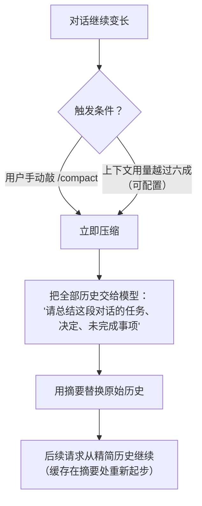

值得注意的取舍：**压缩有损**。摘要丢掉的字节里可能藏着后面需要的细节（某个报错原文、某个文件的具体行号）。所以 Ally 不敢激进：默认阈值设在六成，而且把「任务、决定、未完成事项」列为总结的必答项。业界（包括 Claude Code 的 /compact）共识相同：压缩是必要的恶，越晚做越好，做的时候要告诉模型「哪些信息类别必须保留」。

---

## 9. 会话持久化：三份档案

档案室为每个会话维护三样东西，各有分工：

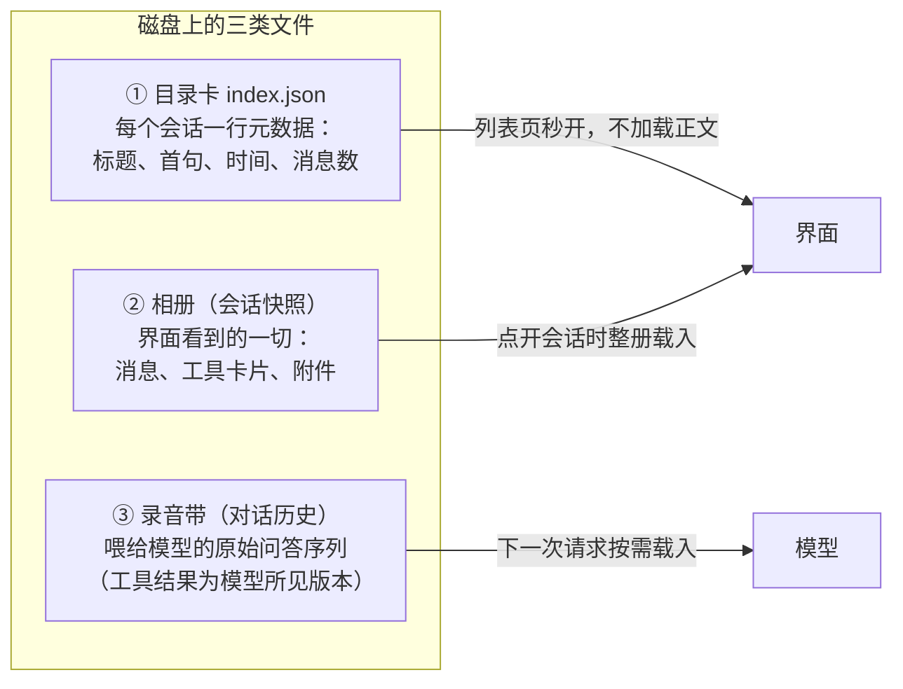

三份档案三条纪律：

**目录卡轻若鸿毛。** 列出所有会话时只碰目录卡，绝不打开相册——几百个会话的列表也要秒开。目录卡有条目上限（两千），满了淘汰最旧的，但**只从目录里除名，不删文件**——下次扫描磁盘时它还能被重新发现。删除数据要慎之又慎。

**相册与录音带分离。** 给人看的（带格式、带卡片、可能很大）和给模型看的（纯问答序列）分开存。相册单册超过 16MB 直接拒收——再好看的相册也不能撑爆内存。

**录音带落盘前必过修复器。** 第 6 章的自愈逻辑在这里复用：先修复（补孤儿、去重复、盖截断章），再按 token 预算裁剪（从旧的用户消息边界裁，绝不把一轮对话腰斩），最后压缩落盘。**修复器是「先治病、再入档」——带毒的历史一旦存下来，会感染之后的每一次请求。**

前端另有一层自己的缓存（浏览器 IndexedDB），读多写少、串行写入，和后端档案互为备份。会话数据的安全性靠「多副本 + 只在确认完成时落盘」保障。

---

## 10. Skill 机制：先递名片，再掏手册

Skill 是给模型装「临时专业模块」的机制：一份带封面信息的手册（Markdown + 前置元数据），教模型在某类任务上按特定流程操作（比如「操作浏览器」「把 Office 文档转 Markdown」「维护代码图谱」）。

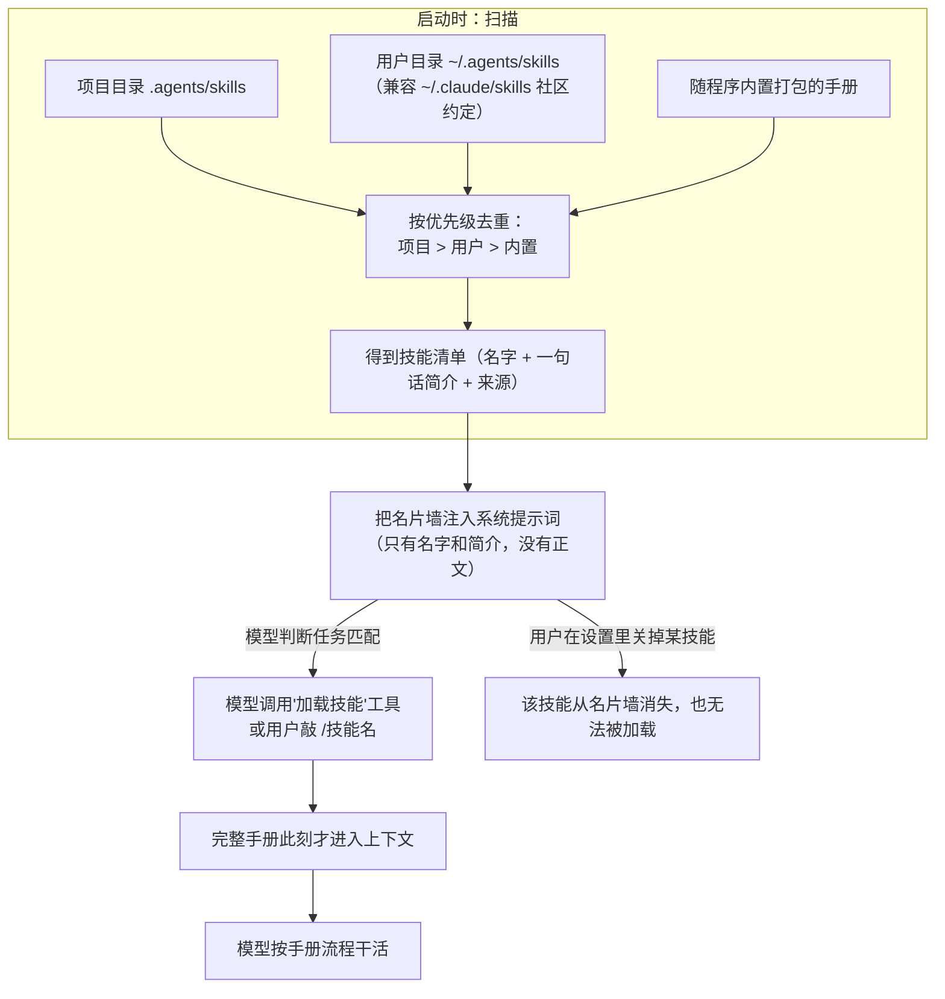

设计的精髓在**两段式注入**：

1. **名片墙常驻**：几十个技能每个只占一行，模型随时知道自己「会什么」；
2. **手册按需**：真正干活时才加载全文，用完这一轮就过去，不占长期上下文。

这与 Anthropic 的 Agent Skills 标准（Ally 兼容 `.claude/skills` 目录约定，别的工具放进去的手册 Ally 直接认）同构，也和「检索增强」的思想相通：**与其问「什么该进上下文」，不如把知识做成可检索、可装载的小单元**。此外，名片的「一句话简介」写得好不好，直接决定模型会不会在正确的时机想起它——写技能时最值得打磨的就是这一句。

---

## 11. MCP 机制：外接设备的通用插口

MCP（Model Context Protocol）是工具生态的通用标准：任何程序按协议暴露自己的能力，Agent 就能即插即用地使用。Ally 作为 MCP 宿主（客户端方）：

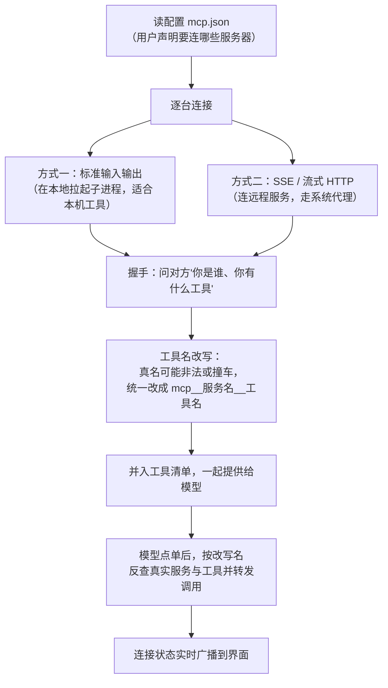

两个运维细节体现「最小扰动」原则：

- **配置变了用「调和」而不是「重启全部」**：只重连增、删、改过的服务器，没动的保持在线。批量重启会让所有外接工具瞬间断线。
- **例外是代理设置**：网络代理变了，所有远程连接的传输层都得换，此时才全量重启。

外接工具的结果同样受输出上限约束（外来的输出同样不能无限灌进上下文），连接失败、工具报错都以统一信封回给模型，模型能看到「这个工具坏了」并决定绕行。

> **延伸思考**：MCP 解决的是「N 个 Agent × M 个工具」的集成爆炸问题——工具方写一次适配，所有 Agent 可用。学习时把它理解为「AI 时代的 USB-C」即可；实现上要记住两件事：名字空间隔离（`mcp__服务__工具`）和「外部输入一律限额」。

---

## 12. 子代理与计划任务：分身与闹钟

主循环是单线程的演唱会，但有些活适合包给「分身」，有些活适合交给「闹钟」。

**子代理**：主 Agent 把一个边界清晰的任务（「调研这个目录的所有测试文件」）连同预算（默认 25 步）打包，派给一个全新的 Agent 实例。分身有**自己独立的上下文**、自己的循环、自己的工具集（但没有「提问」——它不能骚扰用户；也没有「派分身」——不允许套娃），干完后只把**最终报告**交回主线。

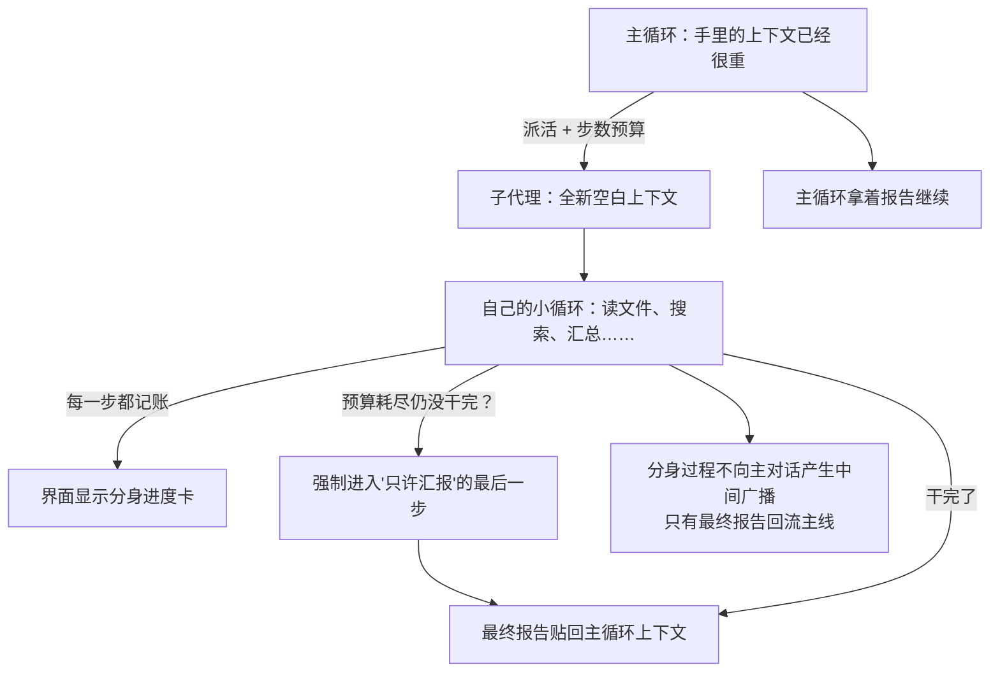

这里体现的是**上下文隔离**：调研过程产生的几十次工具调用、几万字的中间结果，全部留在分身的上下文里「烧掉」，主循环只收到浓缩结论。如果这些中间过程全部涌入主循环，主上下文会迅速被撑爆——分身就是一次性的「上下文焚烧炉」，只回传灰烬里的钻石。分身的生死也和主人绑定：主任务被叫停，分身随之收工。

**计划任务**则是定时闹钟：用户登记「每天早上九点检查依赖更新」这类任务，到点后 Ally 用**全新空白上下文 + 固定工作区**独立执行，全局排队绝不重叠，每个任务有步数与时长上限（默认一百步一小时，最多一千步二十四小时），跑完只保留一小段摘要与错误信息。它与聊天的关系是彻底隔离的——闹钟干活的现场不会污染任何对话。

---

## 13. 安全边界：给实习生立规矩

Agent 能读写文件、能执行命令，等于把实习生请进了机房。Ally 的安检哲学是：**不靠黑名单堆砌，靠理解意图**。

**命令安检不用关键词匹配，用语法树。** 拦截「执行用户没批准的 shell 命令」时，天真做法是正则匹配危险词（`rm`、`format`……），马上就能被 `r""m`、变量拼接、嵌套引号绕过。Ally 把命令先解析成 Bash 语法树，理解「这是个嵌套调用」「这是重定向，目标是这个文件」「这是多行输入块，内容是数据不是命令」，然后基于**语义**判断：命令要写/删的目标如果是工作区外的**已存在**文件，拦截并给模型返回人话解释（哪里违规、该怎么改目标）。注意分寸：读外面的文件放行、写**新**文件放行、改外面的**旧**文件拦截、删除一律走受管通道。拦不住的不硬拦（变量、通配符解析不出目标就放行并记录）——安全策略宁可明确地松，也不含糊地假严。

**路径围栏。** 一切写操作限定在工作区内，唯一的例外是一个专用的全局配置目录（记忆、配置要写到用户主目录下）。围栏检查在所有工具共用的路径解析层做，Windows 下还额外识别两种路径写法（`C:\...` 与 bash 风格 `/c/...`）。

**网络守门。** 所有对外请求默认拒绝访问内网地址（防止「让模型抓个网页，结果它抓了你路由器的管理页」这类注入攻击）；抓网页有大小、时间、重定向限制，重定向跨域时剥掉带密钥的头。

**工具产出也安检。** 第 4 章的输出限额、第 5 章的批量预检、第 4 章的乐观锁，加上本节的围栏，构成「写入四道闸」：**限路径 → 限大小 → 先验后写 → 写后即检**。

---

## 14. 前端与事件流：只把重要的事说出来

后端每一步都在广播事件（流式文字增量、工具开始/更新/结果、运行开始/结束、重试……）。如果不加约束，一秒钟几百条事件会把界面渲染拖死。Ally 的做法是**两端各设一道减速带**，且只给真正高频的两类事件设：

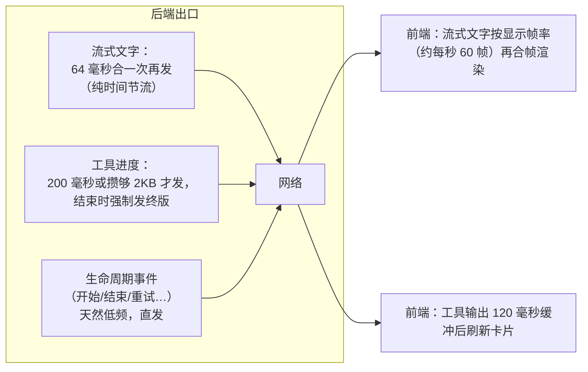

三层节流加起来，模型每秒吐几千字的流被压缩成每秒几十次的界面更新。再配合前端的渲染纪律（消息列表按需重绘、Markdown 结果缓存、大型图表滚出视野就卸载、长历史归档成占位符按需恢复），几千条消息的会话也能流畅滚动。

值得学的不是具体数字，而是**分层节流的思路**：后端限「发」的频率，前端限「渲染」的频率，两层各自独立可调；低频事件绝不节流（保实时性），高频事件绝不直发（保流畅性）。

---

## 15. 外围设施速览

以下模块不参与核心循环的认知，但完整了产品形态：

- **本地 HTTP API 服务**：可选开启（默认关闭），仅监听本机回环地址、固定 Token 鉴权，把会话、模型、MCP、Skill 管理暴露成 28 个 REST 端点，让外部程序（CI、脚本、其他工具）驱动 Ally。参数文档见 `docs/api.md`。
- **自更新**：检查发布、下载、校验、原子替换、失败回滚；更新后的重启借助平台辅助进程完成。
- **桌面通知与提示音**：任务完成/出错/取消时提醒（仅在窗口最小化时打扰，有冷却时间）。
- **全局记忆**：`~/.ally_agent/memories/` 下的 Markdown 笔记，索引进系统提示词，正文按需读取——Skill 之外的另一条「长期知识」通道。
- **代码图谱（CODEGRAPH.md）**：把「哪个功能在哪个文件」做成速查表，与项目说明书一起注入——这是给编程场景特化的「项目记忆」。
- **局域网游戏区**：与 Agent 完全隔离的彩蛋模块（联机棋类/牌类），证明核心与外围的隔离做得足够干净。

---

## 16. 对照与反思：Ally 的选择 vs 业界共识

把 Ally 的机制映射到 Anthropic《Building Effective Agents》的模式分类：

| 业界模式 | 一句话 | Ally 对应物 |
|----------|--------|-------------|
| 增强型 LLM（基础积木） | 模型 + 检索 + 工具 | 上下文装配线 + 工具箱 |
| Agent（自主循环） | LLM 在循环里按环境反馈用工具 | 第 2 章核心循环 |
| 并行化 | 同时发多个独立调用 | 一批内最多四路并发工具 |
| 编排者-工人 | 主 LLM 派活给子 LLM | 子代理（独立上下文 + 步数预算 + 只回报告） |
| 提示链 / 路由 / 评估者-优化器 | 固定代码路径的工作流 | 不内置——Ally 是纯 Agent 形态，工作流留给用户用 Skill/计划任务自建 |

**做得好、值得抄的：**

1. **前缀字节稳定作为一等公民**（冻结地图、瞬态置尾、缓存断点、多 Key 不轻换）——大多数教程只字不提，但这是真实成本的分水岭。
2. **会话级自愈**（历史修复器 + 参数截断标注 + 崩溃隔离）——长跑 Agent 的可靠性来自「假设一切都会坏」。
3. **信息分层双通道**（界面全量 / 模型压缩）——同时伺候两种受众。
4. **渐进式披露**（Skill 名片墙、记忆索引、按需加载）——上下文体积的手艺。
5. **写入四道闸与乐观锁编辑**——把「快速反馈」和「安全」同时做进工具层。
6. **上下文隔离的子代理**——并行性与上下文卫生兼得。

**可以商榷、或有代价的：**

1. **循环上限近万步**：把停止决策交给模型与用户，流畅但不可预测；预算敏感的场景应默认更小并允许放大。
2. **会话内单运行串行**：换来历史一致与缓存友好，代价是同会话无真并行；靠子代理弥补，但子代理无法与主循环同时对话。
3. **压缩有损**：阈值与总结清单缓解，但长程细节（早前的报错原文）仍可能丢失；更进阶的做法是压缩前把关键事实写入持久笔记（Ally 的记忆机制已提供此出口，但未强制关联压缩流程）。
4. **token 用量部分依赖本地估算**：供应商不报用量时数字是近似值，统计图表要容忍误差。
5. **工作区地图按会话冻结**：会话很长时地图可能明显过时，依赖模型主动用列目录工具纠偏——对不主动的模型，可能需要更强的提示。

**如果你要自己写一个 Agent，最小可行清单**：一个带取消与步数上限的循环 → 一套严格 schema + 宽容解码的工具 → 结果压缩与输出限额 → 历史持久化 + 修复 → 重试与退避 → 前缀稳定的上下文装配 → 会话级单运行约束。Ally 的每一章都是在为这七件事补细节。

---

## 17. 参考资料

- Anthropic, *Building Effective Agents* —— Agent 与工作流的分野、五模式、「保持简单」的总原则：<https://www.anthropic.com/engineering/building-effective-agents>
- Anthropic, *Writing Effective Tools for Agents* —— 工具说明书设计、为模型优化接口：<https://www.anthropic.com/engineering/writing-tools-for-agents>
- Anthropic, *How We Built Our Multi-Agent Research System* —— 编排者-工人、并行子代理、上下文交接的工程教训：<https://www.anthropic.com/engineering/multi-agent-research-system>
- Anthropic, *Effective Context Engineering for AI Agents* —— Write/Select/Compress/Isolate 的上下文工程框架、压缩与记忆做法：<https://www.anthropic.com/engineering/effective-context-engineering-for-ai-agents>
- Yao et al., *ReAct: Synergizing Reasoning and Acting in Language Models* —— 「思考-行动-观察」循环的学术源头：<https://arxiv.org/abs/2210.03629>
- 本仓库 `AGENTS.md`（行为规范与不变式）、`CODEGRAPH.md`（功能→文件速查）、`docs/api.md`（对外 API 参数）
