# Ally 架构详解

> 这份文档把 Ally（一个桌面 AI 编程助手）从里到外拆开讲清楚：它如何思考、如何动手、如何记忆、如何在出错后爬起来。
> 文章刻意**少写变量名和函数名**，用平实的语言描述机制，配大量流程图；但保留所有可核查的数字与行为细节。看完你应当能回答：一个能真正干活的 AI Agent，是由哪些部件咬合起来的？
> 想把概念对应到具体代码时，翻根目录的 `CODEGRAPH.md`（功能→文件速查表）和 `AGENTS.md`（行为规范与不变式）。

---

## 目录

1. [全景：一次对话的一生](#1-全景一次对话的一生)
2. [核心循环：Agent 的心跳](#2-核心循环agent-的心跳)
3. [上下文装配线：每次请求要带齐什么](#3-上下文装配线每次请求要带齐什么)
4. [系统提示词的原料：说明书、记忆与图谱](#4-系统提示词的原料说明书记忆与图谱)
5. [工具体系：信封、双通道与输出限额](#5-工具体系信封双通道与输出限额)
6. [文件读写三件套：读、改、验](#6-文件读写三件套读改验)
7. [命令执行与后台服务：从安检到落盘](#7-命令执行与后台服务从安检到落盘)
8. [并发与批次：一次让模型许多个愿](#8-并发与批次一次让模型许多个愿)
9. [失败是常态：重试、自愈与多把钥匙](#9-失败是常态重试自愈与多把钥匙)
10. [提供商适配层：三种方言与一层翻译](#10-提供商适配层三种方言与一层翻译)
11. [缓存与成本：让重复请求变便宜](#11-缓存与成本让重复请求变便宜)
12. [上下文压缩：给记忆做减法](#12-上下文压缩给记忆做减法)
13. [会话持久化：三份档案](#13-会话持久化三份档案)
14. [计划、提问与交卷：会话内的交互工具](#14-计划提问与交卷会话内的交互工具)
15. [Skill 机制：先递名片，再掏手册](#15-skill-机制先递名片再掏手册)
16. [MCP 机制：外接设备的通用插口](#16-mcp-机制外接设备的通用插口)
17. [子代理与计划任务：分身与闹钟](#17-子代理与计划任务分身与闹钟)
18. [安全边界：给实习生立规矩](#18-安全边界给实习生立规矩)
19. [前端与事件流：只把重要的事说出来](#19-前端与事件流只把重要的事说出来)
20. [配置与凭据：谁管什么](#20-配置与凭据谁管什么)
21. [外围设施速览](#21-外围设施速览)
22. [测试与验证：怎么证明 Agent 没坏](#22-测试与验证怎么证明-agent-没坏)
23. [对照与反思：Ally 的选择 vs 业界共识](#23-对照与反思ally-的选择-vs-业界共识)
24. [参考资料](#24-参考资料)

---

## 1. 全景：一次对话的一生

先把整个系统想象成一家**一人设计工作室**：

- **你（用户）** 是甲方，坐在前台（聊天界面）提需求；
- **AI 模型** 是设计师本人，负责想方案；
- **工具箱**（读文件、写文件、跑命令、上网查资料……）是设计师的手和脚；
- **管家**（Go 后端的核心循环）在设计师和工具之间传话、记账、看表、把关；
- **档案室**（会话持久化）把每个项目的来龙去脉存好，下次开门就能接着干。

从分层上看，Ally 是一个桌面应用（窗口与界面跑在系统 WebView 里的 Vue 应用，核心逻辑在 Go 后端）。后端内部又按职责切成几层，**依赖方向永远从上往下**，这是它能保持干净的关键：

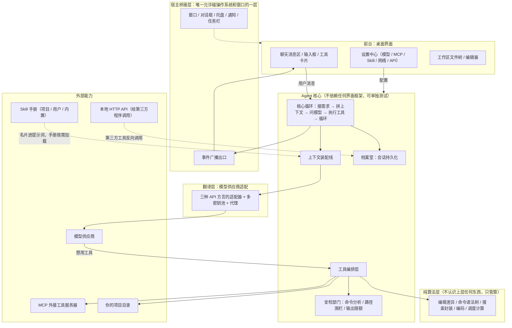

这个分层有一条铁律：**核心不认识界面**。核心层向外的唯一出口是「事件广播」这个抽象口子，测试时可以换成一个记录器来捕获所有广播；纯算法层甚至不认识核心，给它输入它就算结果。这让每一层都能独立验证（见第 22 章）。

一次对话的一生：用户输入一句话 → 界面把它交给后端，后端为这轮对话开一个**可随时取消的任务**（称之为一次「运行」）→ 核心循环开始转（见第 2 章）→ 循环结束，对话记录落盘 → 界面收到完成广播。

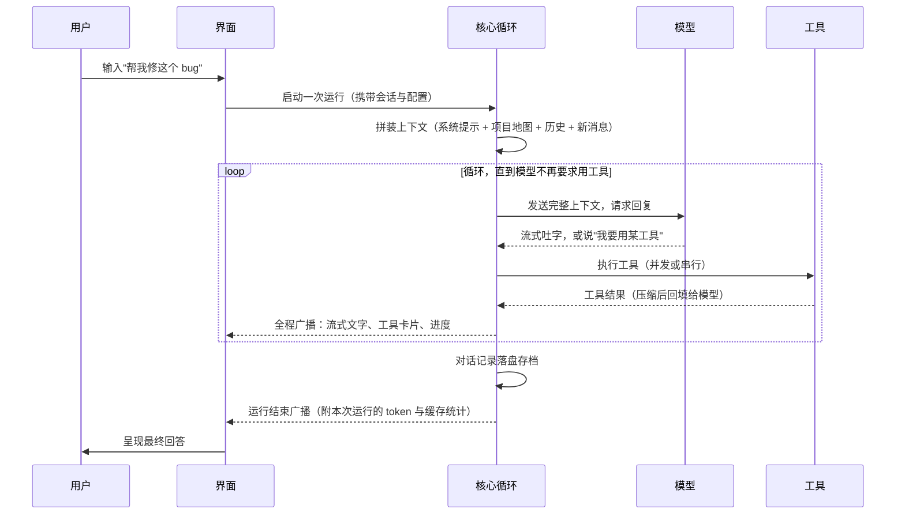

有个容易忽略的细节：**同一个会话同一时刻只允许一个运行**。如果模型正在干活你又发消息，这条消息不会立刻触发新一轮，而是被塞进一个容量为 32 条的「传话队列」，等当前这一步干完、下一个模型请求发出前注入。这是刻意的：两个运行同时改同一份对话记录会互相踩脚，聊天记录的顺序就乱了。界面上运行中追问的体验就是这么实现的；队列满了会明确报错而不是悄悄丢弃。

> **延伸思考**：很多 Agent 框架允许多任务并行，Ally 选择「每会话串行 + 用子代理补并行」。串行换来了历史记录的绝对一致（这是提示词缓存和回放正确性的根基），并行需求则被引导到第 17 章的子代理机制——那里有隔离的独立上下文，不会互相污染。

---

## 2. 核心循环：Agent 的心跳

把所有外壳拆掉，Agent 的本质其实朴素得惊人：**一个 while 循环**——把上下文发给模型，模型要么直接回答，要么说「帮我调一下某个工具」，循环就执行工具、把结果贴回上下文、再问一遍，如此往复，直到模型给出不含工具请求的最终回答。业界的共识也是如此：Agent 就是「LLM 根据环境反馈在循环里使用工具」，没有更神秘的内核（见参考资料 Anthropic《Building Effective Agents》）。

Ally 的核心循环多了几件**工程上的必需品**，它们才是真功夫所在：

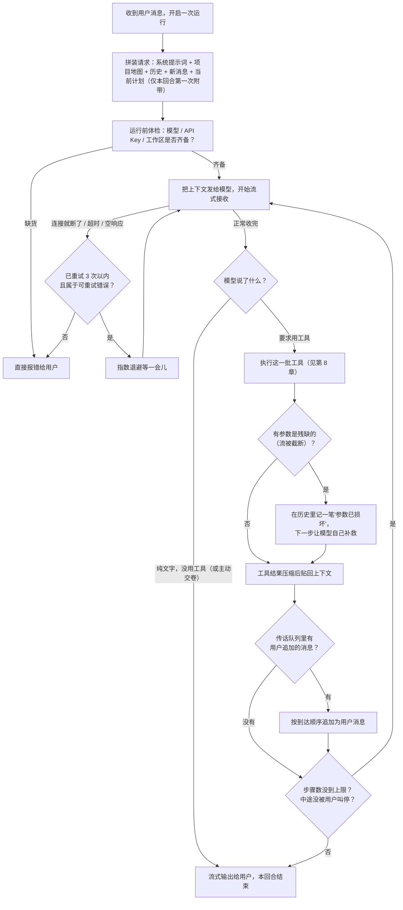

几个值得停下来琢磨的设计：

**循环的上限被故意放到极大（9999 步）。** 通用建议是给 Agent 设一个「够用就好的小预算」，防止模型陷入原地打转的死循环烧钱。Ally 反其道而行，靠三样东西兜底：计划工具让模型自己列清单对照进度、用户随时可以叫停（每一步之间都有检查点）、以及「交卷」工具——模型认为自己做完了会主动提交 1～4 条给用户的后续建议，交卷即结束循环。这是一种「上限不设防、机制引导收敛」的思路：把停止的决策交给模型和用户，而不是一个武断的数字。学习时两种思路都值得了解：预算制更好预测，机制制更流畅。真正怕烧钱的场景（无人值守）用的是另一套：计划任务和子代理都有硬预算（见第 17 章）。

**每一步之间都是检查点。** 用户按下 ESC 不是「凭空消失」：循环会把已经完成的工具调用和结果保存下来，再往历史里塞一张「上一条提问已被用户中断」的字条（以用户口吻、带机器标记写入历史）。下一轮模型读历史时就知道：这里发生过一次人工中断，不是它自己失败。这条字条对模型区分「我干砸了」和「用户不要了」非常重要——否则模型经常会对着中断的任务道歉重试。

**工具请求的参数可能是残缺的。** 模型是流式输出的，如果网络在它念到一半时断掉，工具参数就是半截 JSON。与其冒险执行（拿半截参数写文件等于赌博），循环会在历史里给这个调用盖上「参数已损坏」的印章（一个机器可识别的 JSON 标记），执行器遇到印章一律拒绝并返回明确错误。下一条请求模型看到印章，自己决定重发完整调用。这个「不猜、不编、明确标注」的原则在 Agent 工程里反复出现——后面第 13 章的历史修复还会再见到它。

**一句话的旅行不止一个通道。** 模型每次工具调用会产生两个版本的结果：**给界面看的完整版**（原样 JSON，前端渲染成卡片、diff、命令输出）和**给模型看的压缩版**（剥掉展示性字段，只留决策需要的信息）。同一个事实，两种受众，两种裁剪（细节见第 5 章）。这是上下文工程里「信息分层」的标准实践——模型的注意力是稀缺资源，界面的保真度也是刚需，混在一起两头受损。

**运行是有账本的。** 每次运行结束时，广播里会带上这一轮的总账：输入/输出 token 数、缓存命中/未命中字节数、耗时。有官方计数（供应商随响应报告）就用官方的，没有就本地估算；界面上每次回答下方显示的缓存效率就是这笔账算出来的。

---

## 3. 上下文装配线：每次请求要带齐什么

模型没有记忆，每一次请求都要把「它需要知道的一切」重新讲一遍。所以「拼请求」是 Agent 工程里最像厨师配菜的环节：料要全，盘要小，摆盘顺序还要照顾另一个隐形食客——**提示词缓存**（第 11 章细讲）。

Ally 每次请求的上下文，从上到下依次是：

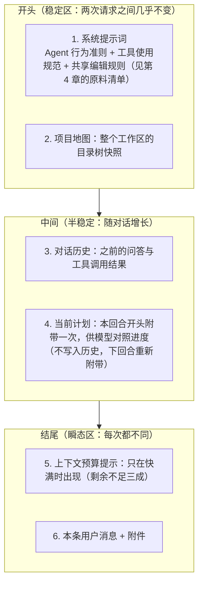

几道配菜的做法值得细看：

**项目地图（workspace map）是「环境预填」。** 编程 Agent 的第一难点是模型对项目一无所知。Ally 在每轮请求里带上一份目录树，让模型「开局就有一张地图」，减少大量盲目探索。这份地图的生成和预算规则都相当讲究：

- **两条生成路径，同一套过滤**：优先用全文搜索引擎 ripgrep 扫（天生遵守 gitignore、速度快），扫描超过 10 秒或引擎不可用则退化为普通目录遍历——网络盘和病态文件系统不能让第一次对话无限等待。两条路径应用同一套过滤语义：敏感文件（`.env` 一类）不进地图、重目录（依赖目录等）跳过、深度和总条目受限（总条目封顶 320，硬停）。
- **单目录配额**：一个目录下最多展开 50 个直接子项，超出部分折叠成一行「还有 N 个文件」——没有配额的话，一个塞了十万张图的目录就能吃光整份地图。目录本身不占配额（只数文件），折叠项排在同目录所有真实条目之后，且**不消耗全局配额**（继续走完整个树，把「还有 N 个」数准）。
- **按会话冻结**：地图在一个会话的第一次请求时被冻结成快照，之后整个会话都用这同一份字节。为什么？见第 11 章——这是前缀缓存的命门。信息会过期怎么办？工具箱里的「列目录」工具随时可以看实时状态，两者分工明确。
- **面向模型的列表是另一套压缩**：「列目录」工具返回给模型的不是完整 JSON 而是换行连接的路径清单（目录带斜杠后缀），超配额目录同样折叠；空目录、被截断都会附一句话说明。给界面用的同一接口则返回完整的元数据（大小、时间、符号链接标记）——又是双通道。

**说明书分用户级和项目级。** 全局的用户说明书放在用户主目录的 agents 目录里，项目说明书放在项目根目录（兼容 `AGENTS.md` / `CLAUDE.md` 等社区约定的四种文件名），逐个拼接并打上「来自哪个文件」的标记、按路径去重。这是「约定优于配置」：用户把经验写进说明书，Agent 每次都自动带着它干活，不用任何人改代码。

**技能只递名片不掏手册。** 系统提示词里只有每个 Skill 的名字和一句话简介；完整手册只在模型主动调用「加载技能」工具、或用户敲 `/技能名` 时才注入（第 15 章）。

**记忆是索引不是全文。** 用户在 `~/.ally_agent/memories/` 下写的 Markdown 笔记（带一句描述的元信息），只有「路径 + 描述」的目录进提示词，正文按需用读文件工具去看。这个目录在写路径白名单里，模型可以直接用建文件/编辑工具维护自己的长期记忆。

**预算提示是「快满才响的警报」。** 上下文窗口剩余不足三成时，请求尾部会追加一条提示：提醒模型少整篇读文件、多用搜索、别重复读已读过的内容。余量充足时这条提示完全不存在——对一百万 token 的窗口，大部分时候这个数字没有任何决策价值，只会成为噪音（模型有时还会把这类提示当内容复读出来）。

**计划走「工具结果回填」而不是每步注入。** 模型每次调用计划工具，工具结果里都带着**更新后的完整清单**——这份结果会存进历史，所以后面每一步、每一回合模型都能看到最新计划，不需要循环层每步重复注入。唯一一次额外注入是：用户发起新回合时，把当前计划作为**临时上下文**附在第一次请求里（不写入历史），让模型带着「上次干到哪了」继续。

> **延伸思考**：上下文工程的行话叫「Write / Select / Compress / Isolate」——把值得记的写下来（项目说明书、记忆、lessons）、按需挑选注入（skill 名片、记忆索引）、压缩旧内容（第 12 章）、隔离到独立空间（第 17 章子代理）。Ally 的装配线四样俱全，可以当上下文工程的教学样本。

---

## 4. 系统提示词的原料：说明书、记忆与图谱

第 3 章的「系统提示词」不是一个写死的大字符串，而是一条**按固定顺序拼接的流水线**，每一段原料都有独立的来源和更新机制：

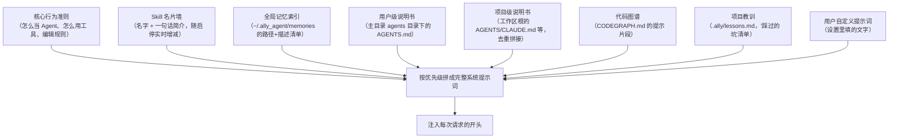

几个原料的特殊之处：

**项目教训（lessons）是「错误驱动」的知识。** 用户敲 `/lesson` 命令，让模型回顾当前对话、把可复用的坑（比如「这个项目的测试必须用某个命令跑」）追加进项目里的 lessons 文件；下次对话这段内容作为提示词的一部分注入。这是比记忆更轻量的「项目级经验积累」——记忆偏个人长期知识，教训偏具体项目的纪律。

**说明书可以来自三层。** 用户主目录（个人通用偏好）→ 项目根目录（团队约定）→ 附加工作区（跨目录协作时）。同名内容按绝对路径去重，每段开头标注来源文件，模型能分清「哪条规矩是哪个 context 说的」。

**禁用即消失。** 设置里关掉的 Skill 不进名片墙，也无法被「加载技能」工具加载——禁用是彻底的，不是隐藏。

**编辑规则是共享的。** 因为「读文件—改文件」是编程 Agent 最核心的动作，怎样选锚点、怎样处理行号、怎样报告冲突，这套规则被单独抽成一段固定文本，所有相关工具的说明书里反复强调——模型在长对话里会「忘」，重复是特性不是浪费。

> **延伸思考**：这一章本质上是「提示词的配置管理」——每段原料独立可测、来源单一、更新机制明确。新手常犯的错是把系统提示词写成一整坨上帝字符串，改一处怕全身，也无法回答「模型为什么这么表现」。

---

## 5. 工具体系：信封、双通道与输出限额

模型本身只会写字。它之所以能「读文件」「跑命令」，是因为循环把一组**工具说明书**（函数名、参数格式、用途描述）随请求一起发送，模型按格式「点单」，循环负责真正执行。工具说明书的质量直接决定 Agent 的上限——业界经验是：宁少而精，不多而乱；描述写给模型看而不是写给人看；把容易合并的动作合并、容易出错的地方把坑先填了。

Ally 内置工具按「危险程度」大致分四档：

| 档位 | 工具 | 特点 |
|------|------|------|
| 只读 | 列目录、读文件、搜索、看 git 状态/差异 | 放心批量执行，部分可在工作区外读 |
| 幂等/无害 | 数学计算（本地确定性求值）、网页抓取、HTTP 请求、沙箱渲染 HTML 片段 | 有界：限速、限时、限响应大小 |
| 改状态 | 创建/编辑/删除文件、跑命令、SSH 管理远程机器 | 严格安检：见第 7、18 章；远程机器靠向对方注入一段自带的辅助脚本完成读写，编辑契约与本地完全一致 |
| 交互与流程 | 提问、列计划、加载技能、交卷建议、暂停等待、派子代理 | 改变循环本身：见第 8、14、17 章 |

**工具说明书本身是「严格模式」的 JSON Schema**：禁多余字段、必填明确。但执行器的解码是**宽容**的——模型多传了未知字段不会报错，而是把「忽略了哪些字段」作为警告附在成功结果里回给模型；缺了必填参数才硬性失败。这个「宽进严出」的折衷很实用：模型偶尔会自由发挥加参数，一票否决太伤体验，静默忽略又会让模型以为生效了——警告是中间态，模型下次会改对。

**所有工具结果走统一信封**：成功与否（ok）、数据（data）、错误信息与错误码（error / errorCode）、补充细节（details）、非致命警告（warnings）。错误码是跨工具统一的（路径越界、版本冲突、参数截断……），界面能据此本地化文案，模型能据此对号入座。

**双通道压缩是按工具定制的**，不是一刀切砍长度：

| 工具 | 给界面的 | 给模型的 |
|------|----------|----------|
| 读文件 | 完整行号预览 | **不压缩**——模型改文件时要引用行号，砍了就废 |
| 编辑 | diff 视图所需的全量数据 | 每文件一行摘要（替换了几处）+ 新版本指纹 |
| 命令 | 完整输出（滚动缓冲） | 输出本身（已限额），超限附「完整内容在临时文件」的指路条 |
| 搜索 | 完整结果 | 精确命中统计 + 每文件热点数（只留最多的前 100 个文件）+ 翻页游标 |
| 列目录 | 带元数据的条目数组 | 换行连接的路径清单 + 折叠说明 |

**输出必须限量。** 所有工具结果都有大小上限（128KB）。命令输出超限时，完整输出存到临时文件（放在工作区内的临时目录、由程序启动时定期清理过期文件），返回给模型的是「前 128KB + 提示：完整内容在某某文件，可用读工具分段查看；大文件建议分段或按需检索」。工具结果直接进模型上下文，没有上限的输出等于让模型用金子打印小说。HTTP 类工具同理：响应大小、超时、重定向次数全都有硬上限。

**渲染 HTML 的工具是个特例**：模型生成的自包含 HTML 片段（上限 5 万字符）在流式阶段不挂载，完整后才装进一个**沙箱 iframe**——禁外部资源（内容安全策略拦截一切外链）、隔离源、通过受控通道上报高度。让模型能「画界面」给用户看，又不给它任意执行网页脚本的能力。

---

## 6. 文件读写三件套：读、改、验

「读—改—验」是编程 Agent 最高频的回路，Ally 把这条回路的每个环节都做成了契约：

**读：带行号的预览，兼容一切文本。**

- 每行带 1 起始的行号前缀（仅展示用），模型改文件时用行号指认范围。
- 编码兜底：UTF-8 原样读；UTF-16（大端/小端、带不带 BOM 都行）自动转成 UTF-8——Windows 生态里 UTF-16 文件不少见，读不出来就等于废了一半工具。
- 二进制识别：内容里出现空字节就拒绝（不是乱码着读完），并区分「文本文件但编码怪」和「真二进制」。
- 大文件友好：单行超 2000 字符截断并打标；支持只读最后 N 行（负数行号，上限一万行）；输出超限时给出「从第几行继续读」的游标；千万行的文件做小范围读取也是线性扫描、内存有界。
- 一次调用可以读多个文件（数组参数），缺失的路径静默跳过不报错——批量探活是合法诉求。
- 办公文档（Word/Excel/PPT/PDF）明确拒绝并指路：用 anydoc 技能转成 Markdown 再读。清晰的拒绝好过硬解。
- 图片走另一条通道：转成数据 URL 直接注入模型的多模态输入（有大小上限）。
- **运行级读缓存**：同一次运行里重复读同一文件，走缓存——既省时间，也保证模型在同一步里看到的内容一致。

**改：一次一个文件，先对暗号。** 模型编辑文件必须遵守一条完整契约：

- **先读后改，凭指纹提交**。每次读取返回一个 6 字符的内容指纹（内容哈希的缩写）；编辑请求必须带上读取时的指纹，对不上就拒绝——说明文件在读取之后被改过了（别的调用、别的程序、用户自己），模型必须重读再改。这叫**乐观并发控制**。指纹错了绝不「自动重读再试」——那会把冲突掩盖掉。
- **一次调用只改一个文件**，文件内的多处修改放在同一次调用的修改列表里（最多 50 处）；要改多个文件就并行发多个调用。
- **两种定位方式**：首选「精确原文替换」——从读取快照里原样复制一小段唯一文本作为锚点；大段整行替换才用「行号区间」。默认要求锚点在全文唯一，可选「全部替换」把所有不重叠的命中都换掉。
- **定位全部基于同一份读取快照**：多处修改之间不需要调整行号偏移；执行时从文件末尾往前逐个应用（前面的修改不会让后面的行号失效），最后一次性写盘。
- **写前全员预检**：所有修改先在快照上验证（锚点存在、唯一、互不重叠、指纹正确），任何一个不合格，整个调用失败、一个字节都不落盘。
- **善意的容错**：多行整行替换匹配失败时，允许忽略每行行首缩进再试一次（只此一次、要求唯一命中，并把替换文本自动对齐到文件实际缩进）——模型经常数错缩进，正文内容永远不模糊匹配。「内容没变的修改」直接忽略并报告为警告；全部都是无效修改时整次调用成功但不写盘。
- **写回后返回新指纹**，模型要在同一文件上继续改就直接用，不确定就重读。
- **编辑时或许带删除语义**：替换文本为空即删除选中内容；在唯一锚点两侧插入内容 = 用「锚点+新增」替换锚点。

**验：写完立刻低成本体检。** 每次写入成功，按改动文件的语言跑一遍便宜的语法检查（Python/Go/JS/TS/Vue/Java/JSON，编译器前端级别，秒级完成），警告作为备注回填给模型。批量编辑时同一「校验单元」（同一个 Go 包、同一个 tsconfig 工程）只跑一次，挂在批次里最后一个触碰它的调用上——既不重复跑，也不漏跑。模型下一轮就能看到「我刚写的这行有语法错」并自己修。这条快速反馈回路比等用户发现错误短了一个数量级。

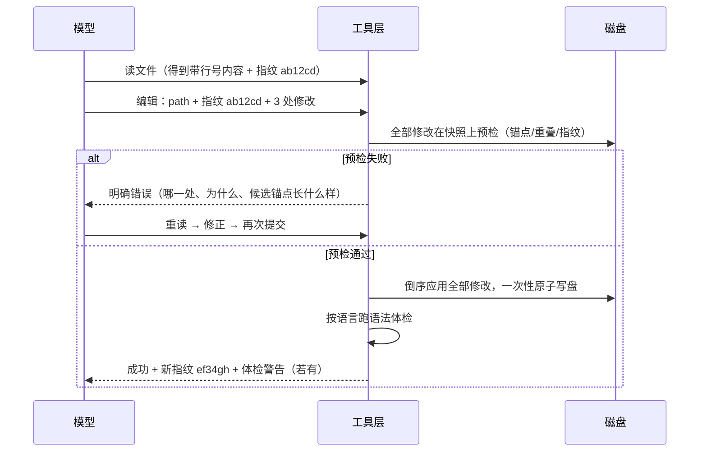

---

## 7. 命令执行与后台服务：从安检到落盘

**跑命令前先过语义安检**（完整规则见第 18 章），通过之后执行环节同样有一堆细节：

- **选对 shell**。Windows 上优先用 Git Bash（检测顺序：用户手动指定的路径 → 常见安装位置 → 从 git 程序反推 → 只认属于 Git 安装的 bash，拒绝系统里那个假 bash——它会把 Linux 环境和参数转发规则带进来，坑极深），都找不到再退回 PowerShell；macOS/Linux 恒定 bash。系统提示词会**动态告知模型当前用的哪种 shell**，让它生成正确语法。用户配了无效的手动路径会收到启动警告。
- **环境要像用户的终端**。macOS/Linux 上会向用户的登录 shell 探测一次环境变量，把缺失的 PATH 条目补进来——否则「命令行能跑、Agent 跑不了」的经典坑（用户装的工具在登录 shell 的 PATH 里）。只补 PATH，不整包导入，避免把登录脚本里的一次性变量也带进来。
- **输出是流式的**。命令执行期间约每 120 毫秒把新增输出发给界面（命令卡片实时滚动、自动跟随末尾），结束前强制发一次最终快照。
- **编码会修复**。中文 Windows 上老程序的管道输出是 GBK 编码，直接当 UTF-8 渲染就是乱码。Ally 对输出做编码探测：合法 UTF-8 原样通过，否则按 GBK 大码表解码修复；输出落盘的溢出文件同样做流式转码（连「最后一个字符被截断一半」的边界情况都修复）。这是本地化桌面 Agent 绕不开的脏活。
- **长任务有出口**。检测到命令像是长期不退出的服务（dev server 之类），工具结果会提示模型改用「后台服务」工具。

**后台服务**是命令的常驻版：启动 dev server、worker 等长驻进程，输出进一个 512KB 的滚动缓冲（最多同时 8 个进程，超了最老的让位），界面可随时查看尾部或全量。停止语义在三个平台统一：先优雅终止 → 宽限期等待（默认 3 秒，上限 30 秒）→ 强杀整个进程树（不是只杀直接子进程——shell 包着的真进程藏在树里），升级过程和失败原因都写进结果。应用退出时全部停掉，不做跨会话复活。

**SSH 远程机器**是同一套工具的远程版：读/改/删/跑命令，通过向远程注入一段自带的 Python 辅助脚本完成（避免拼脆弱的 shell 命令），编辑契约（指纹、锚点、行号）与本地完全一致，编码处理（UTF-16 转码）也共享同一份实现。

---

## 8. 并发与批次：一次让模型许多个愿

模型一次回复里可以同时请求**多个**工具调用（比如「同时读这三个文件」）。怎么执行这一批，直接决定速度和安全：

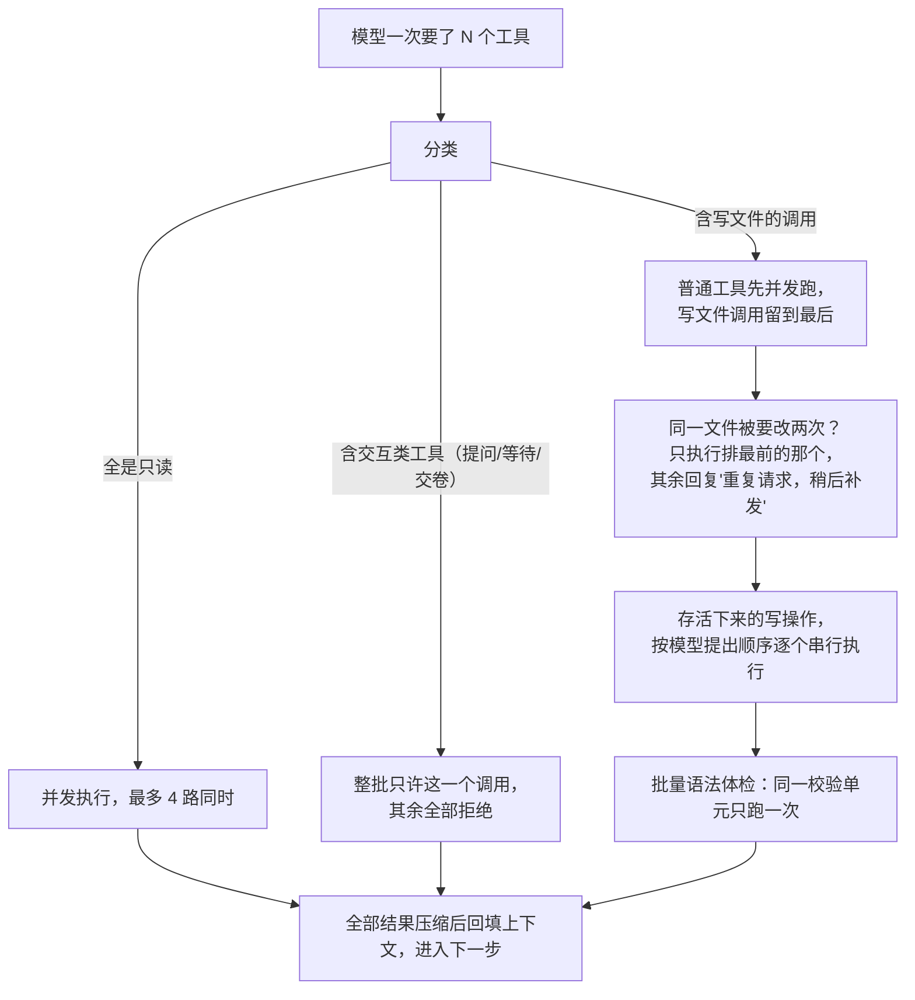

四条规则各有道理：

**交互工具必须独占一批。** 「提问」会暂停整个会话等用户回答，「等待」会挂起计时——它们和别的工具混在一起执行，时序就乱了。硬性屏障：这一批里出现它们，就只能有它们。

**读可以并发，写必须串行。** 四路并发读文件很安全，收益也大；但两个写操作并发执行，谁先谁后、中间状态给谁看，都是灾难。Ally 把文件写入留到批次末尾按顺序执行（全程持有一把文件操作锁），并且对「同一次回复里改同一个文件两次」直接判后者违规——两个编辑各自基于同一份快照，串行执行必然有一个建立在过期认知上，拒绝并让模型稍后重发比静默合并诚实得多。这与 Anthropic 多代理系统的经验一致：**并行读、串行写、显式去重**。

**一批之内先全员安检再动手。** 所有写操作在真正写盘之前整体过一遍校验（路径、指纹、重叠区间），任何一个不合格，整批取消、一个字节都不落盘。批量操作的经典纪律：要么全成，要么全不动。

**写后体检按单元合并。** 上一章的语法体检在批次场景下有去重：同一个校验单元（同一个包/工程）只跑一次、挂在批次里最后触碰它的调用上，输出的过滤范围却取整批所有相关文件——省时且不漏。

---

## 9. 失败是常态：重试、自愈与多把钥匙

长跑的 Agent 必然撞上：网络抖一下、模型服务 5xx、流断在半句话、对话历史被上一次的故障污染……Ally 把「失败」分成三类，各有各的治愈方案：

**「整轮重发」时为什么丢掉半截回复？** 因为流式回复断了就没意义——半篇文字接不上。界面会同步丢弃半截输出。但有个精细的例外：如果断之前模型已经把话说完了、只是收尾信号没到，已流出的文字会保留。原则是：**丢可以丢的（未完成），保必须保的（已完成）**。重试等待期间用户按了 ESC，则以取消收场（补中断标记、正常退出），不会重试到一半又悬在空中。

**「上下文病」的自愈最有趣。** 400 意味着服务方认为你发的请求本身不合法，常见根源是历史记录里藏着毒：比如某次故障让一次工具调用没有对应的结果消息（提问没有回答，模型方会认为协议被破坏，之后每一笔请求都被拒——整个会话报废）。修复器做四件事：给「没有回答的提问」补一条标记或直接删掉问题；删掉「凭空出现的回答」；把残缺的参数盖上「已损坏」印章；把被重复复读的函数名折叠回正常形态（有的中转会在每个流块里重发完整函数名，拼起来就成了「同一个名字重复 N 遍」，模型侧直接拒收）。修完重发，这个会话就救回来了——这一步**不消耗重试次数**，因为它修的不是网络，是请求本身。同样的修复逻辑在**读取旧存档时也会跑一遍**：历史上某个版本写坏的档案，打开时顺手治好。

**两类容易被忽视的坑也提前拦下了：**

- **模型明确说「写到上限被截断」或「被内容过滤拦下」的回复，绝不会被当成正常完成**——那样用户会看到一篇被腰斩的文章却毫无提示，模型也不知道要续写。这类回复以明确错误收场，走正常重试/报错流程。
- **多把钥匙（API Key 池）**：一个模型可配一串密钥，第一把用到坏为止，坏了自动换下一把；换下的进入冷却观察，恢复后再回岗。钥匙切换与重试的协调经过精心设计：单把钥匙的快速重试发生在最内层；**一旦配了多把钥匙，内层重试关闭**，由外层统一「先换钥匙、再整轮重试」——否则「每把钥匙各试三遍」的组合会让等待时间指数爆炸。每次切换都会广播给界面。

**崩溃也要优雅。** 执行工具的代码如果意外崩溃（写代码的人总有想不到），循环会把它捕获、包装成一条普通的工具错误返回给模型（同时记录调用栈供排查），而不是让整个程序倒下。模型看到错误还能换个办法继续。Agent 是长跑者，任何单点异常都不该结束整场比赛。

---

## 10. 提供商适配层：三种方言与一层翻译

模型供应商的接口没有统一标准。Ally 把所有方言的翻译收在一层里（核心循环和工具层完全不感知差异），支持三种 API 形态：

| 方言 | 说明 | 思考内容的形态 |
|------|------|----------------|
| OpenAI Chat | 事实标准，绝大多数国内外厂商/中转兼容 | 专用字段 `reasoning_content`，或正文里包 `<think>` 类标签（可配置解析） |
| OpenAI Responses | OpenAI 新接口 | 只有「思考摘要」的流式事件（拿不到原始思考全文） |
| Anthropic Messages | Claude 原生 | 原生思考块，类型标注明确 |

适配层统一负责这些脏活：

**流式解析与产出**。三种方言都是服务端推送事件流（SSE），适配器逐事件解码，把「正文增量 / 思考增量 / 工具调用增量 / 用量 / 结束原因」归一成统一的内部事件。有一个专门的**事件门控**：工具调用的增量参数在拼出可读片段之前不外发，避免界面闪烁半截 JSON。

**工具调用的增量合并与修复**。流式传输中工具调用是按碎片到达的（名字一块、参数一小段一块），适配器负责按序拼接。这里有两类著名的脏数据都被处理：中转站把「名字+参数」整包重发导致内容重复（去重合并，完全相同的碎片直接丢弃）；名字被复读成「同一个词重复 N 遍」（折叠回正常形态）。拼完再做一次「参数是合法 JSON 吗」的检查，残缺的盖「已损坏」章（第 2 章）。

**结束原因的语义化**。「正常说完」和「说到上限被掐断」「被内容过滤」在协议里是不同的结束码，适配器把它们翻译成「成功」或「明确错误」，绝不让截断的回复冒充完成（第 9 章）。

**用量提取**。各家的用量报告字段不一致，适配器统一解析成「输入/输出/缓存命中/缓存未命中」，没有报告时上层用本地估算兜底。

**多密钥池与重试的分工**见第 9 章。**思考内容的解析**按方言各有细节：Chat 方言默认认专用字段；用户也可在模型设置里指定一个标签名（如 think），适配器就会在正文流里解析 `<标签>…</标签>` 并路由到思考通道——解析器是跨块的（标签被拆在两个流块里也能认出来），支持一次回复里多段思考；Responses 方言只有摘要；Anthropic 方言按事件类型精确分类。

**网络与代理是适配层的另一半**：

- **代理三模式**：关 / 跟系统 / 手动。系统代理检测按平台各显神通（macOS 读系统配置、Windows 读注册表、Linux 读环境变量），配置式 PAC（自动代理脚本）明确不支持——诚实地拒绝比假装支持好。
- **fail-closed 原则**：代理解析失败时请求直接报错，**绝不悄悄绕过代理直连**——对有合规要求的用户，静默直连等于泄密。
- **内网守卫（SSRF）**：所有对外拨号默认拒绝私网地址（防「让模型抓个网页，结果它抓了你路由器的管理页」这类注入）；显式开启「允许私网」才放行（本地大模型用户需要它）；代理服务器本身永远放行。
- 连接池按代理配置缓存，代理设置变更立刻作废重建，并触发所有 MCP 远程连接重连（stdio 子进程也会继承新代理环境变量）。

---

## 11. 缓存与成本：让重复请求变便宜

这是全文最「值钱」的一章。Agent 的请求有个天然特点：**下一步请求 = 上一步请求 + 一点点新增**。对话循环几十步，每一步都把几乎相同的一大坨上下文重发一遍。主流模型厂商为此提供了**提示词缓存**：请求前缀若与近期某次请求逐字节相同，命中部分按一折左右计费、且响应更快。

这解释了 Ally 一系列看似古怪的设计：

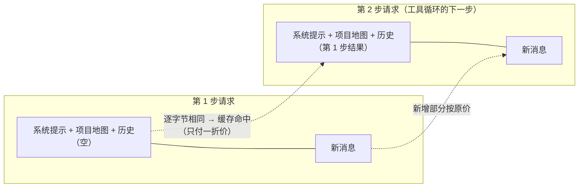

**为什么项目地图要在会话开始时冻结？** 如果每一步都重新扫描目录生成地图，文件系统任何风吹草动（编辑器保存个文件）都会让地图变一个字节——前缀缓存瞬间全部失效，每一步都付全价。冻结换稳定，过期信息用「列目录」工具补查。**这是一笔明码标价的交易：拿信息新鲜度换九成的输入费用折扣。**

**易变的为什么要放在最后？** 上下文预算提示、当回合附带的计划这类「每次都可能变」的内容，全部放在请求的最尾部。这样它们变了，也只污染缓存的最尾端（新增部分本来就按原价），前面的大头安然无恙。Anthropic 方言还支持显式声明「缓存断点」，Ally 把断点精确放在所有瞬态内容之前。

**为什么换密钥要谨慎？** 缓存通常按「谁发来的请求」隔离——换了钥匙，前面攒的缓存作废。所以主钥匙工作正常时绝不轮换，只在它失败时才切换（第 9 章）。省钱的细节都是环环相扣的。

**Responses 方言的服务端缓存**另有机制：服务端记住上次会话状态，适配器为每个会话维护一条缓存路由，让隐式缓存稳定命中同一前缀——同一思想在不同协议下的不同实现。

**账本同样分层**：供应商报了用量就用官方的（精确到缓存命中/未命中），没报就本地按字符数估算（容忍误差）；运行结束时汇总总账广播给界面；同时一条**异步有界队列**把每步用量按天落盘（保留 90 天、损坏自动从备份恢复），统计页能看每天、每个模型、每个工作区花了多少。记账绝不阻塞主流程——队列满了宁可丢数据也不拖慢对话。

> **延伸思考**：提示词缓存是 Agent 成本结构的分水岭。同样一个循环，「每步重排上下文」和「每步稳定追加」的账单可以差一个数量级。学习 Agent 开发时，把「上下文是否逐字节稳定」当成和「功能是否正确」同级的验收标准。

---

## 12. 上下文压缩：给记忆做减法

对话越滚越长，窗口总有装不下的一天。Ally 的策略是双管齐下：**先节流，再压缩**。

节流靠前面的机制：历史按 token 预算裁剪、上下文预算警报引导模型少拿大数据、工具结果进历史前已按工具定制压缩。这些让「增长速度」慢下来。

压缩（compact）则是「主动清账」：请模型把漫长的对话**总结成一份摘要，用摘要替换原始历史**，然后从精简的状态继续工作。触发方式两种：

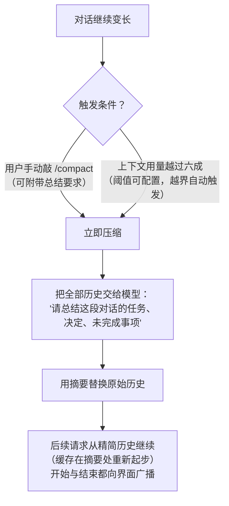

几个实现细节值得注意：压缩是一次**同步的模型调用**（界面显示压缩中，直到总结完成才继续），用户可以附带自己的总结要求；压缩期间会话不可并发干别的（单运行约束天然保证了这点）；压缩后的第一笔请求缓存从摘要处重新起步——前半段缓存的损失是压缩的固定成本，因此「越晚压越好」。

值得注意的取舍：**压缩有损**。摘要丢掉的字节里可能藏着后面需要的细节（某个报错原文、某个文件的具体行号）。所以 Ally 不敢激进：默认阈值设在六成，而且总结要求里明确「任务、决定、未完成事项」是必答项。业界（包括 Claude Code 的 /compact）共识相同：压缩是必要的恶，越晚做越好，做的时候要告诉模型「哪些信息类别必须保留」。

---

## 13. 会话持久化：三份档案

档案室为每个会话维护三样东西，各有分工：

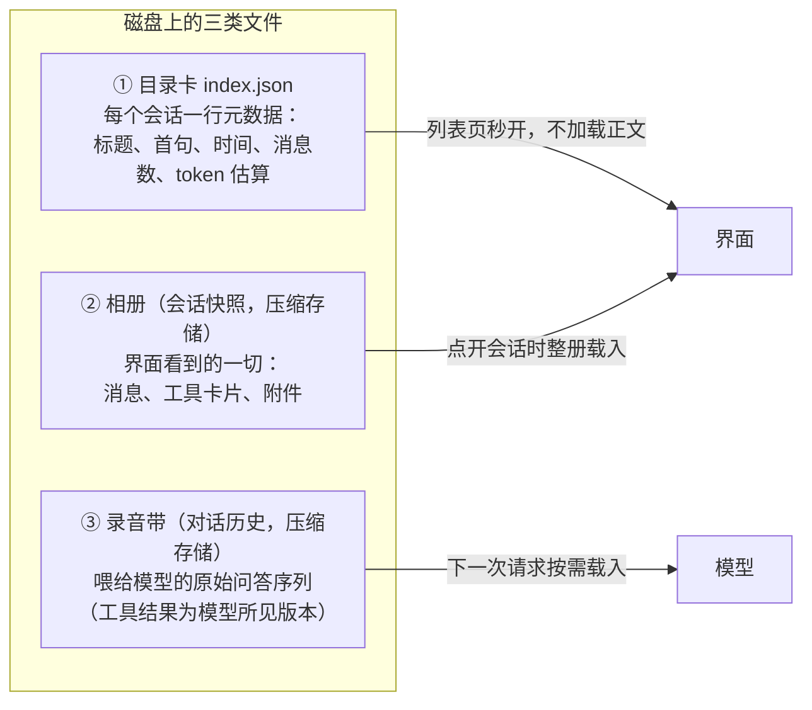

三份档案各自的纪律：

**目录卡轻若鸿毛。** 列出所有会话时只碰目录卡，绝不打开相册——几百个会话的列表也要秒开。目录卡有条目上限（两千），满了按最近活跃时间淘汰最旧的，但**只从目录里除名，不删文件**——下次扫描磁盘时它还能被重新发现。删除数据要慎之又慎。目录卡还有自愈能力：损坏时降级重建（从磁盘上的相册/录音带反向恢复），发现只有录音带的「裸会话」也会补录进目录，旧格式的首句、消息数等元信息缺失时顺手补齐并回写。

**相册与录音带分离。** 给人看的（带格式、带卡片、可能很大）和给模型看的（纯问答序列）分开存。相册单册超过 16MB 直接拒收——再好看的相册也不能撑爆内存。**相册只在回合确认完成或元数据变化时写入**，流式中间态绝不落盘——半截的相册没有意义。

**录音带落盘前必过修复器与裁剪器。** 第 9 章的自愈逻辑在这里复用：先修复（补孤儿、去重复、盖截断章），再按 token 预算裁剪（从旧的用户消息边界裁，绝不把一轮对话腰斩），最后压缩落盘。三条写盘纪律：系统提示词永不入库（每次请求重新拼，省空间且不会过期）；工具调用与模型所见结果**原样**保存（这是回放正确性和缓存命中的根基）；多模态消息降级成文字摘要再存。**修复器是「先治病、再入档」——带毒的历史一旦存下来，会感染之后的每一次请求。**

**前端还有一层自己的缓存**：浏览器 IndexedDB 存相册的本地副本（串行写队列防写乱），会话列表的轻量状态放在浏览器本地存储里（有 240KB 预算——超大工具预览、附件数据在入缓存前剥除）。前后端两套存档互为备份，界面的会话切换、崩溃恢复都靠它们。

---

## 14. 计划、提问与交卷：会话内的交互工具

有一类工具不产出数据，而是**改变循环本身的走向**。它们的共同纪律是「一批之内只许一个」（第 8 章），各自的设计值得单看：

**计划工具（plan）是模型的自我导航。** 模型用它维护一份任务清单，规则很严：同一时刻最多一项「进行中」，做完一项标完一项才能开下一项。每次调用的结果都携带**更新后的完整清单**并随历史持久化——模型在后面每一步、每个回合都能看到最新进度，循环层不需要每步重复注入（第 3 章）。新用户回合开始时，当前计划作为临时上下文附一次。界面上计划渲染成常驻面板，「进行中」的那项居中高亮。这套机制是对「长任务失焦」的直接解药：模型 wanders off 时，清单在眼前。

**提问工具（ask）让模型主动喊停。** 模型拿不准需求时，可以一次提出多个问题（每个问题一个选项卡，支持多选和自定义回答），整个运行**阻塞**直到用户提交全部答案或取消运行（取消返回明确的「提问被取消」错误，模型知道不是拒绝回答）。它只对可见的主会话开放——子代理和无人值守任务没有资格打扰用户（第 17 章）。

**交卷工具（suggest）是体面的收尾。** 模型认为任务完成时，提交 1～4 条「你可以继续问……」的快捷追问按钮。它是一张「暗牌」：界面上不显示工具卡（对比：其他工具都有运行卡片），单次成功调用即结束整个运行。把「结束权」做成一个工具而不是循环里的猜测逻辑，是个聪明的解耦——模型自己决定何时收工，循环只负责执行决定。

**等待工具（wait）是可控的暂停**（1～3600 秒，可被取消），用于轮询外部状态（等服务起来、等构建完成），替代「疯狂空转重试」。

---

## 15. Skill 机制：先递名片，再掏手册

Skill 是给模型装「临时专业模块」的机制：一份带封面信息的手册（Markdown + 前置元数据），教模型在某类任务上按特定流程操作（比如「操作浏览器」「把 Office 文档转 Markdown」「维护代码图谱」）。

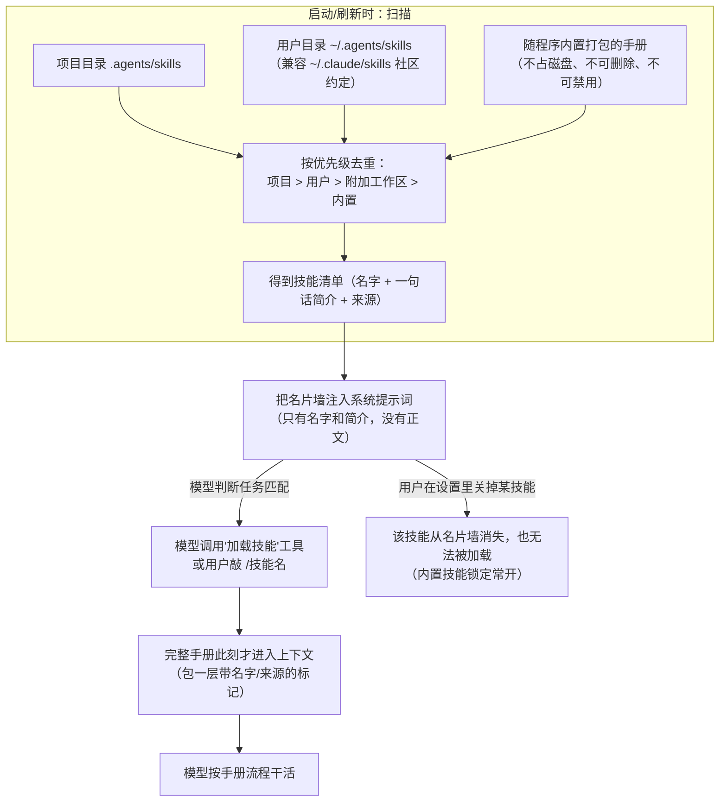

**手册的三种物理形态都被支持**：目录式（`技能名/SKILL.md`，可携带脚本等附属资源）、单文件式（`技能名.md`）、内嵌式（随程序打包）。元数据统一从文件头的 YAML 区解析：名字、描述、类型、适用时机（兼容两套字段命名——Ally 原生驼峰和社区标准的下划线，原生拼法优先）；连元数据都没有时，文件名兜底当名字。社区标准的其他字段（工具白名单、上下文注入方式等）暂被忽略——**兼容生态先做到「认得出、读得了」，不假装全支持**。

设计的精髓在**两段式注入**：

1. **名片墙常驻**：几十个技能每个只占一行，模型随时知道自己「会什么」；
2. **手册按需**：真正干活时才加载全文，用完这一轮就过去，不占长期上下文。

这与社区 Agent Skills 标准同构（Ally 直接认 `.claude/skills` 目录约定，别的工具放进去的手册 Ally 立即可用），也和「检索增强」的思想相通：**与其问「什么该进上下文」，不如把知识做成可检索、可装载的小单元**。此外，名片的「一句话简介」写得好不好，直接决定模型会不会在正确的时机想起它——写技能时最值得打磨的就是这一句。

**一键全关**有个细节：批量禁用不得波及内置技能（它们在界面里就是锁死的），替换禁用名单时还要顺手把老配置里误关的内置技能放出来——迁移旧数据时的兼容义务。

---

## 16. MCP 机制：外接设备的通用插口

MCP（Model Context Protocol）是工具生态的通用标准：任何程序按协议暴露自己的能力，Agent 就能即插即用地使用。Ally 作为 MCP 宿主（客户端方）：

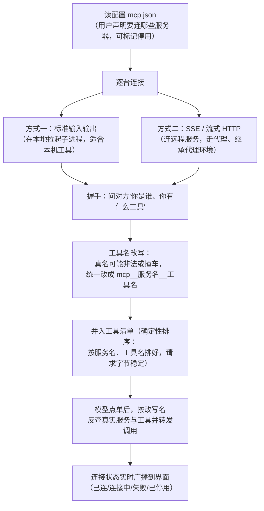

几个运维细节体现「最小扰动」原则：

- **配置变了用「调和」而不是「重启全部」**：只重连增、删、改过的服务器，没动的保持连接、工具注册原样保留。批量重启会让所有外接工具瞬间断线，正在用的模型上下文里那些工具全部失效。
- **例外是代理设置**：网络代理变了，所有远程连接的传输层都得换，此时才全量重启。
- **配置文件坏了要大声说**：`mcp.json` 解析失败不是静默清空，而是广播一条配置警告——用户的工具清单凭空消失却不解释，是最糟糕的失败方式。
- **失效自动重连**：连接坏了（超时、进程死了）的会话在下次调用时走统一的重连通道，子代理也一样。

外接工具的说明书（schema）保持原样并入请求；名字经过净化改写后建立双向映射（模型用的假名 ↔ 真实的服务+工具）。外接工具的结果同样受输出上限约束（外来的输出同样不能无限灌进上下文），连接失败、工具报错都以统一信封回给模型，模型能看到「这个工具坏了」并决定绕行。

> **延伸思考**：MCP 解决的是「N 个 Agent × M 个工具」的集成爆炸问题——工具方写一次适配，所有 Agent 可用。学习时把它理解为「AI 时代的 USB-C」即可；实现上要记住三件事：名字空间隔离（`mcp__服务__工具`）、「外部输入一律限额」、以及**工具清单的确定性排序**（排序变了，请求字节就变了，缓存就没了——又是第 11 章的那笔账）。

---

## 17. 子代理与计划任务：分身与闹钟

主循环是单线程的演唱会，但有些活适合包给「分身」，有些活适合交给「闹钟」。

**子代理**：主 Agent 把一个边界清晰的任务（「调研这个目录的所有测试文件」）连同角色名和预算（默认 25 步，上限 1000）打包，派给一个全新的 Agent 实例。同时最多养四个分身。

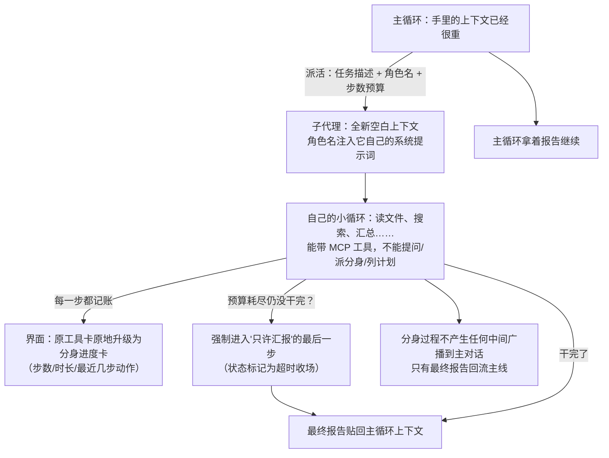

这里体现的是**上下文隔离**：调研过程产生的几十次工具调用、几万字的中间结果，全部留在分身的上下文里「烧掉」，主循环只收到浓缩结论。如果这些中间过程全部涌入主循环，主上下文会迅速被撑爆——分身就是一次性的「上下文焚烧炉」，只回传灰烬里的钻石。

工程细节：分身的生死和主人绑定（主任务被叫停，分身随之收工；界面也能单独停某个分身）；分身完成后的记录只保留有界的内容（每个最多留一百条工具事件，全局最多留最近五十条完成记录，运行中的永不清理）；分身拿到的工具说明书与主循环同源（包括 MCP），但排除了一切「改变循环走向」的交互工具。

**计划任务**则是定时闹钟：用户登记「每天早上九点检查依赖更新」这类任务（支持 cron 表达式、固定间隔、一次性三种触发方式），到点后 Ally 用**全新空白上下文 + 固定工作区**独立执行。铁律：全局串行（一次只跑一个，绝不重叠）、每轮有步数与时长上限（默认一百步一小时，最多一千步二十四小时）、跑完只保留一小段摘要与错误信息（旧记录清场）、只存活于当前进程（重启即清空——定时任务的宿主是进程不是磁盘）。它的执行同样不发流式广播，与聊天的关系是彻底隔离的。

---

## 18. 安全边界：给实习生立规矩

Agent 能读写文件、能执行命令，等于把实习生请进了机房。Ally 的安检哲学是：**不靠黑名单堆砌，靠理解意图**。所有写操作共享「四道闸」：

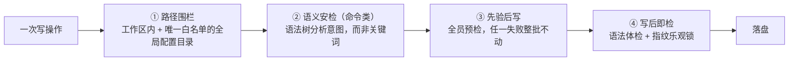

**命令安检不用关键词匹配，用语法树。** 拦截「执行用户没批准的 shell 命令」时，天真做法是正则匹配危险词（`rm`、`format`……），马上就能被 `r""m`、变量拼接、嵌套引号绕过。Ally 把命令先解析成 Bash 语法树，理解「这是个嵌套调用」「这是重定向，目标是这个文件」「这是多行输入块（heredoc），内容是数据不是命令」，然后基于**语义**判断。几条精细的分寸：

- 命令要写/删的目标如果是工作区外的**已存在**文件，拦截并给模型返回人话解释（哪里违规、检测到的目标是什么、该怎么改）——错误信息本身就是教学，模型下一次就改对了。
- 读外面的文件放行、写**新**文件放行、改外面的**旧**文件拦截；删除操作只能走受管通道（专用删除工具），shell 里夹带的删除一律拦。
- 多行输入块的内容按「数据」对待（带引号的定界符完全字面，不带引号的只检查里面的命令替换）——防止「把恶意命令藏在文本里骗过检查」。
- 解析不出目标的（变量、通配符）**放行并记录**——安全策略宁可明确地松，也不含糊地假严；含糊的拦截会让模型学会绕路，明确的规则才能让它配合。
- Windows 下额外识别两种路径写法（`C:\...` 与 bash 风格 `/c/...`）——Git Bash 里的路径是 MSYS 风格的，只认一种就会漏。

**路径围栏**是所有工具共用的（在第 6 章的路径解析层统一实现，不是每把工具自己抄一份）：写操作限定在工作区 + 附加工作区，唯一例外是全局配置目录（记忆、配置需要写到用户主目录下）。围栏检查和路径解析是同一个函数——**安全和功能共用一份实现，才不会改功能时漏了安全**。

**网络守门**：SSRF 防护（默认拒私网，第 10 章）、HTTP 工具的响应大小/超时/重定向次数上限、跨域重定向时剥掉带密钥的请求头（Authorization 之类不该跟着跳转到别的域）。

**界面侧的沙箱**：模型生成的 HTML 在沙箱 iframe 里渲染（禁外链、隔离源，第 5 章）；Markdown 里的链接全部经系统浏览器打开而不在应用内跳转。

---

## 19. 前端与事件流：只把重要的事说出来

后端每一步都在广播事件。Ally 的事件是**全量目录化**的：运行生命周期（开始/等待模型/流式增量/结束/出错/重试/消息注入/压缩前后）、每个工具的（开始/进度/结果/出错）、计划更新、提问收发、MCP 状态、调度任务与后台服务的生命周期、token 账单、更新进度、配置警告……**每条事件都带会话 ID 和运行 ID**，界面按这两个坐标路由——多开会话 Tab 各看各的流，互不串台；终止类事件只有运行 ID 仍匹配当前运行时才被接受（迟到的旧事件会被丢弃）。

如果不加约束，一秒钟几百条事件会把界面渲染拖死。Ally 的做法是**两端各设一道减速带**，且只给真正高频的两类事件设：

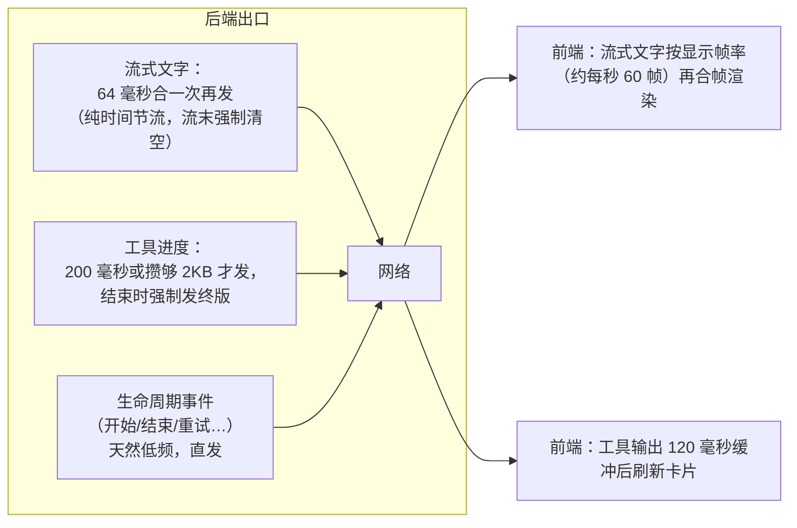

三层节流加起来，模型每秒吐几千字的流被压缩成每秒几十次的界面更新。值得学的不是具体数字，而是**分层节流的思路**：后端限「发」的频率，前端限「渲染」的频率，两层各自独立可调；低频事件绝不节流（保实时性），高频事件绝不直发（保流畅性）。

界面本身还有一整套渲染纪律，每个都对应一类真实痛点：

- **消息区常驻不重建**：每个会话 Tab 一个永久挂载的消息列表，切 Tab 只是隐藏——切换不丢滚动位置、不重渲染。
- **工具卡片按签名重绘**：每张卡片的渲染签名（关键字段拼串）没变就跳过——几百张卡片的长会话里，只有变化的那张重画。工具卡的动词文案（"读取了/编辑了/运行了"）由一张以**后端原始工具名**为键的动词表驱动，查不到就退化成"使用了 X"——这是个真实的回归案例，教训是「新增工具必须同步登记动词条目」。
- **Markdown 渲染有缓存**：完成的消息缓存渲染结果；流式中的消息绕过缓存（每帧都在变）。
- **大图按需渲染、按需卸载**：Mermaid 图表只在滚近视口时才渲染；滚远了就卸载 DOM、把结果存进一个小型 LRU（16 张 / 2M 字符），滚回来再恢复。拖拽缩放的指针事件合并到每一动画帧只写一次。
- **超长历史归档**：几万条消息的会话在界面上把最老的部分折叠成占位符（底层数据不动，只是不渲染）。
- **附件预览用可撤销的临时地址**：原始数据只在需要喂模型时保留，会话关闭即释放内存。
- **双语文案单一来源**：全部界面文案集中在一张翻译表里（中/英），跟随系统语言；但模型输出、文件内容、命令输出永不翻译。

---

## 20. 配置与凭据：谁管什么

Ally 的持久化状态分散在几个文件里，各管一摊、互不渗透：

| 文件 | 管什么 | 特点 |
|------|--------|------|
| `~/.ally_agent/config.json` | 模型与密钥、工作区、界面偏好、代理、校验开关…… | 整体读写；合并规则有唯一边界：**非空字段才覆盖**（老配置缺字段不会被新默认值冲掉），少数三态开关用「指针字段」区分「没填」和「填了 false」 |
| `~/.ally_agent/mcp.json` | MCP 服务器清单 | 独立文件，坏了会显式警告 |
| `~/.ally_agent/api.json` | 本地 API 服务的端口与 Token | 独立文件；服务开关是运行时状态，每次启动默认关闭 |
| `~/.ally_agent/sessions/`、`histories/` | 第 13 章的三份档案 | 压缩存储、原子写 |
| `~/.ally_agent/memories/` | 用户长期记忆 | 在写路径白名单里，模型可直接维护 |
| 项目内 `.ally/lessons.md` | 项目教训 | 用户可见可改的普通文件 |

几条值得学习的原则：

- **密钥明文存在本地配置里**（桌面应用的常见取舍：不引入系统钥匙串依赖，换取零配置），但**对外接口（API 服务、统计、日志）一律脱敏**——返回模型清单时只给「是否配置了密钥、几把」，永不回传明文。
- **配置合并只有一个边界**：所有「老配置 + 新输入」的合并集中在一处做，别的层只消费合并结果——规则散落各处必然出现「某处忘了兼容旧字段」。
- **启动时清理遗产**：废弃的旧配置文件、过期的临时文件，启动时顺手清掉，并保持对新文件的写入原子性（先写临时文件再改名，崩溃也不会留下半截配置）。

---

## 21. 外围设施速览

以下模块不参与核心循环的认知，但完整了产品形态：

- **本地 HTTP API 服务**：可选开启（默认关闭），仅监听本机回环地址、固定 Token 鉴权（常量时间比较），把会话、模型、MCP、Skill 管理暴露成 28 个 REST 端点，让外部程序（CI、脚本、其他工具）驱动 Ally。全部端点是对既有内部能力的薄封装，不引入新业务逻辑。参数文档见 `docs/api.md`。
- **自更新**：检查发布 → 下载 → 校验 → 原子替换 → 失败回滚；支持跳过某个版本；更新后的重启借助平台辅助进程完成。用户可选关闭自动下载。
- **桌面通知与提示音**：任务完成/出错/取消时提醒（仅在窗口最小化时打扰，有 700ms 冷却防轰炸）。
- **任务栏进度**（Windows）：运行中显示进度条，完成后未激活窗口会闪烁提醒。
- **局域网游戏区**：与 Agent 完全隔离的彩蛋模块（联机棋类/牌类，房间令牌 + 加密通道 + 房主权威模式），证明核心与外围的隔离做得足够干净。

---

## 22. 测试与验证：怎么证明 Agent 没坏

Agent 的正确性测试有个天然难点：核心循环横跨「模型（不可控）→ 工具（本地）→ 持久化（磁盘）→ 事件（异步广播）」。Ally 的策略是**分层测 + 边界测 + 真入口测**：

- **纯算法层单测**：编辑差异应用（含各种缩进/模糊/重叠边界）、命令语法树分析（绕过手法的样本库）、编码转换、调度计算——这些不碰任何上层，测起来最快、覆盖最密。
- **核心层用「可捕获的事件口」测**：核心对外的一切广播都走一个抽象出口，测试时换成记录器——于是「运行中重试/取消/空响应」「注入消息顺序」「压缩」这些跨异步的复杂行为都能确定性断言，不需要真的跑界面。
- **端到端走真入口**：关键契约（编辑的完整行为、批次冲突、工具调用修复）的测试**从和产线完全相同的入口进入**，而不是绕过编排层直接调内部函数——「单测绿了、线上还是坏」的最大根源就是测试走了捷径。
- **契约快照**：工具说明书的结构（严格模式、必填项）有专门的测试盯防——模型侧的兼容性靠它兜底。
- **验证命令只有一个**：一条构建命令同时编译后端、构建前端、产出桌面程序——「唯一验证命令」让「跑一遍验证」这件事永远不需要思考。

> **延伸思考**：给 Agent 写测试时，最容易漏的是**故障路径**（流截断、历史带毒、密钥失效、进程崩溃）。Ally 的经验是：每一种线上出过的事故（第 9 章的自愈能力几乎全部来自真实事故）都对应一条回归测试——故障不是异常路径，是 Agent 的日常。

---

## 23. 对照与反思：Ally 的选择 vs 业界共识

把 Ally 的机制映射到 Anthropic《Building Effective Agents》的模式分类：

| 业界模式 | 一句话 | Ally 对应物 |
|----------|--------|-------------|
| 增强型 LLM（基础积木） | 模型 + 检索 + 工具 | 上下文装配线 + 工具箱 |
| Agent（自主循环） | LLM 在循环里按环境反馈用工具 | 第 2 章核心循环 |
| 并行化 | 同时发多个独立调用 | 一批内最多四路并发工具；四个并行分身 |
| 编排者-工人 | 主 LLM 派活给子 LLM | 子代理（独立上下文 + 步数预算 + 只回报告） |
| 提示链 / 路由 / 评估者-优化器 | 固定代码路径的工作流 | 不内置——Ally 是纯 Agent 形态，工作流留给用户用 Skill/计划任务自建 |

**做得好、值得抄的：**

1. **前缀字节稳定作为一等公民**（冻结地图、瞬态置尾、缓存断点、工具清单确定性排序、多 Key 不轻换）——大多数教程只字不提，但这是真实成本的分水岭。
2. **会话级自愈**（历史修复器 + 参数截断标注 + 崩溃隔离 + 目录卡降级重建）——长跑 Agent 的可靠性来自「假设一切都会坏」。
3. **信息分层双通道**（界面全量 / 模型压缩，且压缩规则按工具定制）——同时伺候两种受众。
4. **渐进式披露**（Skill 名片墙、记忆索引、按需加载）——上下文体积的手艺。
5. **写入四道闸与乐观锁编辑**——把「快速反馈」和「安全」同时做进工具层。
6. **上下文隔离的子代理**——并行性与上下文卫生兼得。
7. **错误信息即教学**（安检拦截时附「违规原因 + 改法」，让模型下一次自己改对）——把模型当成会学习的执行者而不是被管教的机器人。

**可以商榷、或有代价的：**

1. **主循环上限近万步**：把停止决策交给模型与用户，流畅但不可预测；预算敏感的场景应默认更小并允许放大。
2. **会话内单运行串行**：换来历史一致与缓存友好，代价是同会话无真并行；靠子代理弥补，但子代理无法与主循环同时对话。
3. **压缩有损**：阈值与总结清单缓解，但长程细节（早前的报错原文）仍可能丢失；更进阶的做法是压缩前把关键事实写入持久笔记（记忆机制已提供此出口，但未强制关联压缩流程）。
4. **token 用量部分依赖本地估算**：供应商不报用量时数字是近似值，统计图表要容忍误差。
5. **工作区地图按会话冻结**：会话很长时地图可能明显过时，依赖模型主动用列目录工具纠偏——对不主动的模型，可能需要更强的提示。
6. **交互工具的独占屏障**是硬规则而非模型提示：模型偶尔会违规混合调用，收到的是拒绝而非引导（不过拒绝信息本身也附了原因）。
7. **思考内容解析对厂商形态敏感**：方言差异和厂商实现不一致（字段 vs 标签 vs 无标注）会让思考显示不稳定——这是整个行业的兼容性泥潭，见第 10 章。

**如果你要自己写一个 Agent，最小可行清单**：一个带取消与步数上限的循环 → 一套严格 schema + 宽容解码的工具 → 结果压缩与输出限额 → 历史持久化 + 修复 → 重试与退避 → 前缀稳定的上下文装配 → 会话级单运行约束。Ally 的每一章都是在为这七件事补细节。

---

## 24. 参考资料

- Anthropic, *Building Effective Agents* —— Agent 与工作流的分野、五模式、「保持简单」的总原则：<https://www.anthropic.com/engineering/building-effective-agents>
- Anthropic, *Writing Effective Tools for Agents* —— 工具说明书设计、为模型优化接口：<https://www.anthropic.com/engineering/writing-tools-for-agents>
- Anthropic, *How We Built Our Multi-Agent Research System* —— 编排者-工人、并行子代理、上下文交接的工程教训：<https://www.anthropic.com/engineering/multi-agent-research-system>
- Anthropic, *Effective Context Engineering for AI Agents* —— Write/Select/Compress/Isolate 的上下文工程框架、压缩与记忆做法：<https://www.anthropic.com/engineering/effective-context-engineering-for-ai-agents>
- Yao et al., *ReAct: Synergizing Reasoning and Acting in Language Models* —— 「思考-行动-观察」循环的学术源头：<https://arxiv.org/abs/2210.03629>
- Model Context Protocol —— 工具生态的通用协议规范：<https://modelcontextprotocol.io>
- 本仓库 `AGENTS.md`（行为规范与不变式）、`CODEGRAPH.md`（功能→文件速查）、`docs/api.md`（对外 API 参数）

