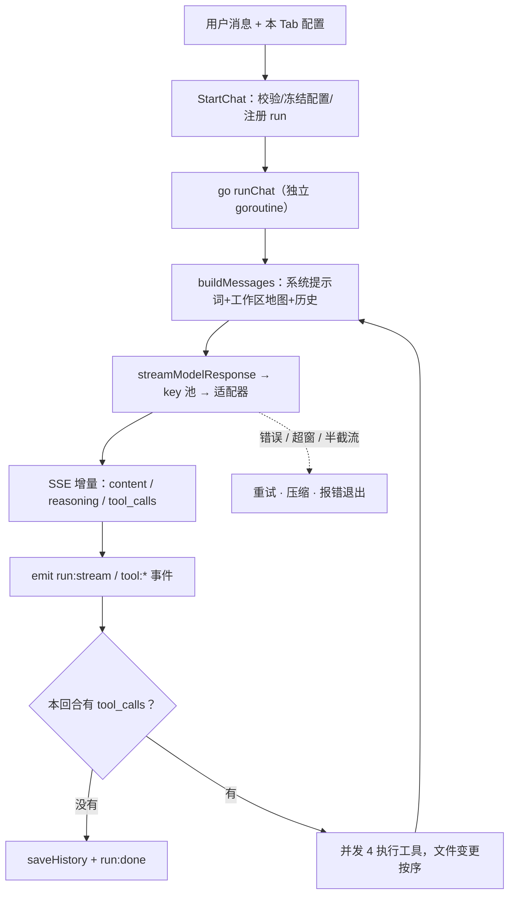

# Ally Agent Core：主循环代码导读

> 本文只依据当前工作区源码撰写（不依赖其它文档），按「一次 run 的真实执行顺序」讲清 agent 主循环。
> 行号基于撰写时的工作区版本，重构后可能漂移；定位以「函数名 + 文件」为准。

## 0. 一句话概括

Agent core = `internal/app/app.go` 的 `runChat` 里一个 `for step := 0; step < 9999; step++` 循环（`app.go:1794`）：

> 组装消息 → 流式请求模型 → 判定本回合是否结束 → 若模型要调工具就把工具结果塞回消息列表 → 下一步重发。

**唯一真实状态是 `messages []openai.ChatCompletionMessage`**（`app.go:1739`），前端只是事件流的投影；上下文不是从 UI 恢复，而是每步由后端重新拼出（`app.go:1855`）。

## 1. 分层：谁负责什么

| 层 | 位置 | 职责 |
|---|---|---|
| 编排 | `internal/app/app.go`（`runChat` / `executeTool`） | 循环、消息列表、工具分发、事件发射 |
| 协议适配 | `internal/app/prov_model.go` | 三种 API 格式的请求构造与流式解析（协议脏代码唯一聚集区） |
| 纯算法 | `internal/tools/*` | 工具实现（不认识 `*App`） |
| 宿主桥 | `internal/app/host_*.go` | `emit()` 把事件发给前端（唯一允许 import Wails 的地方） |

关键约束：`runChat` 只认识 `modelStreamResult`，不认识任何 provider wire 结构。

## 2. 一次 run 的时序



## 3. 入口：`StartChat`（`app.go:1412`）

薄入口，只做四件事：

```go
cfg := a.effectiveConfig(req.Config)       // 本 Tab 配置覆盖（模型 / baseURL / key 池）
runID := newID()
ctx, cancel := context.WithCancel(context.Background())
a.runs[runID] = cancel                     // 注册取消句柄
a.runInputs[runID] = make(chan string, runInputBufferSize) // 32，运行中追问注入队列
go a.runChat(ctx, runID, req, cfg)
return runID, nil                          // 立刻返回，前端靠事件推进
```

设计点：

1. **同步入口、异步循环**：`StartChat` 只校验（模型 / key / 工作区）并注册，立即返回 `runID`；取消 = `cancel()`（`app.go:1504`）。
2. **配置在入口冻结**：`sessionWorkspaces` / `sessionModelConfigs`（`app.go:1435-1455`）记录本 session 实际使用的模型连接字段，因为 Tab 的模型选择不落盘，而 run 之外的调用（手动压缩）也必须用同一套连接参数。
3. **会话级单 run 守卫**（`app.go:1464`）：同一 session 不允许两个并发 run，否则交叉 `saveHistory` 会打乱消息顺序；运行中的追问走 `InjectRunMessage`（`app.go:1530`）入队，不新开 run。
4. **注入消息在步边界进入上下文**（`app.go:1810`）：当前工具批次跑完后、下一个模型请求前追加，因此模型下一回合才看到它。

## 4. 组装请求：`buildMessages`（`biz_context.go:943`）

```go
messages = a.buildSystemContextMessages(...)          // system 提示词 + 工作区地图
messages = append(messages, a.loadSessionHistoryCopy(sessionID)...)
messages = appendUserMessageWithAttachments(messages, req.Message, req.Attachments)
return downgradeUnsupportedImages(messages, cfg)      // 不支持图片的模型 → 文字占位
```

两个贯穿全局的原则：

- **系统提示词按 session 冻结**（`biz_context.go:1091`）：它内嵌 memory 索引、`AGENTS.md`、`CODEGRAPH.md` 等磁盘内容，而 agent 自己会写这些文件；每步重拼会让请求前缀从第一个字节起失效，供应商 prompt cache 全线作废。
- **瞬态注入只放最新用户消息之前、且只放一次**（`app.go:1852` + `appendTransientTailForUserTurn`）：位置稳定，前缀才稳定。

## 5. 调用模型：`streamModelResponse`（`prov_model.go:453`）

本身不解析协议，只负责 **多 key 故障转移 + 统一重试预算**：

- 单 key：直通适配器，重试由适配器内部负责（`prov_model.go:469`）。
- 多 key：循环取「第一个不在冷却期的 key」，失败按错误类别记冷却（认证/配额 30min、瞬时 10s）后顺延；**一旦已产出任何流事件就禁止换 key**（`emitted`，`prov_model.go:548`），否则用户会看到重复输出。
- 重试次数唯一来源是设置项「LLM 请求重试次数」（`effectiveLLMRetries`）；多 key 路径设 `noAdapterRetry=true` 关掉适配器内退避，避免两层重试组合爆炸。
- 按 `APIFormat` 分发（`prov_model.go:653`）：`streamOpenAIChat` / `streamOpenAIResponses` / `streamAnthropicMessages`。

## 6. 流式解析与工具调用归并（`prov_model.go:932` 起）

主循环逐帧 `stream.RecvRaw()` 读 SSE（`prov_model.go:988`），每帧解成 delta 后分三路：

| 增量 | 去处 |
|---|---|
| `delta.Content` | `assistant` builder + 发 `ContentDelta` |
| `delta.ReasoningContent` / `reasoning_details` | `reasoning` builder / 思考台账（下轮回灌），发 `ReasoningDelta` |
| `delta.ToolCalls` | `toolAcc.merge(...)` 累积（`prov_model.go:1111`） |

### 6.1 工具调用归并规则（`prov_model.go:3319` `resolve`）

**id 才是身份，index 只做定位**：

- 带 id 且该 id 未被任何未完成调用占用 → 新调用（`toolCallAppend`）；若 index 仍指向一个「id 还没到」的合成调用，则把 id 认领给它（`toolCallAdoptID`）。
- 不带 id 时才用 index 定位续片。
- 无 id、无可用 index → 归给最新那个未完成调用；连名字都没有的空碎片直接丢弃，不新建空调用。
- 该碎片报的工具名与当前累积名「接不上」→ 它是另一个调用（`nameContinues`）。
- id 唯一性由 `toolcall.CallIDFoundry` 集中铸造（重复变 `id__2`、缺失则铸造、按历史播种），所以中转每回合复用 `call_0` 也不会产生重复 id。
- 累积器必须**跨整条流存活**：只带 index 的碎片要靠表跨块匹配。

### 6.2 终止判定必须显式（`prov_model.go:996`）

go-openai 把 `[DONE]` 与「连接在帧边界被切断」都归一成同一个 `io.EOF`。所以判定要求 **`finish_reason` 或真实 `[DONE]` 至少有一个**：

- `[DONE]` 由 transport 上挂的 `sseDoneReadCloser` 在 body 流经时记录（`prov_reasoning.go`，匹配规则与 SDK 一致：`^data:\s*` 归一化后比较 `[DONE]`，且支持跨 Read 的残余窗口）。
- 每次 attempt 开始要 `reset()`，否则上一次失败读到过的 `[DONE]` 会让下一次被截断的重试通过判定。
- 两者都没有 → `errChatStreamNoFinishReason`，已产出内容时交由 runChat 整轮重试，半截答案绝不入库。

### 6.3 到前端的流式节流

`runStreamDeltaEmitter`（`infra_stream.go:24`）把 content / reasoning 合并为单个 `run:stream` 事件，**64ms 一次**（≈15FPS）；reasoning 只发字符数（`reasoningLen`），正文不回传，减少 Wails IPC 开销。工具参数增量由 `modelToolCallEventGate` 限流（`infra_stream.go:114`），完整参数在 provider 返回后由 `forceEvents` 补齐。

## 7. 回合判定：循环继续还是结束

模型返回后依次看三件事：

```go
if stopErr := modelResponseStopError(cfg, modelResp); stopErr != nil { ... } // ① 供应商级终止原因
if len(toolCalls) == 0 { ... saveHistory; run:done; return }               // ② 无工具调用 = 结束
// ③ 有工具调用：追加 assistant(tool_calls) → 执行工具 → 下一 step
```

- ① `prov_model.go:2214`：`length`（撞 max_tokens）、`content_filter`、Anthropic 的 `refusal` / `max_tokens` / `model_context_window_exceeded` 带 usage 报错退出；`stop` / `tool_calls` / `end_turn` / `pause_turn` 等为正常值。
- ② 结束前再抽一次注入队列（`app.go:2038`）：若用户刚追问过就 `continue` 再跑一步，避免带着未读的用户消息结束。
- ③ `app.go:2054`：追加的 assistant 消息带 `ToolCalls`，这是下一轮请求里「模型看到自己调过什么」的依据。

## 8. 工具执行：并发但不乱序（`app.go:2064-2178`）

```go
toolSem := make(chan struct{}, 4)                          // 并发上限 4
toolConflicts := detectToolBatchConflicts(cfg, toolCalls)  // 同路径多次写：只执行最早一个
// 第一遍：非文件变更工具并发执行，每个完成即刻 emit tool:result / tool:error
// 第二遍：文件变更工具按调用顺序串行执行
// 最后：按 tool-call 顺序把结果 append 成 role=tool 消息
```

刻意的取舍：

- **文件写必须串行且有序**：`isOrderedFileMutationTool`（`orch_batch_policy.go:24`，覆盖 `edit` / `create` / `delete` / `remote_edit` / `remote_create_file` / `remote_delete_path`）是唯一判定点；同批次对同一路径的第二个写请求判 `E_WRITE_BATCH_CONFLICT` 跳过，让模型等结果后重发。
- **结果回填顺序与执行顺序解耦**：emit 完成即发（前端用 `runId:toolBatchId:toolCallIndex` 定位卡片），但塞回 `messages` 严格按调用顺序，保持上下文确定。
- **截断参数不执行**（`orch_edit.go:308` + `app.go:2316`）：流中断产生的半截 JSON 被替换为显式截断标记（`toolcall.RepairTruncatedArguments`），provider 不会因非法 JSON 回 400，执行器返回 `E_TRUNCATED_ARGS` 让模型重发。
- **本批读到的图片再注入一条 user 消息**（`app.go:2176`），把 base64 图塞进多模态上下文。
- **单个成功的 `suggest` 调用直接结束 run**（`app.go:2185`）：追问气泡渲染在最后一条消息下方，再跑一步只会让内容落到气泡之后。
- `executeTool`（`app.go:2225`）是所有工具的唯一入口（主循环 / 子代理 / 计划任务共用），入口处 `recover()` 把 handler panic 转成工具错误，保证循环不被击穿。

## 9. 停止条件全清单

| 停止原因 | 触发点 | 结果 |
|---|---|---|
| 无工具调用 | `app.go:2029` | `saveHistory` + `run:done` |
| 单个成功的 `suggest` | `app.go:2185` | `run:done` |
| 用户 ESC / 取消 | `app.go:1798`、`1924`、`1978` | 追加上一轮中断标记 + `run:error(cancelled)` |
| 供应商终止原因异常 | `app.go:2017` | `run:error`，usage 保留 |
| 达到最大步数 | `app.go:2198` | `run:error`（`maxAgentSteps = 9999`，`app.go:55`） |
| 不可重试的错误 | `app.go:1965` | `run:error` |
| 超窗且压缩也失败 | `app.go:1951` | `run:error` 并提示删历史 |
| runChat panic | `app.go:1779` | 转成 `run:error`，历史检查点照常落盘 |

### 两条重试线（最容易看糊涂的地方）

| | 触发条件 | 位置 |
|---|---|---|
| 适配器内重试 | **尚未产出任何输出**时失败（建流失败 / 产出前流内错误） | `prov_model.go:913` |
| 轮次重试 | 已产出内容后流被截断、或空响应（适配器不敢重试的场景） | `app.go:1868`（`turnAttempt`） |

两类特殊恢复也在轮次循环里：

- provider 400 → 先做一次历史协议修复（`sanitizeHistoryMessages`）后重发（`app.go:1929`）。
- 判定「上下文超长」→ 忽略阈值强制压缩一次再发（`app.go:1948`，`compactReasonOverflow`）；压缩也失败才报出可操作提示。

## 10. 收尾

`runChat` 开头的 `defer`（`app.go:1764`）保证**任何退出路径**（含 panic、超步数、取消）都会：

1. 把消息做协议卫生修复后 `saveHistory` 落盘检查点（`success == false` 时）；
2. 还原 token 口径（`restoreSavedHistoryBreakdown`）；
3. `finishRun(runID)` 释放 run 注册与输入队列。

所以中断不丢工作，下一轮请求能接着读。

## 11. 建议阅读顺序

1. `app.go:1728-2200` —— 循环主体（先看骨架，别陷细节）
2. `app.go:2225` 起 `executeTool` 的 switch —— 工具长什么样
3. `prov_model.go:932-1152` —— 流式解析主循环
4. `prov_model.go:3319-3460` —— tool call 归并规则（id 身份 / index 定位）
5. `app.go:1412` —— 入口与 run 注册
6. `prov_model.go:2214` —— 停止原因判定
