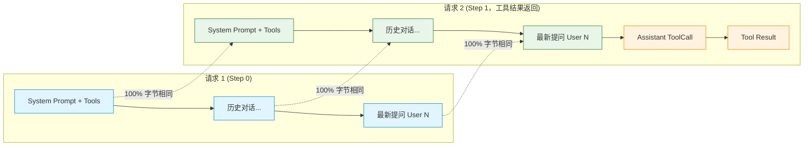

# Agent 提示词缓存（Prompt Cache）极致实践：三大主流协议与架构设计

> 本文总结了 Ally 与 pi 在多轮 Agent 对话中为了将 **Prompt Cache（KV Cache 前缀复用）推到理论极限** 所沉淀的完整机制、协议细节与踩坑铁律。

---

## 0. 核心本质：大模型 Prompt Cache 是如何工作的？

大模型服务商（OpenAI、Anthropic、DeepSeek、Moonshot 等）的 Prompt Cache 本质是 **服务端 KV Cache 的单调最长公共前缀匹配（Monotonic Longest Common Prefix Matching）**。



### 命中与击穿的两大铁律
1. **逐字节单调匹配（Byte-for-Byte Determinism）**：
   比对必须从第 0 个 Token 严格向前进行。**前缀中间只要变动一个字符、一个空格、甚至一个 JSON Key 的顺序，该变动点之后的所有 Token 全部缓存击穿**。
2. **算力节点路由粘性（Session Affinity）**：
   在大模型厂商的分布式集群中，KV Cache 存放在具体某张或某组 GPU 显存中。如果连续两次请求被负载均衡分发到了不同的计算节点，即使文本完全相同，依然会发生**冷启动击穿**。

---

## 1. 三大主流协议的底层机制与协议适配

不同厂商对 Prompt Cache 的开启方式、控制粒度、参数拼写各不相同，必须在适配层统一收口。

### 1.1 OpenAI Responses API 协议

#### ① 隐式缓存（Implicit）vs 显式模式（Explicit）的深坑
OpenAI Responses API 默认采用**隐式自动缓存（Implicit Mode）**：服务端会自动检测输入序列中的消息边界并缓存最长前缀。
* ❌ **错误做法**：盲目设置 `prompt_cache_options: { mode: "explicit" }` 并在消息开头注入自定义锚点（如 `<boundary/>`）。**一旦显式指定了 `mode: "explicit"`，OpenAI 会彻底关闭全局隐式缓存**；由于后续对话消息没有显式设置 breakpoint，整段多轮对话的上下文将几乎无法命中缓存！
* ✅ **正确做法**：始终保持在默认的隐式模式，依靠消息列表的自然单调增长，让服务端自动完成断点累积。pi 仅在明确要求“关闭缓存”（`cacheRetention === "none"`）时才发送 `{ mode: "explicit" }`。

#### ② 模型代际分水岭（GPT-5.6 前后）
* **GPT-5.6 之前的官方模型**：
  长保留时长通过顶层参数 `prompt_cache_retention: "24h"` 表达。
* **GPT-5.6 及之后的模型**：
  OpenAI 开始对 prompt-cache 写入计费，废弃了原参数，改用：
  `prompt_cache_options: { ttl: "30m" }`。
* **端点门禁**：
  上述字段严格通过 `isOfficialOpenAIEndpoint` 门禁隔离，第三方兼容中转网关（DeepSeek、OneAPI 等）可能对未知顶层参数返回 400 报错，严禁外发。

#### ③ 路由粘性（Affinity）
* 对官方端点，统一计算会话的稳定散列：`prompt_cache_key: "ally:<sha256(sessionID)[:16]>"`（受 64 字符长度约束，pi 实现了相同的截断），并将 `store: false` 附带发送，驱动集群固定路由。

---

### 1.2 OpenAI Chat Completions 协议（兼容 DeepSeek / Kimi / OpenRouter）

Chat Completions 是开源模型与中转代理最常用的格式，协议层面的脏细节最多。

#### ① 请求粘性与长保留
* **官方端点**：通过 HTTP Transport 拦截改写，注入 `prompt_cache_key: "ally:<hash>"`、`store: false`；开启长保留档时补充 `prompt_cache_retention: "24h"`。
* **OpenRouter 聚合网关**：通过专用 Header `x-session-id: "ally:<hash>"` 实现路由粘性，将多轮对话固定在下游同一个提供商实例上。
* **DeepSeek 官方端点**：服务端全自动按 64 Token 粒度匹配最长公共前缀，无需且不可发送任何私有保留字段。

#### ② 思考流（Reasoning Content）全局确定性回填
DeepSeek V3/V4、Kimi K3 等模型在启用思考（Thinking）时，如果多轮历史中某条助手消息（尤其是调了工具的消息）漏掉了 `reasoning_content`，服务端会直接报 400 错：
> `"The reasoning_content in the thinking mode must be passed back"`

* ❌ **错误做法**：只修补最新一条消息，或者在序列化时依赖 `omitempty`（Go 的 `omitempty` 会把空字符串字段剔除，导致服务端校验存在性失败）。
* ✅ **正确做法**（收口在 `patchChatRequestFields`）：
  1. **全局统一回填**：扫描历史中的所有 Assistant 消息，缺失 `reasoning_content` 时一律显式补全为 `""`；
  2. **Go 字典序保障**：改写时解析为 `map[string]json.RawMessage`，Go 标准库在序列化 map 时**严格按键名字典序排列**，确保前后两次请求中历史部分的 JSON 字节完全一致（Byte-Identical）。

---

### 1.3 Anthropic Messages API 协议

Anthropic 采用显式断点（Cache Breakpoints）机制，灵活性最高，但有配额限制。

#### ① 4 断点配额与黄金 3 断点布局
Anthropic 单个请求最多允许设置 **4 个** `cache_control: { type: "ephemeral" }` 断点。Ally 与 pi 采用经过实战验证的**黄金 3 断点布局**：
1. **最后一个 Tool 声明**：`params.Tools[lastIdx].OfTool.CacheControl = cc`；
2. **最后一个 System 文本块**：`params.System[len-1].CacheControl = cc`；
   * （断点 1 和 2 共同固化「工具声明 + 系统提示词」，跨会话/多次提问只要工具和 System 没变即可复用）；
3. **最新消息的最后一个有效内容块**：`setAnthropicBlockCacheControl(...)`；
   * （固化递增的对话历史，使每一次工具调用都在前一次的基础上增量缓存）。

#### ② 只跳过不能承载标记的块
寻找“最新消息的最后一个有效块”时向前扫描：thinking / redacted_thinking 块**根本没有 `cache_control` 字段**（SDK 的 `ThinkingBlockParam` 不存在该字段），遇到这类块必须继续向前找，否则一条以思考块结尾的消息会让这个断点整个落空：
```go
for j := len(msg.Content) - 1; j >= 0; j-- {
    if setAnthropicBlockCacheControl(msg.Content[j], cc) { // 返回是否写入了标记
        return
    }
}
```
回放的思考块只在助手消息的**最前面**（`anthropicThinkingBlockParams`），所以正常对话里断点仍落在 text / tool_use / tool_result 尾块上。

#### ③ 保留时长 TTL：只对官方端点写出
* **官方端点**：显式 `cache_control: { type: "ephemeral", ttl: "5m" }`；`5m` 本就是官方默认档，写出来只是让每条请求的断点标记完全一致。
* **兼容网关/反代**：只发 `cache_control: { type: "ephemeral" }`，不带 `ttl`；兼容端点未必认识这个较新的键，而默认档就是 5m，所以两者的缓存寿命相同。
* ⚠️ SDK 陷阱：`cache_control` 字段带 `omitzero`，`CacheControlEphemeralParam{}` 这种全零值（`type` 与 `ttl` 都为空）会被**整条丢弃**——看似“发了个不带 ttl 的标记”，实际一个断点都没发。必须用构造函数 `anthropic.NewCacheControlEphemeralParam()` 起手。
* 1 小时长档（`ttl: "1h"`）目前在实现中未提供，只有 5m。

---

## 2. 协议字段对照一览表

| 协议 / 服务商 | 路由粘性参数 | 短档 (默认) | 长档 (Long Retention) | 断点位置策略 |
| :--- | :--- | :--- | :--- | :--- |
| **OpenAI Responses** | `prompt_cache_key: "ally:..."` | 保持隐式（无多余参数） | `< gpt-5.6`: `prompt_cache_retention: "24h"`<br>`>= gpt-5.6`: `prompt_cache_options: { ttl: "30m" }` | 默认隐式模式（严禁开 explicit 禁用隐式缓存） |
| **OpenAI Chat (官方)** | `prompt_cache_key: "ally:..."` | 官方自动 1024 tok 缓存 | `prompt_cache_retention: "24h"` | 纯前缀逐字节单调匹配 |
| **OpenAI Chat (OpenRouter)** | Header `x-session-id: "ally:..."` | 下游网关决定 | 下游网关决定 | 纯前缀逐字节单调匹配 |
| **DeepSeek (Chat 兼容)** | 无需私有 key（自动前缀匹配） | 64 tok 起自动前缀复用 | 不支持私有字段（防 400） | 依赖历史 `reasoning_content` 确定性回填 |
| **Anthropic Messages** | 由 API Key / Session 内部维护 | 官方端点 `cache_control: { ttl: "5m" }`，兼容端点不带 ttl | 未提供（仅 5m） | 显式 3 断点（Tool 尾 + System 尾 + 最新消息尾） |

---

## 3. Agent 架构层面的极致工程设计

除了对接协议，Agent 的主循环与状态管理是决定缓存能否达到 100% 命中的核心战场。

### 3.1 头部绝对冻结（Byte-Freezing）
系统提示词通常内嵌当前工作区的动态数据：
* 项目指导规则 `AGENTS.md`
* 代码架构索引 `CODEGRAPH.md`
* 长期记忆与经验教训 `LESSONS.md`
* 用户档案 `~/.ally_agent/USER.md`（跨项目的个人偏好，全文注入）
* 当前目录文件树结构（Workspace Map）

如果 Agent 在运行期间修改了上述任何一个文件（例如修完 Bug 记录了一条 Lesson），一旦下一回合重新扫描磁盘并重新拼装 System Prompt，**头部哪怕变动一个字，整整几万 Token 的历史缓存将瞬间全军覆没**。

* ✅ **解决方案**：
  * [`sessionSystemPrompt`](file:///D:/coding/go/src/ally-agent/internal/app/biz_context.go#L1082)：首次请求时装配完成，并在内存 `sessionSystemPrompts[sessionID]` 中**永久冻结**，后续回合直接取只读副本。
  * [`sessionWorkspaceMap`](file:///D:/coding/go/src/ally-agent/internal/app/biz_workspace.go#L286)：同样按 Session 冻结。文件变更通过 `read` / `list_files` 等工具动态获取，绝不污染系统前缀。

---

### 3.2 子代理（Subagent）Cache Lane 共享与台账隔离
多智能体（Subagent）协作是缓存击穿的重灾区：如果每次派发子代理都随机生成一个 UUID 作为 `sessionId`，每个子代理启动时面对一模一样的系统提示词与工具集，却**次次 100% 缓存击穿**。

* ✅ **参考 pi 解决：Lane 共享路由**：
  子代理的缓存路由继承父会话的专属通道：
  ```go
  cfg.responsesPromptCacheKey = openAIResponsesPromptCacheKey(parentSessionID + ":subagent")
  ```
  同一个主会话派发的所有子代理，共享预热好的 System + Tools 缓存前缀。

* ⚠️ **架构避坑：思考台账（Reasoning Stash）必须按 Run 隔离**：
  Responses / Chat 协议需要台账记录思考块以便在工具轮次中重放。由于工具调用 ID（如 `call_0`）可能重复，如果子代理的台账也共享同个 key，会导致多 Agent 间思考块相互覆盖串包。
  因此，Ally 将 **缓存路由（`responsesPromptCacheKey`）** 与 **回放作用域（`reasoningScope`）** 彻底解耦：
  * 缓存路由共享，保证命中 KV Cache；
  * 台账按单次 Run 隔离，并在子代理结束时通过 `defer a.reasoningStash.clearScope(...)` 显式回收，防止死数据堆积撑爆 64 槽 LRU 缓存。

---

### 3.3 彻底抛弃瞬态注入，拥抱纯单调追加（Monotonic History）

在复杂任务管理（Plan / Todo）中，常见一种设计：在每个 Run 的第 1 次请求前，把最新计划快照临时插入到用户提问前；工具执行完后，又把快照撤掉不存历史。

**这种做法对缓存是致命的微小破坏**：
* **Step 0 发送**：`[老历史] -> [临时计划快照] -> [最新提问]`
* **Step 1 发送**：`[老历史] -> [最新提问] -> [工具调用] -> [工具返回]`

由于大模型缓存从第 0 个 Token 向前严格逐字对比，Step 1 对比 Step 0 时，在中间插拔快照的位置直接**产生前缀分叉**，导致最新用户提问和工具调用无法复用 Step 0 刚刚建好的 KV 缓存。

* ✅ **终极解决方案**：
  1. **彻底移除请求侧的瞬态注入**；
  2. **将任务进度完全交由内置的 `plan` 工具自闭环**：
     * 模型调用 `plan(todos: [...])` 更新进度时，工具返回结果直接是完整的 Todo 列表与各状态；
     * 该结果作为标准的 `role: tool` 消息自然、永久沉淀在对话历史尾部；
  3. **实现 100% 严格单调追加**：
     从首轮提问到多次工具调用，再到下一轮提问，消息列表永远只做 `append`。在支持 KV Cache 的端点上，后续每一步的缓存命中率均直接拉满到理论上限（~100% 全中）。

---

## 4. 统计与核算口径（Usage Accounting）

提示词缓存生效后，Token 的统计口径需要严谨对齐：
1. **命中率公式**：
   $$\text{CacheHitRate} = \frac{\Sigma \text{CacheHitTokens}}{\Sigma (\text{CacheHitTokens} + \text{CacheMissTokens})}$$
   * 用户侧实际阅读/计算的输入 Prompt 总量为 $\text{Hit} + \text{Miss}$。
2. **缓存写入量（CacheWriteTokens）独立展示**：
   * Anthropic 的 `cache_creation_input_tokens` 与 OpenAI Responses 的 `cache_write_tokens` 代表新写入缓存的 Token 数（它们本身已经包含在服务端的 Miss 计费中）。
   * 写入量应当作为**成本审计指标**独立呈现（用于核算 1 小时长保留档的溢价成本），绝不能算作独立的第三分母破坏基础命中率。
