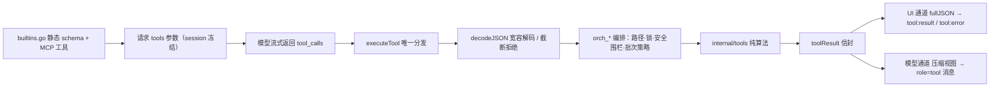

# Ally Agent Core：工具系统代码导读

> 本文是 `agent-core-loop.md` 的续篇，讲「模型说要调工具」到「模型看到工具结果」之间的全部代码。
> 工具系统是 agent 中唯一有副作用的一环，也是最容易写歪的一环。
> 行号基于撰写时的工作区版本，重构后可能漂移；定位以「函数名 + 文件」为准。

## 一、管道全景



| 环节 | 位置 |
|---|---|
| schema 声明 | `internal/tools/shared/builtins.go` |
| 工具集组装（含 MCP） | `biz_mcp.go:1062` `buildToolsWithMcp`、`biz_mcp.go:1096` `buildToolsForSession` |
| 分发 | `app.go:2225` `executeTool` |
| 参数契约 | `app.go:2243` `decodeJSON` + `internal/tools/toolcall/` |
| 编排（绑定 `*App` 状态） | `internal/app/orch_*.go` |
| 纯算法 | `internal/tools/<name>/` |
| 结果信封与模型视图 | `internal/app/infra_result.go` |
| 批次策略 | `internal/app/orch_batch_policy.go` |

## 二、声明层：schema 是静态的、共享的、strict 的

`internal/tools/shared/builtins.go`：

```go
func Builtins() []openai.Tool {           // :41
    chatToolsCache.once.Do(func() { chatToolsCache.tools = chatToolsUncached() })
    return chatToolsCache.tools            // 共享只读：调用方不得改 slice 或 Parameters
}
func functionTool(name, desc string, params map[string]any) openai.Tool {  // :387
    if ex := builtinToolExamples[name]; ex != "" { desc += " Canonical JSON example(s): " + ex }
    return RawFunction(name, desc, enforceStrictSchema(params))
}
```

三个值得学的做法：

1. **示例写进描述**（`builtinToolExamples`，`builtins.go:372`）。参数描述说一百句，不如给一条能直接抄的样例 JSON——提升工具调用成功率最便宜的手段。
2. **strict schema 递归规范化**（`enforceStrictSchema` → `normalizeSchemaNode`，`builtins.go:489` / `:497`）。遍历 `properties` / `items` / `anyOf` / `oneOf` / `allOf` / `not`，给每个 `type: object` 补 `additionalProperties: false` 与 `properties: {}`。少规范化一层，strict 模式就会被 provider 拒或在子对象上静默放宽。任意 JSON 参数用 `jsonValueSchema`（`anyOf` 六种类型，`builtins.go:476`）表达。
3. **schema 与 DTO 必须对齐**：`batchReadFilesSchema` 的 `minItems/maxItems`、`editChangeSchema` 的 `oneOf(oldText | lineRange)` 与执行侧解码/校验是同一套规则的两处表述。它们漂移的那天，模型就会发出「schema 允许但执行必拒」的调用。

工具集本身在 session 首次请求时**冻结**（`buildToolsForSession`，`biz_mcp.go:1096`）：`tools` 是请求前缀的一部分，中途变化会让供应商 prompt cache 全线作废。`cloneTools` 深拷贝，保证冻结的那份不被后续 MCP 启停改到。子代理 / 计划任务这类无 session 的调用方走 `buildToolsForConfig`，永远看实时集合（它们本来也无前缀可保）。MCP 工具靠名字前缀 `mcp__<server>__<tool>`（`mcpFunctionNamePrefix`）并入同一张表。

## 三、分发层：`executeTool` 是唯一入口（`app.go:2225`）

主循环、子代理、计划任务三条路径都调用它，因此所有公共契约在这里收口：

```go
defer func(){ if r := recover(); r != nil {       // ① handler panic → E_TOOL_PANIC
    result = toolErrorResult(codedToolError("E_TOOL_PANIC", ...)) } }()
name = normalizeToolName(name)                     // ② 小写 + 别名/弃用名归一
if toolcall.IsTruncatedArguments(string(args)) {   // ③ 流式截断参数一律不执行
    return toolErrorResult(codedToolError("E_TRUNCATED_ARGS", ...)) }
switch name {
case "list_files": ...  /* 26 个工具分支（含弃用别名 document_read / agent_delegate） */
case "skill": ...
default:
    if strings.HasPrefix(name, "mcp__") { ... }    // ④ MCP 按前缀路由，不是白名单
    err = fmt.Errorf("unknown tool: %s", name)
}
if err != nil { return toolErrorResult(err) }
return toolResult{OK: true, Data: data, Warnings: argWarnings}   // app.go:2622
```

要点：

- **① panic 隔离**：循环跑在独立 goroutine 里，一次 handler panic 逃逸就会带走整个应用；文件变更阶段 panic 还会带着悬空 `tool_calls` 进入 deferred 检查点落盘。这里统一转成工具错误，循环继续。
- **② 归一化收在一处**（`NormalizeName`）：历史会话里的旧工具名靠别名映射继续可用；不要在别处用排除式补丁（`!= 'specal_case'`）替代归一。
- **③ 截断参数的唯一契约**是 `toolcall.TruncatedArgumentsMarker`。
- **④ MCP 用前缀路由**，新增 MCP 工具不需要改任何白名单。

## 四、参数契约：`decodeJSON` + `toolcall` 包

`decodeJSON`（`app.go:2243`）是「宽容解码、严格报错」的示范：

| 情况 | 处理 |
|---|---|
| 未知参数键 | 收集进 `Warnings`，成功后**回给模型**（不是静默忽略） |
| 值被双重编码（`{"files":"[{...}]"}`） | 按字段路径自动修复一次并记 warning（`repairToolArgJSON`、`maxToolArgRepairRounds`） |
| JSON 被流截断（`isIncompleteStreamJSON`） | 明确报 "tool arguments JSON was truncated"，edit 类工具附可操作建议 |
| 类型 / schema 错 | 失败报错，且**不能**误标成截断（历史上这个混淆让老的 `oldString` 调用看起来像耗尽了 max_tokens） |
| 参数是截断标记 | `E_TRUNCATED_ARGS` 直接拒绝执行 |

`internal/tools/toolcall`（179 行）是「适配器产出 / 会话加载修复 / 执行前拒绝」三条路径共享的规则源——包注释说明了原因：这套知识曾经散在三处，改一份就会和另两份静默不一致。内容包括：

- `ForAnthropic` / `ForResponsesCall` / `Effective`：id 归一化，共用同一个 `sanitize` 核心（保留 `[a-zA-Z0-9_-]`，超 64 字符截 56 + sha256 前 7 位防碰撞）；
- `DecodeArguments`：非 object 的 JSON 包成 `_raw` 而不是丢弃；
- `MergeRepeatedDelta`：中转重发全名时不会拼出 `http_requesthttp_request`；
- `TruncatedArgumentsMarker` / `RepairTruncatedArguments` / `IsTruncatedArguments`。

## 五、编排层：`orch_*` 是纯算法与 App 状态之间唯一的粘合点

| 关注点 | 收口位置 |
|---|---|
| 工作区写串行 | `withFileOpsLock`（`app.go:2219`）；用 defer 解锁，因为 executeTool 会把 panic 转成错误，手写 Unlock 会在那条路径上永久卡死 |
| 知识库只读 | `kbDenyCheckPaths` / `kbDenyCheckCommand`；run 开始时把策略挂到 ctx，子代理继承 |
| 编辑后验证 | `attachValidation` + `validateChangedFilesForCall`（`orch_validation.go:170`）；批次里由 `planBatchValidation`（`orch_validation.go:189`）摊到「最后一次触碰该目录的变更」上，避免每个 edit 都跑一遍 `go vet` / `tsc` |
| 命令安全围栏 | `checkCommandSafetyAtCwd`（`orch_command_safety.go:45`） |
| 路径保护 | `pathutil`：`CanonicalPath` / `VCSMetadataReason`，写、删、命令三条入口共用 |

命令围栏的四道检查都是「拒绝并解释」，不是「尝试纠正」：

1. 显式删除命令 → 拦截，要求改用 `delete` 工具（delete 工具自带工作区边界与递归范围检查）；
2. 写入目标落在 `.git` / `.svn` / `.hg` 元数据内 → `E_PROTECTED_PATH`（`> .git/hooks/pre-commit` 会在下次 git 命令时执行代码）；
3. 写入目标在工作区外**且已存在** → `E_PATH_OUTSIDE`（允许读、允许写 `/dev/null`、允许创建新路径；并解析符号链接，拦截「经工作区内软链逃逸到外面」的写法）；
4. 高危模式（`MatchRiskPattern`）→ `E_COMMAND_BLOCKED`。

远端命令只跑第 4 道（`validateRemoteCommandSafety`）——远端路径语义不同，套本地边界只会误判。

错误文案是写给模型看的：**说清原因 + 给出下一步该怎么做**。

## 六、结果层：一个信封、两条通道（`infra_result.go`）

```go
type toolResult struct {                       // infra_result.go:19
    OK        bool   `json:"ok"`
    Data      any    `json:"data,omitempty"`
    Error     string `json:"error,omitempty"`
    ErrorCode string `json:"errorCode,omitempty"`
    Details   any    `json:"details,omitempty"`
    Warnings  []string `json:"warnings,omitempty"`   // 非致命提示（如被忽略的未知参数）
}
```

- **UI 通道**：`fullJSON` 经 `a.redactSSHCredentials(...)` 脱敏后进 `tool:result` / `tool:error` 事件（前端展示完整数据）。
- **模型通道**：`compactToolResultForModel`（`infra_result.go:172`）产出 `role=tool` 消息的 `Content`。

压缩是逐工具定制的——**给模型的视图和给人的视图本来就该不一样**：

| 工具 | 模型视图 |
|---|---|
| `list_files` | 只发换行分隔的路径（目录带 `/`），比完整 FileEntry 省约 3/4 token |
| `read` | 本轮已读过的同一 path/range → 内容替换为「已给过你、version 未变、可复用」说明（配合 run 级 read cache，`newRunReadCache`） |
| `read` 图片 | 内容转为后续 user 消息的图片输入，这里只留说明 |
| `grep` | 命中行文本按预算裁剪（`capGrepLineTexts`） |
| `mcp__*` | 第三方无上限输出，统一夹到内置上限（`compactMcpOutputForModel`） |
| 任何失败 / 解码失败 | 回退 `fullJSON`（`marshalToolResultOrFallback`），永不因压缩丢信息 |

`injectEnvelopeWarnings` 把参数警告合并进 `data.warnings`，解析失败就退化成追加一行纯文本——**通知必须送达模型**。

`toolResultSummary`（`infra_result.go:49`）是给人看的短摘要（如 `3 files · +12 -4`、`exit 0 (120ms)`），子代理卡片用它展示进度（`orch_subagent.go:333`）。

## 七、批次策略：一批工具调用怎么调度（`orch_batch_policy.go`）

`detectToolBatchConflicts`（`orch_batch_policy.go:61`）在执行前统一裁决：

1. **独占型工具**（`ask` / `wait` / `suggest`）必须独占一批，否则整批全部拒绝（`E_ASK_BATCH_CONFLICT` / `E_WAIT_BATCH_CONFLICT` / `E_SUGGEST_BATCH_CONFLICT`）——这类工具语义上要求模型单线程等待。
2. **同路径多写**（`detectWriteBatchConflicts`，`orch_batch_policy.go:33`）：按参数解析写入目标（本地走 edit plan，远端按 `remote:<target>:<path>`），只执行最早一个，其余 `E_WRITE_BATCH_CONFLICT`。
3. **语义重复调用**：参数 JSON 解析后按 key 排序重序列化做去重键，重复判 `E_DUPLICATE_TOOL_CALL`（字段顺序、空白差异都能识别；刻意不做默认值归一，那需要逐工具知识且会掩盖真实不同意图）。

配合主循环那边（见 `agent-core-loop.md` 第 8 节）：非文件变更工具并发 4 个、文件变更按调用顺序串行、同批目录级验证只跑一次。

## 八、可复用的设计原则

1. **双视图**：给人看的（保真）与给模型看的（省 token、可读）分开生成，别共用一份 JSON。
2. **规则下沉、编排只绑定**：跨路径共享的判定（工具名归一、id 归一、截断标记、路径保护）放进 `internal/tools/*` 纯函数包，`orch_*` 只负责接 App 状态（锁、工作区、KB 策略）。改一处即全局生效。
3. **护栏式拒绝 + 可操作文案**：安全判定一律「拒绝 + 解释原因 + 告诉模型该改用哪个工具」。
4. **把模型输出当不可信输入**：工具参数可能被截断、可能双重编码；命令与路径要过静态分析围栏。
5. **冻结与共享只读**：schema 缓存、session 工具集都是「建一次、只读共享」，既省开销又保住请求前缀稳定。

## 九、建议阅读顺序

1. `app.go:2225-2320` —— 分发 + `decodeJSON`
2. `internal/tools/toolcall/toolcall.go` 全文（179 行，规则最集中）
3. `infra_result.go:19-46`、`172-300` —— 信封 + 模型视图
4. `orch_batch_policy.go` 全文 —— 批次策略
5. `orch_command_safety.go` 全文 —— 安全围栏
6. `builtins.go:387-403` + `489-534` —— schema 生成与 strict 化
