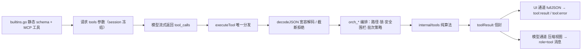

# Ally Agent Core：工具系统代码导读

> 本文是 `agent-core-loop.md` 的续篇，讲「模型说要调工具」到「模型看到工具结果」之间的全部代码。
> 工具系统是 agent 中唯一有副作用的一环，也是最容易写歪的一环。
> 行号基于撰写时的工作区版本，重构后可能漂移；定位以「函数名 + 文件」为准。

## 一、管道全景


```mermaid
flowchart LR
  A["builtins.go 静态 schema + MCP 工具"]:::core --> B["请求 tools 参数（session 冻结）"]:::core
  B --> C["模型流式返回 tool_calls"]:::llm
  C --> D["executeTool 唯一分发"]:::exec
  D --> E["decodeJSON 宽容解码 / 截断拒绝"]:::core
  E --> F["orch_* 编排：路径·锁·安全围栏·批次策略"]:::risk
  F --> G["internal/tools 纯算法"]:::exec
  G --> H["toolResult 信封"]:::core
  H --> I["UI 通道 fullJSON → tool:result / tool:error"]:::ev
  H --> J["模型通道 压缩视图 → role=tool 消息"]:::core
```

| 环节 | 位置 |
|---|---|
| schema 声明 | `internal/tools/shared/builtins.go` |
| schema 查找（按工具名） | `builtins.go:98` `BuiltinSchema` |
| 工具集组装（含 MCP） | `biz_mcp.go:1106` `buildToolsWithMcp`、`biz_mcp.go:1140` `buildToolsForSession` |
| 分发 | `app.go:2375` `executeTool` |
| 参数契约（宽容解码 + schema 闸门） | `app.go:2399` `decodeJSON` + `internal/tools/schemautil/validate.go` + `internal/tools/toolcall/` |
| 编排（绑定 `*App` 状态） | `internal/app/orch_*.go` |
| 纯算法 | `internal/tools/<name>/` |
| 结果信封与模型视图 | `internal/app/infra_result.go` |
| 批次策略 | `internal/app/orch_batch_policy.go` |

## 二、声明层：schema 是静态的、共享的、strict 的

`internal/tools/shared/builtins.go`：

```go
func Builtins() []openai.Tool {           // :78
    chatToolsCache.once.Do(func() { chatToolsCache.tools = chatToolsUncached() })
    return chatToolsCache.tools            // 共享只读：调用方不得改 slice 或 Parameters
}
func functionTool(name, desc string, params map[string]any) openai.Tool {  // :490
    if ex := builtinToolExamples[name]; ex != "" { desc += " Canonical JSON example(s): " + ex }
    return RawFunction(name, desc, enforceStrictSchema(params))
}
```

三个值得学的做法：

1. **示例写进描述**（`builtinToolExamples`，`builtins.go:474`）。参数描述说一百句，不如给一条能直接抄的样例 JSON——提升工具调用成功率最便宜的手段。
2. **strict schema 递归规范化**（`enforceStrictSchema` → `normalizeSchemaNode`，`builtins.go:683` / `:691`）。遍历 `properties` / `items` / `anyOf` / `oneOf` / `allOf` / `not`，给每个 `type: object` 补 `additionalProperties: false` 与 `properties: {}`。少规范化一层，strict 模式就会被 provider 拒或在子对象上静默放宽。任意 JSON 参数用 `jsonValueSchema`（`anyOf` 五种类型，`builtins.go:670`）表达，且自带 `anyOf` 的节点不会被补上标量 `type`——两者取交集会把「对象/数组/字符串都行」缩成「只能是字符串」（`schemautil.declaresOwnShape`）。
3. **schema 与 DTO 必须对齐**：`batchReadFilesSchema` 的 `minItems/maxItems`、`editChangeSchema(sourceTool)` 的 `oneOf(oldText | lineRange)`（本地与远程共用同一份声明，只有来源工具名不同）、`deletePathsSchema` + `deletePathSourceOneOf` 的 `path | paths`（本地 `delete` 与 `remote_delete_path` 共用，上限 `DeletePathListLimit` 同时被两个 schema、handler 侧校验与 `App.DeletePath` 读）与执行侧解码/校验是同一套规则的两处表述。它们漂移的那天，模型就会发出「schema 允许但执行必拒」的调用。对齐不再靠人看：内置工具的入参会在分发层按 schema 校验一次（见四），漂移会当场地报 `E_BAD_ARGS`。另一个易错点是互斥判定的口径：`oneOf`/`not` 要按参数的**有效值**判，不能按 `required` 的键是否存在——`tailLines: 0`、`body: ""` 在运行时就是「没传」，按键存在判会把模型补零/补空串的写法误报成「两种形式都给了」。正例见 `editSourceOneOf` 与 `batchReadFilesSchema`（闸门用例 `TestBuiltinGateTreatsEmptyOptionalsAsAbsent`）。来源之外还有一处互斥：`replaceAll` 只能跟 `oldText` 搭配，配 `lineRange` 由 `editReplaceAllRule`（`allOf` + `not` + `const`）当场拒，执行侧 `ValidateBatchTextChanges` 用同一条规则复核——两处漂移就是「schema 允许、执行必拒」的经典来源。

4. **按协议的顶层形状限制就地改写**：Anthropic Messages 的 `input_schema` 顶层不接受 `oneOf` / `anyOf` / `allOf`（400 `…does not support oneOf, allOf, or anyOf at the top level`，一次就废掉整个请求的全部工具），所以 `anthropicInputSchema` 先走 `schemautil.FlattenTopLevelComposites`：把顶层分支的 `properties` 并进 root（root 已有声明优先——分支写的是「只在该分支内成立」的收窄）、`required` 只保留每个可选分支都要的（`allOf` 则取并集），分支自带的 `not` 守卫与标量分支按「什么都没声明」处理；嵌套的复合关键字原样保留（限制只在顶层）。方向是**只放宽**：展平后的 root 接受的入参是原声明的超集，不会拒掉运行时接受的调用；声明本身与入参闸门都不动，Chat / Responses 照原样发顶层 `oneOf`。

工具集本身在 session 首次请求时**冻结**（`buildToolsForSession`，`biz_mcp.go:1140`）：`tools` 是请求前缀的一部分，中途变化会让供应商 prompt cache 全线作废。`cloneTools` 深拷贝，保证冻结的那份不被后续 MCP 启停改到。子代理 / 计划任务这类无 session 的调用方走 `buildToolsForConfig`，永远看实时集合（它们本来也无前缀可保）。MCP 工具靠名字前缀 `mcp__<server>__<tool>`（`mcpFunctionNamePrefix`）并入同一张表。

## 三、分发层：`executeTool` 是唯一入口（`app.go:2375`）

主循环、子代理、计划任务三条路径都调用它，因此所有公共契约在这里收口：

```go
defer func(){ if r := recover(); r != nil {       // ① handler panic → E_TOOL_PANIC
    result = toolErrorResult(codedToolError("E_TOOL_PANIC", ...)) } }()
name = normalizeToolName(name)                     // ② 小写 + 别名/弃用名归一
if toolcall.IsTruncatedArguments(string(args)) {   // ③ 流式截断参数一律不执行
    return toolErrorResult(codedToolError("E_TRUNCATED_ARGS", ...)) }
switch name {
case "list_files": ...  /* 26 个工具分支（含弃用别名 document_read / agent_delegate） */
case "skill": ...
default:
    if strings.HasPrefix(name, "mcp__") { ... }    // ④ MCP 按前缀路由，不是白名单
    err = fmt.Errorf("unknown tool: %s", name)
}
if err != nil { return toolErrorResult(err) }
return toolResult{OK: true, Data: data, Warnings: argWarnings}   // app.go:2797
```

要点：

- **① panic 隔离**：循环跑在独立 goroutine 里，一次 handler panic 逃逸就会带走整个应用；文件变更阶段 panic 还会带着悬空 `tool_calls` 进入 deferred 检查点落盘。这里统一转成工具错误，循环继续。
- **② 归一化收在一处**（`NormalizeName`）：历史会话里的旧工具名靠别名映射继续可用；不要在别处用排除式补丁（`!= 'specal_case'`）替代归一。
- **③ 截断参数的唯一契约**是 `toolcall.TruncatedArgumentsMarker`。
- **④ MCP 用前缀路由**，新增 MCP 工具不需要改任何白名单。

## 四、参数契约：`decodeJSON` + schema 闸门 + `toolcall` 包

`decodeJSON`（`app.go:2399`）是「宽容解码、严格报错」的示范：

| 情况 | 处理 |
|---|---|
| 未知参数键 | 声明了 schema 的内置工具：直接拒绝（`E_BAD_ARGS`，报出键名与可选清单）；无声明的名字（MCP 工具、弃用别名）仍收集进 `Warnings` 回给模型 |
| 值被双重编码（`{"files":"[{...}]"}`） | 按字段路径自动修复一次并记 warning（`repairToolArgJSON`、`maxToolArgRepairRounds`）；校验跑在修复后的载荷上 |
| JSON 被流截断（`isIncompleteStreamJSON`） | 明确报 "tool arguments JSON was truncated"，edit 类工具附可操作建议 |
| 类型 / schema 错 | 失败报错，且**不能**误标成截断（历史上这个混淆让老的 `oldString` 调用看起来像耗尽了 max_tokens） |
| 参数是截断标记 | `E_TRUNCATED_ARGS` 直接拒绝执行 |

**schema 闸门**（`app.go:2399` 内 → `schemautil.ValidateArgs`，`internal/tools/schemautil/validate.go`）：内置工具的入参在解码后按它自己的 schema 校验一次，支持 `type` / `required` / `additionalProperties` / `items` / `min–maxItems` / `min–maxLength`（按字符）/ `pattern` / `enum` / `const` / `minimum` / `maximum` / `anyOf` / `oneOf` / `allOf` / `not`，报告带路径（`changes[0].newText`）且一次列多个问题。两条约定：**`null` 等于「没提供」**（跳过类型检查，也不再满足 `required`），未被声明用到的关键字忽略不拒。它针对「模型看到的就是它要遵守的」这件事——同名规则不再一处写在提示词、一处写在 handler：

- 只有内置工具过闸（MCP 工具的 schema 来自服务端，不归我们发誓）；MCP 调用里未声明的参数会被点名警告（`mcpUnknownArgWarnings`，`biz_mcp.go`），但仍原样转发给服务端。
- 每条声明必须能过闸才能存在：`TestEveryBuiltinSchemaIsEnforceable`（strict object + pattern 可编译）、`TestExecuteToolGatesEveryBuiltinTool`（25 个名字逐个验闸）守住。

`internal/tools/toolcall`（179 行）是「适配器产出 / 会话加载修复 / 执行前拒绝」三条路径共享的规则源——包注释说明了原因：这套知识曾经散在三处，改一份就会和另两份静默不一致。内容包括：

- `ForAnthropic` / `ForResponsesCall` / `Effective`：id 归一化，共用同一个 `sanitize` 核心（保留 `[a-zA-Z0-9_-]`，超 64 字符截 56 + sha256 前 7 位防碰撞）；
- `DecodeArguments`：非 object 的 JSON 包成 `_raw` 而不是丢弃；
- `MergeRepeatedDelta`：中转重发全名时不会拼出 `http_requesthttp_request`；
- `TruncatedArgumentsMarker` / `RepairTruncatedArguments` / `IsTruncatedArguments`。

## 五、编排层：`orch_*` 是纯算法与 App 状态之间唯一的粘合点

| 关注点 | 收口位置 |
|---|---|
| 工作区写串行 | `withFileOpsLock`（`app.go:2369`）；用 defer 解锁，因为 executeTool 会把 panic 转成错误，手写 Unlock 会在那条路径上永久卡死 |
| 知识库只读 | `kbDenyCheckPaths` / `kbDenyCheckCommand`；run 开始时把策略挂到 ctx，子代理继承 |
| 编辑后验证 | `attachValidation` + `validateChangedFilesForCall`（`orch_validation.go:170`）；批次里由 `planBatchValidation`（`orch_validation.go:189`）摊到「最后一次触碰该目录的变更」上，避免每个 edit 都跑一遍 `go vet` / `tsc` |
| 命令安全围栏 | `checkCommandSafetyAtCwd`（`orch_fence.go:100`）：**唯一入口**，围栏自己问「谁管边界」（`kernelOwnsBoundary`），沙箱接不接都走这里；受保护位置是一张表（`protectedLocations`：每项带 `remove` / `scan` 两列，删除守卫只登记深度规则兜不住的目标，搜索守卫没有深度概念、逐个点名一级系统树；`removableProtectedTargets()` 同时喂远端 helper），`isDangerousDeletePath` / `isDangerousSearchRoot` 各取一列，与两形态路径复判（`vcsMetadataMutationHit`）同在 `orch_fence.go` |
| 密钥/凭据禁读（三平台） | `pathutil.SensitiveReadReason`（`internal/tools/pathutil`）：`~/.ssh`、`~/.aws`、`~/.gnupg`、`~/.kube`、`~/.docker/config.json`、`~/.netrc`、`~/.git-credentials`、`~/.npmrc`、`~/.pypirc`、`~/.config/{gcloud,gh,glab-cli}`、平台钥匙串、Ally 自己的 `config/api/mcp/ssh_clusters.json`。三条入口共用同一份判定：命令围栏（`firstSensitiveReadTarget` + `command.DisclosingPathOperands`，只算「可能把内容交回来」的操作数：`ssh -i KEY`、`chmod 600 KEY`、`ls ~/.ssh` 这类只是用密钥不算读，照常放行；`cat ~/.ssh/id_rsa` 仍拦）、`read`、`grep`；`memories/` 与 `USER.md` 照旧可读 |
| 命令沙箱（OS 级；**当前未接入**） | `sandboxSpec` / `wrapSandboxedCommand` / `annotateSandboxDeniedWrite` / `kernelOwnsBoundary`（`orch_sandbox.go`）；写工具的落盘同样包在内核里（同在 `orch_sandbox.go`）；策略与 profile 在 `internal/sandbox`（纯算法，不依赖 App）。command 与 service 两条执行路径共用。接入开关是 `internal/sandbox` 的 `attached`（`ResolvedMode` / `ModeForced` / `Attached` 同源）：关着时三个平台都只走安全围栏，profile / 策略 / 诊断 / 探测原样保留；要接回来只需改这一个常量 + 把 `GetSandboxStatus` 那条设置页链路接回 |
| 边界归属（越界写由谁拒） | `kernelOwnsBoundary`（`orch_sandbox.go`）：唯一的判据，问的是「沙箱此刻是否真在围」（`sandbox.ResolvedMode` + `sandbox.Available`），**不问平台**。内核接管时写 / 删 / cwd 三个解析器（`resolveBoundaryPath` + `resolveWritableFilePath` / `resolveDeletablePath` / `resolveCommandCwd`）只归一化、越界留给内核拒（报 `E_SANDBOX_WRITE_DENIED`）；内核不在时围栏全强度顶上（报 `E_PATH_OUTSIDE`）。`.git` 元数据、高危命令语义、delete 的工作区根 / dangerous / recursive 保护、软链接拒绝四类始终留在 Go 侧——内核看不见它们 |
| 路径保护 | `pathutil`：`CanonicalPath` / `VCSMetadataReason`，本地写 / 删 / 命令与远端写（`remoteVCSMetadataWrite`）/ 命令（`remoteCommandVCSMetadataTarget`）共用同一份；远端只判得了字面路径那半，解析后（软链接到 `.git`）由 helper 用远端事实复判 |
| 删除多路径 | `resolveDeletePathList` / `checkDeletePathList`（`orch_file_ops.go`）：两种写法折叠成一条候选列表，并拒重复与包含；本地与远端共用这一份。单条路径的落盘判定仍各自留在自己的信任域（本地问本机文件系统，远端只能在 SSH 另一头问）。「本来就不存在」两端一致：不是失败、不拦同批其它路径，只报 `DeleteResult.Absent`（本地 `resolveDeleteTarget`，远端 `check_delete_path` 的 `missing` 标记） |

命令围栏的四道检查都是「拒绝并解释」，不是「尝试纠正」：

1. 显式删除命令 → 拦截，要求改用 `delete` 工具（delete 工具自带工作区边界与递归范围检查）；
2. 写入目标落在 `.git` / `.svn` / `.hg` 元数据内 → `E_PROTECTED_PATH`（`> .git/hooks/pre-commit` 会在下次 git 命令时执行代码）；
3. 写入目标在工作区外**且已存在** → `E_PATH_OUTSIDE`（允许读、允许写 `/dev/null`、允许创建新路径；并解析符号链接，拦截「经工作区内软链逃逸到外面」的写法）；
4. 高危模式（`MatchRiskPattern`）→ `E_COMMAND_BLOCKED`。

远端命令跑第 1、2、4 道：第 1 道同样由 Go 侧 `ContainsExplicitDeleteCommand` 拦；第 2 道用 `remoteCommandVCSMetadataTarget` 判字面写目标（按远端 cwd 解析相对路径，解析后那半在 helper 的 `check_write_targets` 里复判）；第 4 道是 `validateRemoteCommandSafety`。第 3 道（越界写）本地靠 Go 侧问本机文件系统，远端改为 helper 在动手前用远端事实判（`check_write_targets` → `E_PATH_OUTSIDE`）——两端都不套对方的路径语义。

**操作系统级沙箱**（macOS Seatbelt / Linux bubblewrap）与上面四道不互斥：围栏拦的是「看得出意图的写入」，沙箱拦的是「命令自己拼出来、围栏看不出来的越界写」——命令被包在 shell 外面，怎么拼都绕不过去，脚本里的语言无关也一样（Python/Node 都是 shell 的子进程，内核级沙箱随 fork/exec 继承）。

macOS 上沙箱**强制开启且没有开关**：档位是宿主的属性（`sandbox.ResolvedMode`），不是用户设置；设置 → 沙箱 页只显示本机状态与安全围栏机制。策略的其余部分也是写死的：写根 = 本次运行的 `roots` + 工具链缓存 + 临时目录，`sources/` 在写根内重新禁写，Ally 自己的数据目录（模型 key / SSH 凭据 / 会话历史）从命令视野里遮蔽，出网保持开放（包管理器与构建需要）。

写根是主工作区 + 会话级附加工作区（`roots` 全量，不是只有 `roots[0]`），且**每条命令现算**：在 Tab 上加/删附加工作区，下一条命令立即生效；已在跑的后台服务仍用它启动时的策略，需重启。

边界要看清：沙箱**只拦写，读是默认放开的**（除了被遮蔽的数据目录），所以“读得到密钥”这类风险靠禁读遮罩而不是沙箱本身。包不上时命令不裸跑：macOS 强制档没有关掉的退路，降级为「只受安全围栏保护」并记日志告警；拦下写入时在结果里追加可照做的下一步（内核只回一句裸权限错误，模型会当成自己命令写错而反复重试）。

错误文案是写给模型看的：**说清原因 + 给出下一步该怎么做**。

## 六、结果层：一个信封、两条通道（`infra_result.go`）

```go
type toolResult struct {                       // infra_result.go:19
    OK        bool   `json:"ok"`
    Data      any    `json:"data,omitempty"`
    Error     string `json:"error,omitempty"`
    ErrorCode string `json:"errorCode,omitempty"`
    Details   any    `json:"details,omitempty"`
    Warnings  []string `json:"warnings,omitempty"`   // 非致命提示（如被忽略的未知参数）
}
```

- **UI 通道**：`fullJSON` 进 `tool:result` / `tool:error` 事件（前端展示完整数据）。敏感凭据通过 `ssh_cluster` 安全资产池持久化并在模型侧严格脱敏，不再直接流经提示词历史。
- **模型通道**：`compactToolResultForModel`（`infra_result.go:178`）产出 `role=tool` 消息的 `Content`。

压缩是逐工具定制的——**给模型的视图和给人的视图本来就该不一样**：

| 工具 | 模型视图 |
|---|---|
| `read` | `<ally-file path version lines total>` 标签块，行号正文零转义；本会话已读过的同一 path/range → 内容换成「已给过你、version 未变、可复用」说明（会话级 read cache，`sessionReadCacheFor`，`remote_read` 共用同一份：后续 run 也复用；改盘不触发失效——命中靠逐字节比对载荷哈希；只有压缩 / 删回合 / 历史从磁盘重载才失效） |
| `read` 图片 | 内容转为后续 user 消息的图片输入，块里只留 `image="…"` 说明 |
| `list_files` | `<ally-files count>` 标签块，只发换行分隔的路径（目录带 `/`），比完整 FileEntry 省约 3/4 token |
| `grep` | `<ally-grep mode matched hits files next-offset>` 头 + `path:line: text` 行（count 模式为 `path: count=N`）；命中行文本按预算裁剪（`capGrepLineTexts`） |
| `command` | `<ally-cmd exit timed-out promoted-to-service truncated full>` 块，输出零转义落体；command/cwd 不回显（模型刚在参数里写过） |
| `service` read/info | `<ally-svc-read>` / `<ally-svc>` 块（字节账目走属性），`list` 仍走 JSON |
| `edit` / `create` | 自闭合属性标签；summary/validation 走属性，warnings 走尾部行（自由文本经 `neutralizeClosingMarkers` 中和标记形状） |
| `delete` / `remote_delete_path` | `<ally-deleted deleted failed absent>` 块 + 每条路径一行 `<path value ok absent kind files dirs bytes error>`：单路径调用就是一个单槽批量，本地与远端同一份渲染（失败槽一眼可见，不用数行）。本来就不存在的路径报 `absent="true"`（`ok` 仍为 true，两个计数都不含它）——不报错、也不必重试 |
| `http_request` / `web_fetch` | `<ally-http>` / `<ally-fetch>` 块（砍 url/statusText 回显，链接作尾部行） |
| `mcp__*` | 第三方无上限输出，统一夹到内置上限（`renderMcpResultForModel`） |
| 任何失败 / 解码失败 | 回退 `fullJSON`（`marshalToolResultOrFallback`），永不因压缩丢信息 |

正文或自由文本自带闭合标记形状时统一就地转义（`</ally-x` → `&lt;/ally-x`，收口在 `escapeClosingMarker`）：字面闭合标记只允许渲染器自己写的那一个，外部内容无法伪造块边界，也没有任何回退路径需要保 cap。转义在 cap 之后发生，极端对抗性内容（密集标记）最多膨胀约 1/3，测试按 1.5 倍上限覆盖。

`injectEnvelopeWarnings` 把参数警告合并进 `data.warnings`，解析失败就退化成追加一行纯文本——**通知必须送达模型**。

`toolResultSummary`（`infra_result.go:49`）是给人看的短摘要（如 `3 files · +12 -4`、`exit 0 (120ms)`），子代理卡片用它展示进度（`orch_subagent.go:350`）。

## 七、批次策略：一批工具调用怎么调度（`orch_batch_policy.go`）

`detectToolBatchConflicts`（`orch_batch_policy.go:120`）在执行前统一裁决：

1. **独占型工具**（`ask` / `suggest`）必须独占一批，否则整批全部拒绝（`E_ASK_BATCH_CONFLICT` / `E_SUGGEST_BATCH_CONFLICT`）——`ask` 会把 run 停在等人回答上，`suggest` 成功即结束 run，两者都不能和「结果还没被模型看到」的调用同批。执行阶段（并发 / 文件变更有序 / 延后串行）由 `toolBatchPhases` 表声明，`isOrderedFileMutationTool` 与 `isDeferredSerialTool` 都从它派生，主循环与子代理循环共用同一份分类：加新延后工具只需在表里加一行。
2. **同路径多写**（`detectWriteBatchConflicts`，`orch_batch_policy.go:79`）：按参数解析写入目标（本地走 `localMutationKey`，远端走 `remoteMutationKey` = `remote:<target>:<path>`）；两个删除工具认 `path` 与 `paths` 两种写法，每个路径各出一个目标。只执行最早一个，其余 `E_WRITE_BATCH_CONFLICT`。这同一套目标键还被「一次删除调用内部的重复/包含」判定复用（`checkDeletePathList`），所以同批两次与同调用两次认的是同一个身份。
3. **计划工具一批只许一个写操作**（`planBatchWriteSource`，`orch_batch_policy.go:111`）：`steps` / `finish` 同属写（判定直接复用工具的请求分类器，不另写一份），并发池里谁后落谁生效，会造成「报了一步又被整份重设抹掉」这种两调用互相矛盾的结果；只执行最早一个，其余 `E_PLAN_BATCH_CONFLICT`；只读（不传任何源）不算写，可以和其他调用同批。
4. **语义重复调用**：参数 JSON 解析后按 key 排序重序列化做去重键，重复判 `E_DUPLICATE_TOOL_CALL`（字段顺序、空白差异都能识别；刻意不做默认值归一，那需要逐工具知识且会掩盖真实不同意图）。

配合主循环那边（见 `agent-core-loop.md` 第 8 节）：非文件变更工具并发 4 个、文件变更按调用顺序串行、`wait` 排到批次末尾串行、同批目录级验证只跑一次。

## 八、可复用的设计原则

1. **双视图**：给人看的（保真）与给模型看的（省 token、可读）分开生成，别共用一份 JSON。
2. **规则下沉、编排只绑定**：跨路径共享的判定（工具名归一、id 归一、截断标记、路径保护）放进 `internal/tools/*` 纯函数包，`orch_*` 只负责接 App 状态（锁、工作区、KB 策略）。改一处即全局生效。
3. **护栏式拒绝 + 可操作文案**：安全判定一律「拒绝 + 解释原因 + 告诉模型该改用哪个工具」。
4. **把模型输出当不可信输入**：工具参数可能被截断、可能双重编码；命令与路径要过静态分析围栏。
5. **冻结与共享只读**：schema 缓存、session 工具集都是「建一次、只读共享」，既省开销又保住请求前缀稳定。

## 九、建议阅读顺序

1. `app.go:2375-2798` —— 分发 + `decodeJSON`
2. `internal/tools/toolcall/toolcall.go` 全文（179 行，规则最集中）
3. `infra_result.go:19-48`、`178-1213` —— 信封 + 模型视图
4. `orch_batch_policy.go` 全文 —— 批次策略
5. `orch_fence.go` 全文 —— 安全围栏
6. `builtins.go:117-512` + `514-763` —— schema 生成与 strict 化
