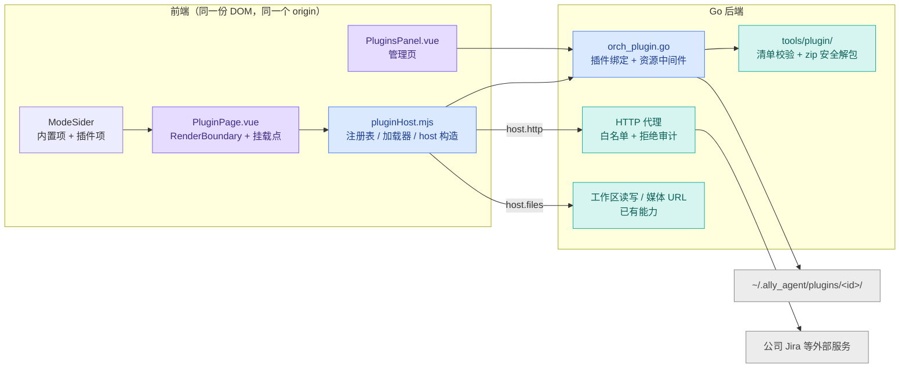

# Ally 插件系统详细设计（v1）

> 一句话：插件是一个 zip 包，装进来后在侧栏一级菜单多一个整页；页面用纯 JS/TS 写，只能通过宿主给的 `host` 对象触达后端能力，不写 Go。
>
> 已定稿的四个产品决策见 2.2；第 4、6、9 节是对「主题怎么同步 / 后端给哪些 API / 要不要做成内置 skill」三个问题的回答。
>
> 实现状态见第 13 节；**要动手写一个插件，直接从第 14 节开始**。

## 1. 目标与非目标

目标：

- 插件页 = 侧栏一级菜单项 + 右侧整块区域；页面内部的二级/三级导航由插件自己实现。
- 插件用纯 JS/TS；能像主页面一样调后端能力（HTTP、文件、存储、事件、UI 提示），但不提供写 Go 的方式。
- 专门的插件管理页：导入、导出、启停、删除。
- 插件包为 zip，可导入可导出。

非目标（v1 不做）：插件市场 / 在线分发、同 id 多版本并存、插件间通信、iframe 隔离、插件注入侧栏以外的 UI（工具卡、设置项等）。

## 2. 架构与数据流

### 2.1 总体



### 2.2 已定稿的产品决策

| 决策 | 结论 | 理由 |
|---|---|---|
| 同 id 重复导入 | 覆盖升级，保留数据目录；旧包留 `.old` 备份 | 升级顺畅、数据不丢、可回退 |
| 导出内容 | 默认只导包本体（逐字节一致）；「包含数据」单独开关，默认不打勾 | 数据里可能有 Jira 凭据，默认不外带 |
| 禁用插件 | 菜单消失 + 不可进入，与「隐藏页面」共用同一套拦阻判据 | 两套可见性判定必然分叉 |
| 权限确认 | 安装不弹确认框，按声明静默放行 | 少一步点击 |

「静默放行」= **声明内放行、声明外一律拒绝**（默认拒绝不变）。因为没有安装确认，管理页的权限摘要与被拒记录成为用户唯一的事后感知手段，属于硬需求。

## 3. 插件包规范

### 3.1 目录

```
jira-helper-1.0.0.zip
├── plugin.json     必需，清单
├── index.js        必需，入口（作者打成多文件也可以，入口负责 import 其它文件）
├── style.css       可选
└── assets/*        可选
```

### 3.2 清单

```json
{
  "id": "jira-helper",
  "name": "Jira Bug 管理",
  "version": "1.0.0",
  "author": "twh",
  "description": "公司 Jira 的 bug 查询与增删改",
  "entry": "index.js",
  "menu": [{ "key": "jira", "title": "Jira", "icon": "ApiOutlined" }],
  "permissions": { "http": ["jira.corp.com", "*.corp.com"], "workspace": "read" }
}
```

约束：

- **清单只认下面这 10 个键**：`id` / `name` / `version` / `author` / `description` / `entry` / `menu` / `permissions` / `keepAlive` / `group`。解析是严格模式（`DisallowUnknownFields`），**多写任何一个键都会直接报错、装不上**，错误会显示在管理页里。要加字段得先改后端结构体，别在包里偷偷加。
- `id`：`^[a-z0-9][a-z0-9._-]{1,48}$`，同时用作目录名、一级菜单 key（`plugin:<id>`）与数据目录名。
- `version`：`X.Y.Z`，仅用于展示与升级提示（不做多版本并存）。
- `entry`：包内相对路径，必须是文件；不允许绝对路径或 `..`。
- `menu`：**v1 必须恰好一项**（写两项、写空数组都校验不过）；`icon` 只能是下面图标白名单里的名字（插件只传字符串，组件由宿主渲染，插件不能往宿主组件树里塞东西）。名字不在名单里**不会报错**，只是静默回退成默认图标——写错了只能从图标看出来。
- `permissions.http`：主机白名单，`*.example.com` 匹配子域；匹配对象是实际连接的主机名（含重定向后的复判）。
- `permissions.workspace`：`none` | `read`，默认 `none`。**v1 写 `write` 会在校验阶段被直接拒掉**（`host.files` 还没有写能力，给个假权限不如不给）：声明了就装不上。
- `keepAlive`（可选，布尔）：插件页切走时**保留还是销毁**，默认 `true`（保留）。`true` = 页面留着被藏起来，插件自己的状态、滚动位置都在；`false` = 切走即卸载，下次进来重新 `mount`。两种情况下插件都会收到 `shown` / `hidden` 事件（见 §5.3）。
- `group`（可选，对象）：把该插件的页面挂到侧栏的某个**一级菜单**（子菜单）下，`{ "key": "nsfocus", "title": "公司", "icon": "GlobalOutlined" }`。`key` 是身份（同 key 即同组，见 §5.4），`title` 必填且不超过 24 字，`icon` 从同一份图标白名单里取（不命中同样只是静默回退）。不写就留在侧栏顶层。
- 版本要求字段（原设计的 `minAppVersion`）已删除：后端没有可比对的版本源，声明了也校验不了——宁可没有，也不给一个不会生效的承诺。

菜单图标白名单（唯一来源是 `frontend/src/components/ModeSider.vue` 的 `PLUGIN_ICON_WHITELIST`，未命中回退 `AppstoreOutlined`）：

| | | | |
|---|---|---|---|
| `ApiOutlined` | `AppstoreOutlined` | `BarChartOutlined` | `BugOutlined` |
| `CloudServerOutlined` | `ClusterOutlined` | `CodeOutlined` | `DatabaseOutlined` |
| `DeploymentUnitOutlined` | `FileTextOutlined` | `GlobalOutlined` | `ProjectOutlined` |
| `RobotOutlined` | `SettingOutlined` | `ThunderboltOutlined` | `ToolOutlined` |

### 3.3 校验与安装

- **解包直接复用**已有实现：`biz_update.go` 的 `extractZip` 已覆盖绝对路径、`..`、软链、越界、条目数上限、解压总字节上限。它**原地不动**，插件安装（`orch_plugin.go`）与自更新共用同一份，**不写第二份**（两份安全判定必然漂移）。`internal/tools/plugin/` 只做解包**前**的静态校验（`InspectPackage` / `InspectDir`）与重新打包，不碰文件系统写入。
- 插件包上限比自更新包更严：条目数、解压总字节、单文件大小各自独立常量。**上限真正生效的地方是落位前的 `plugin.VerifyContentSizes`**：zip 头里的 `UncompressedSize64` 是打包者写的数字，谎报一个小值就能让解包前那道静态校验失效，而 `extractZip` 用的是自更新那套宽松限额（单文件 1GB），所以必须按盘上真实字节再验一次（解包后验整个暂存目录、落位前再验一次内容目录）。包**本体**大小也单独卡（它会被原样留存供导出复制，低压缩率的大包能绕过解压体积校验）。
- 逐条校验：清单存在且可解析 → id 合法 → name/version/entry 合法 → `menu` 恰好一项且图标名形状合法 → 声明的权限字段合法（含 `workspace` 只允许 none/read）→ 入口文件在包里。
- 安装流程：解到暂存目录 → 校验 → 同 id 时旧目录改名搬进 `plugins/.old/<id>`（只留上一版）→ 原子搬进 `plugins/<id>/`。
- 目录布局（数据**不住在插件目录里**，否则「删插件保留数据」无法成立）：

```
~/.ally_agent/plugins/
├── jira-helper/              插件本体（= 包内容）
│   ├── package.zip           导入时的原始包（导出 = 原样复制，round-trip 逐字节一致）
│   ├── plugin.json
│   ├── index.js
│   └── style.css
├── .data/jira-helper.json    插件自己的数据（点开头，不会被当成插件扫描到）
└── .old/jira-helper/         上一版本体（覆盖升级时留的备份）
```

包里若带 `data.json`（导出时勾了「包含数据」），导入时会被搬到 `.data/<id>.json`，而不是留在插件目录里被当成资源提供服务；**留存的那份原始包也会同步重写成「无数据形态」**——否则默认导出会把上一次带进来的凭据再带出去。

## 4. 入口契约与加载方式（为什么不能像主页面那样 import 绑定）

### 4.1 入口

```js
// index.js

export function mount(el, host) {
  // 自己渲染进 el；可选返回卸载回调（取消订阅、移除自己插入的 <style>、清定时器）
  return () => { /* 清理 */ };
}
```

插件要加载自己的样式/图片，不需要额外 API：模块 URL 就是 `/plugins/<id>/<entry>`，所以
`new URL('./style.css', import.meta.url)` 直接可用（同源、相对导入都成立）。这也是选
「资源中间件 + 原生 import」而不是 Blob 方案的回报——Blob 里没有相对路径可言。

模块 URL 上还会带一个缓存戳，而且它落在**目录**位置：`/plugins/<id>/@<插件目录更新时间>/<entry>`（前端 `pluginAssetUrl`，后端按 `plugin.StripCacheStamp` 认，两边的形状是同一个契约）。

为什么不是查询串（`?v=…`）：模块表（module map）按 URL 常驻整个文档，重新导入只会让**入口**换一个 URL；插件内部 `import './util.js'` 解析出来的是不带戳的绝对 URL，于是子模块依旧命中上一次那份实例——改完重装还是旧行为。戳放进目录段后，子模块的相对解析会自动继承它（`/@<戳>/util.js`），整棵树才真的换新。

反过来：**不重新导入就永远看到的是旧代码**（戳没变、URL 没变）——这是本地调试时最常见的“我改了怎么没反应”。中间件按「先按原样找文件，找不到才把首段当戳剥掉」处理，所以插件里真叫 `@xxx/` 的目录不会被误剥。

### 4.2 为什么必须由宿主注入能力

生成的 bindings（`frontend/bindings/ally-dev/internal/app/app.ts`）在生产包里**不存在**：Vite 把它打进了主 chunk，`frontend/dist` 只有 `index.html` 和 `assets/`。所以插件运行期 `import('/bindings/...')` 必然 404。这不是缺陷，反而好：后端绑定怎么重构都不会碎插件。

### 4.3 三种加载方案对比（结论：选 B）

| 方案 | 做法 | 结论 |
|---|---|---|
| A. Blob URL | 后端读入口字节 → 前端 `import(URL.createObjectURL(blob))` | 不动 Go 接线，但不支持相对导入、css、图片（等于强制插件单文件）。作为降级备选 |
| **B. 资源中间件（推荐）** | `main.go` 的 `Assets.Middleware` 把 `/plugins/<id>/*` 交给 app 包实现的 handler（从插件目录读、路径校验、类型白名单） | 插件 URL 与页面**同源**（`http://wails.localhost`），原生 `import('/plugins/jira/index.js')`、相对导入、css/图片全部可用；dev 与 prod 同源同路径 |
| C. 复用回环媒体服务 | 现有 `GetWorkspaceMediaURL` 已有一个 127.0.0.1:随机端口 + token 的流式服务 | 跨源（`127.0.0.1:port` vs `wails.localhost`），ES module import 需要额外 CORS 头，还要扩类型白名单（现在只放行图片/视频/PDF）。比 B 麻烦，不用 |

选 B 的两个已验证前提：

1. `application.Middleware` 的底层类型就是 `func(http.Handler) http.Handler`（纯标准库签名）。因此实现可以放在 app 包里（`func PluginAssetMiddleware(a *App) func(http.Handler) http.Handler`），`main.go` 只加一行接线——**不破「app 包不 import wails」的分层铁律**。
2. 中间件在 dev 和 prod 都在请求链上：dev 时页面 URL 是 `http://wails.localhost:<vite端口>`（`GetStartURL` 换端口），请求先过中间件再被代理给 Vite，所以 `/plugins/*` 在开发态同样可用。

## 5. 宿主 API（`host`）

### 5.1 类型

```ts
interface Host {
  app:   { version: string; locale: string; workspace: string };
  http:  { request(req: {
             method?: string; url: string; headers?: Record<string,string>;
             query?: Record<string,string>; body?: string; json?: unknown;
             timeout?: number; maxBytes?: number }): Promise<HttpResult> };
  store: { get(): Promise<unknown>; set(value: unknown): Promise<void> };
  files: { read(p: string): Promise<string>;
           list(p: string, options?: { maxDepth?: number; limit?: number; includeHidden?: boolean; includeIgnored?: boolean }): Promise<{ path: string; name: string; dir: boolean }[]>;
           stat(p: string): Promise<WorkspaceFileInfo>;
           mediaUrl(p: string): Promise<string> };        // 图片/视频/PDF 预览，直接塞进 src
  open:  { inFileManager(p: string): Promise<void> };
  // v1 只发布宿主自己产生的三类事件：theme / shown / hidden。后端事件流（会话、
  // 运行状态）不开放：那些载荷属于用户主流程的数据。
  events:{ on(name: string, cb: (payload: unknown) => void): () => void };
  log:   { info(msg: string): void; error(msg: string): void };
  ui:    { notify(msg: string, type?: 'info'|'success'|'warning'|'error'): void;
           theme: { snapshot(): ThemeSnapshot;      // { name, mode, tokens }
                    tokens(): string[];             // 公开 token 的名字数组
                    on(cb: (t: ThemeSnapshot) => void): () => void } };
}

interface ThemeSnapshot { name: string; mode: 'dark' | 'light'; tokens: Record<string, string> }

// http.request 的返回，与后端 HTTPRequestToolResult 一一对应。
interface HttpResult {
  method: string; url: string; finalUrl: string;
  status: number; statusText: string; headers: Record<string, string>;
  contentType: string;
  body?: string; bodyBase64?: string; bodyEncoding: 'text' | 'base64';
  json?: unknown; jsonPreview?: string; jsonTruncated?: boolean;
  bytesRead: number;
  // 响应体超过 maxBytes 被截断时为 true。此时 json 一定为空（截断的 JSON 解析不出来），
  // 别把“没有 json”当成“对方返回了空”。
  truncated: boolean;
  durationMs: number; redirects?: string[]; savedPath?: string;
}
```

要点：

- `host` 由宿主**按该插件权限现构造**：没声明的能力直接不存在（拿不到引用）。但 **v1 只有 `files` / `open` 走这条规则**（两者都要求 `permissions.workspace` 声明到 `read`）；`host.http` 是无条件挂着的——没声明 `permissions.http` 时，是**调用时**返回 `E_PLUGIN_HOST_DENIED`。所以判断“这插件能不能联网”要看清单，不能拿 `if (host.http)` 做特性检测（会得到假阳性）。
- `host.http` 复用后端现成的实现（`http_request` 工具用的那一套：方法/头/体/重定向/TLS 跳过/体积上限/自动解压），只把 SSRF 闸门换成插件白名单。
- `host.files` 复用 `ReadWorkspaceFileAt` / `ListFiles` / `GetWorkspaceFileInfoAt` / `GetWorkspaceMediaURL`，但**路径在宿主层就被收窄成工作区内的相对路径**：空串、结对路径与任何一段 `..` 直接拒绝并记入被拒日志（后端这几个绑定对结对路径是**放行**的——它们服务的是编辑器那套语义，见 LESSONS 的 `resolve-read-no-fence`）。这不是安全边界（插件能绕开 `host` 直接调绑定，见第 8 节），但 `host` 给出去的能力必须与「工作区: 只读」这句摘要一致。
- `host.files` **v1 只读**：写工作区要走 edit 契约里的版本令牌（乐观并发），仓促开口一定会静默覆盖用户文件。所以清单里写 `permissions.workspace: "write"` 在校验阶段就被明确拒绝——宁可拒绝，也不给一个假权限。
- `host.store` 是插件唯一能落盘的地方：宿主没有单独的“密钥”能力，凭据也只能放这里。数据落在 `<appData>/plugins/.data/<id>.json`（权限 0600、上限 1 MiB、内容必须是合法 JSON），删插件时可以单独选择是否保留。`get()` 没数据时返回 `null`。给用户的说明里记得提一句：**默认导出不含数据，勾了“包含数据”就会连凭据一起打进包里。**
- `host.log.info` 与 `host.log.error` 现在走的是同一条前端错误日志通道（都算错误级别），插件里分不出级别——能用，但别指望它分级。

### 5.2 后端 API 清单

**插件专有绑定（10 个，v1）**

| 绑定 | 作用 |
|---|---|
| `ListPlugins()` | 已安装清单：id/名称/版本/作者/包大小/更新时间/启用态/权限摘要/清单错误，以及侧栏用的 `mode` |
| `SelectPluginPackage()` | 原生文件框选 zip，返回路径（取消返回空串） |
| `ImportPlugin(srcPath)` | 从 zip 安装（静态校验 + 安全解包 + 覆盖升级 + `.old` 备份 + 留存原始包） |
| `ImportPluginFromDir(dir)` | 从工作区目录安装，走**同一套**校验（给「AI 生成插件」闭环用） |
| `ExportPlugin(id, includeData)` | 导出：无数据时直接复制 `package.zip`（逐字节一致），否则重新打包 |
| `DeletePlugin(id, purgeData)` | 删插件本体；数据单独问一次 |
| `SetPluginEnabled(id, enabled)` | 写 `disabledPlugins`（目录必须存在，避免名单越积越脏） |
| `PluginHTTPRequest(req)` | HTTP 代理：目标主机必须命中该插件声明的白名单（含重定向后的目标） |
| `PluginStoreGet(id)` / `PluginStoreSet(id, value)` | 读写插件数据文件（要求合法 JSON，有体积上限） |

除这 10 个之外，`host` 还复用了 6 个宿主已有的绑定：`ReadWorkspaceFileAt` / `ListFiles` / `GetWorkspaceFileInfoAt` / `GetWorkspaceMediaURL`（对应 `host.files`）与 `OpenPathInFileManager`（对应 `host.open`）、`LogFrontendError`（对应 `host.log`）。**插件能碰到的后端桥面一共是 16 个**，上表这 10 个是为插件新增的。

**设计里写过、实现里故意没做的两个**

| 没做 | 理由 |
|---|---|
| `GetPluginEnv()` | 版本 / 语言 / 工作区这三个值前端本来就有（`buildVersion`、`locale`、`config.workspace`），再从后端取一份就是第二份真源，只会漂移 |
| `RecordPluginError()` | 挂载错误由前端持有（App.vue 按 id 记录、管理页展示），落盘走现成的 `LogFrontendError`，不需要为它加一个绑定 |

**明确不给（每条都有理由）**

| 不给 | 理由 |
|---|---|
| `GetConfig` / `SaveConfig` | `ConfigState` 含 `APIKeys`（模型密钥池）——给了等于把用户所有模型密钥交给插件 |
| `StartChat` / `InjectRunMessage` / `SwitchModel` / `SaveSession` / `DeleteSession` / `TruncateSessionHistory` | 会话与模型身份属于用户主流程，v1 不给（后面要「插件能问 AI」时再单独设计） |
| SSH 全套（`SaveSSHServer` / `TestSSHServer` / `ApproveServerConnection` / `AuthorizeServerForWorkspace` / `GetSSHServer`） | 服务器凭据与授权闸门，属于最高敏感面 |
| `ApplyUpdate` / `DownloadUpdate` / `QuitForUpdate`、`SetWindow` / `SetErrorLogger` / `SetApp` | 宿主生命周期与内部接线 |
| `SaveSkill` / `SaveMcpConfig` / `SaveApiSettings` / `SetAutostartEnabled` | 改全局配置 |
| 定时任务与服务（`ListScheduledTasks` / `StopService` …） | v1 不给，避免插件在用户背后起后台任务 |

白名单本身要收口在一处（一个 map + 一个查询函数），`host` 构造、管理页权限摘要、文档三处共用它，避免「文档说能调、实际拿不到」的分叉。

### 5.3 页面生命周期与状态保留

插件页默认是**常驻**的：切到别的页面只是把它藏起来（v-show），组件和插件渲染的 DOM 都不销毁，所以表单草稿、滚动位置、插件自己维持的连接都还在。这正是 `shown` / `hidden` 两个事件存在的原因——页面没有经历挂载/卸载，只能靠这两个事件知道“被藏起来了 / 又露出来了”。

是否常驻由清单里的 `keepAlive` 决定（归一后的默认值由后端算好，前端只读 `PluginInfo.keepAlive`）：

| 声明 | 效果 |
|---|---|
| 不写 / `"keepAlive": true`（默认） | 切走时留着（v-show），回来还是原样，`shown` / `hidden` 照常发 |
| `"keepAlive": false` | 切走即卸载（插件先收到 `hidden`、随后 `mount` 返回的清理函数被调用），下次进来重新 `mount` |

对照一下内置页面：只有**游戏面板**同样常驻（卸载会停掉服务、关掉房间），其余（设置 / 技能 / MCP / 模型 / SSH 集群 / 插件管理 / Token 统计）都是切走即卸载、回来重建；聊天工作台里每个 Tab 的输入框和资源树也是常驻的（为了保住光标、输入法与滚动状态）。

不管选哪种，这三种情况都会重来：重新导入（覆盖升级）会重挂；插件被禁用或删除会卸载；重启应用。另外，**没打开过的插件一个组件都不渲染**（懒加载）——这是“常驻”之外的另一种省内存办法。

作者该做的两件事：

1. 页面可能常驻，所以定时器 / 轮询 / 长连接必须在 `hidden` 里停掉（或者干脆声明 `keepAlive: false`，把生命周期交给宿主）；
2. 想要“每次进来都从头开始”（重新拉数据、清筛选条件），在 `shown` 里重置，不要指望重新挂载。

### 5.4 侧栏一级菜单（插件分组）

多个插件可以落在同一个一级菜单下，而**插件之间不需要知道对方存在**：各自在清单里声明同一个 `group.key` 即可，合并由前端做（`ModeSider.vue` 的 `modeOptions`）：

| 声明 | 侧栏表现 |
|---|---|
| 不写 `group` | 自己占一个顶层图标（v1 原本的行为） |
| 写了 `group.key = "nsfocus"` | 与所有同 key 的插件合到同一个一级菜单；鼠标悬停一级图标弹出二级列表 |

几条约定：

- `key` 是唯一身份，`title` / `icon` 只是展示。展示信息**以先出现的那份为准**（插件彼此独立，宿主不做汇总），所以同组插件应当把 `title` / `icon` 写成一样；写得不一致不会报错，只是菜单上看到的是先出现的那份。
- 组内没有任何插件启用时，这个一级菜单不会出现（分组是从“启用中的插件列表”现算的，不存状态）。
- 一级图标上有个主题色小点，表示“组内有页面正在显示”；点二级项才是真正切页面。
- 一级菜单的 key 是 `group:<key>`，与插件页的 `plugin:<id>` 不会混。

## 6. 主题样式同步

结论：**大部分不需要「同步」，只有一小部分需要 API**。分三层看：

### 6.1 第一层：CSS 变量自动继承（零成本）

插件页渲染在**同文档**的 DOM 里，而主题变量都定义在 `:root`（`style.css` 里有几十个不同的 `--ally-*` 变量、合计出现上千次），两轴都挂在 `<html>`：

- `data-theme`：`amber`（默认，不带属性）/ `icecream` / `ocean` / `forest` / `violet`
- `data-mode`：`dark`（默认，不带属性）/ `light`

插件只要用 `var(--ally-*)`，宿主切主题或切明暗时变量自动重算，**插件一行代码都不用写**。这就是「要不要搞」的答案：同步机制不用造，靠 CSS 层叠就够。

### 6.2 第二层：JS 需要色值时才要 API

图表（echarts）、canvas、内联 SVG 这类必须拿到具体色值。给 `host.ui.theme`：

- `host.ui.theme.snapshot()`：返回 `{ name, mode, tokens }`——`name` 是主题族（`amber` / `icecream` / `ocean` / `forest` / `violet`，默认 `amber`），`mode` 是明暗，`tokens` 是公开变量的色值表。**`name` / `mode` 只在这个快照里，`theme` 对象上没有这两个属性**（写 `host.ui.theme.name` 会得到 `undefined`）。
- `host.ui.theme.tokens()`：公开 token 的名字数组。
- `host.ui.theme.on(cb)`：变化回调，`cb` 收到的就是新快照。宿主实现 = `MutationObserver` 只观察 `<html>` 的 `data-theme` / `data-mode` 两个属性（属性观察，不是轮询），触发时再 `getComputedStyle` 读公开变量快照广播给订阅者。

### 6.3 第三层：公开 token 契约（关键，别让所有变量都成契约）

插件只能依赖**一份公开子集**，其余变量随便改不通知。契约**不新造命名**，直接把这批现有变量声明为公开变量；**唯一真源是 `frontend/src/utils/pluginTheme.mjs` 的 `PLUGIN_THEME_TOKENS`**，下面这张表与它必须逐项一致（改契约只改那一处）：

| 类别 | 公开变量 |
|---|---|
| 表面 | `--ally-surface-content` / `-panel` / `-chrome` / `-raised` / `-deep` |
| 文字 | `--ally-text-primary` / `-high` / `-body` / `-secondary` / `-soft` / `-tertiary` / `-muted` / `-faint` / `-ghost` |
| 语义 | `--ally-success`(`-text`) / `--ally-danger`(`-text`) / `--ally-warning`(`-text`) / `--ally-info` |
| 强调 | `--ally-accent` / `--ally-accent-ink` / `--ally-accent-bright` / `--ally-accent-strong` |
| 悬停与边框 | `--ally-hover-faint` / `--ally-hover-strong` / `--ally-border-input` |
| 字体字号 | `--ally-ui-font` / `--ally-mono-font` / `--ally-message-font-size` / `--ally-sub-font-size` / `--ally-aux-font-size` |
| 毛玻璃 | `--ally-composer-blur` / `--ally-panel-glass` |

契约里必须写清的四条禁令：

1. 别写死颜色（写死了切主题就不跟着变）。
2. 别用 `prefers-color-scheme`：宿主的明暗是显式设置，可能和系统不一致。
3. 要用 naive-ui 就自己带一份（插件 bundle 自带 vue 与 naive），它的组件主题得自己配；**直接用上面这些变量是最省事的路子**——宿主的 naive 主题状态不会跨 bundle 传过去。
4. 上面这张表就是**全部**契约，表外的 `--ally-*` 一律当内部实现，随时可能改名。需要用表外的变量时（例如做表格要的分隔线 `--ally-border` / `--ally-border-subtle`），只能写成 `var(--内部token, var(--公开token))` 这种**带兜底**的形态，改名时自动退回兜底色，不会变成一条看不见的线。

## 7. 插件管理页

独立一级菜单项（与技能/MCP 同级），整块区域，沿用现有 `settings-page-container` 的 `v-show` 容器（切走再切回不丢状态）。

| 区域 | 内容 |
|---|---|
| 顶部 | 「导入插件」（原生文件框选 zip）+ 拖拽落区 + 「从目录安装」（给 AI 生成流程用） |
| 列表行 | 图标、名称、`id@版本`、作者、包大小、安装时间、权限摘要（要访问的域名 / 工作区级别）、启停开关、导出、删除 |
| 展开 | 清单原文、入口文件、**挂载失败的具体错误**、被拒请求的最近记录与计数 |
| 交互 | 删除二次确认并单独问「是否连带删数据」；导出时勾选框「包含插件数据」（默认不勾） |

## 8. 启停、权限与安全边界

**启停**：与现有 `DisabledSkills` 同构——配置里加 `disabledPlugins`，清洗收口在 `persistableConfig`（每条落盘路径共用）+ `mergeConfig` 的 overlay 采纳（`nil` 保留 base，否则一次旧前端保存就把名单洗掉）。三个联动点：

1. 侧栏菜单项按启用态过滤（App.vue 派生 `pluginRailItems`，只含启用且清单合法的插件）；
2. 进入判定收敛到一处：`isModeEnterable(key)`——内置页看隐藏名单，插件页看它是否还装着且启用中。`switchMode` 与菜单渲染共用它，程序化跳转同样拦得住；
3. 插件页**不进** `hiddenModes`：那套名单只认内置页面键（后端 `sanitizeHiddenModes` 会把未知键丢掉），插件的显隐由它自己的启用开关表达，少一套重名机制就少一处分叉。**插件管理页（`plugins`）是内置页面，因此在名单里**——用户可以像隐藏统计页那样把它藏掉，与插件页自身无关。

**默认拒绝**：未声明主机、未声明的工作区写一律拒绝并返回明确错误码；拒绝要记审计（管理页可见）。重定向后的新主机同样要按白名单复判，且这个判定要与现有 SSRF 判定**同源**，不写第二份。

**信任边界（必须对用户讲清，别把摘要说成保证）**：

- 插件 JS 跑在主页面上下文（同 origin、同 localStorage、同后端桥），而 Wails 运行时把调用入口挂在全局上（`window._wails.invoke`）——也就是说**插件能绕开 `host` 直接调任意后端绑定**。
- 所以**真正硬的边界只有一条**：后端 HTTP 白名单（按插件身份判，默认拒绝，声明内放行、声明外拒绝，重定向目标同样复判），加上安装时那套清单/体积/路径校验（会复用同一份安全解包）。
- 管理页那句**权限摘要是「插件声明要什么」的留痕，不是「它被限制在什么范围」的保证**：`host` 上未声明的能力确实拿不到引用，但这守不住恶意插件。
- 结论：装第三方插件 = 信任它，等于把后端能力（含模型密钥、SSH 凭据）一并交给它。要真正划边界只能上二期：iframe + `sandbox="allow-scripts"` + postMessage 桥（`HtmlRenderCard.vue` 已有同款先例）。

**被拒记录**：`host.http` 捕到 `E_PLUGIN_HOST_DENIED` 时记一笔（次数 + 最后一条），管理页按插件展示。记在 host 层而不是插件里，所以插件自己 `catch` 掉也照样留痕。

**资源中间件的额外防线**：只服务 `/plugins/<已安装 id>/` 前缀、路径必须落在该插件目录内（`..`、绝对路径、软链一律拒）、类型白名单（js/css/json/图片/字体）、禁用中的插件不提供资源。

## 9. 插件开发做成内置技能

**结论：做，而且几乎零代码。** 机制现成：`internal/builtin_skills/skills/<name>/SKILL.md`，`embed.go` 明确写着「加一个目录即可，运行时 walk，无需其它改动」。现有三个：`anydoc` / `codegraph` / `playwright-cli`。

但有三件事必须想清楚：

1. **技能正文必须自包含**。SKILL.md 是注入给模型的契约，不能只写「详见 docs/plugin-system.md」——用户的工作区未必有这份文档。所以：`SKILL.md` 讲流程与约束，具体 API 类型放技能目录里的附件（`references/host-api.d.ts`），模型需要细节时用 `read` 读它（技能支持带参考文件）。
2. **契约只有一份真源，并且要防漂移**。`host-api.d.ts` 是唯一真源；建议加一条测试：把它的键集合与后端那个「可暴露 API 白名单」、前端 `host` 构造函数三者的键集合做一致性断言。否则改了实现忘了改文档，模型就会照过期契约写插件（这类静默漂移本项目已吃过亏）。
3. **`whenToUse` 要写准**：技能名片是常驻的，正文按需加载，写宽了每次对话都在提示，写窄了模型想不起来用。

**顺带的闭环（值得做）**：模型把插件源码生成到工作区（如 `<工作区>/plugins-src/jira-helper/`），再调用 `ImportPluginFromDir` 安装，走同一套校验，用户立刻能在侧栏看到。注意模型的沙箱可写根只有工作区 + 工具链缓存 + 临时目录，**不含 `~/.ally_agent`**——所以「生成到工作区再安装」不是绕路，而是唯一且更安全的路径。

## 10. 涉及文件清单

后端：

| 文件 | 动作 |
|---|---|
| `internal/tools/plugin/plugin.go` | 新增（纯算法）：清单解析与校验、主机白名单匹配、安装目录扫描、包内路径解析（词法 + 软链两道） |
| `internal/tools/plugin/package.go` | 新增（纯算法）：zip 静态校验、目录校验、重新打包、目录复制 |
| `internal/tools/plugin/testdata/demo-plugin/` | 新增：示例插件（同时是受测 fixture，见第 9 节末尾） |
| `internal/app/orch_plugin.go` | 新增（编排）：绑定、安装/导出/删除/启停/存储、HTTP 代理 |
| `internal/app/orch_plugin_assets.go` | 新增（编排）：`PluginAssetMiddleware` + 类型白名单 + 资源服务（只用标准库） |
| `internal/app/host_plugin_dialogs.go` | 新增（host 层）：选插件包、选导出目标两个原生对话框 |
| `internal/app/app.go` / `biz_config.go` | `ConfigState.DisabledPlugins` + `persistableConfig` 清洗 + `mergeConfig` overlay 采纳 |
| `internal/app/orch_http.go` | 新增 `validateHTTPTargetAccess`（白名单与 SSRF 判定的唯一入口）+ `HTTPRequestToolRequest.AllowedHosts`（`json:"-"`，JSON 入口无法设置） |
| `main.go` | `Assets` 加 `Middleware: backend.PluginAssetMiddleware(app)`（唯一允许碰 Wails 的地方） |
| `internal/app/biz_update.go` | **不动**：`extractZip` 原地复用（它已是唯一的安全解包实现，搬走反而多一次改动风险） |

前端：

| 文件 | 动作 |
|---|---|
| `frontend/src/utils/pluginHost.mjs` | 新增：注册表、加载器、`host` 构造、统一错误包装。**注意** `utils/*.mjs` 不许 import `i18n.mjs`（顶层会拉 naive-ui，node 测试直接崩），文案由调用方传 |
| `frontend/src/components/PluginsPanel.vue` | 新增：管理页 |
| `frontend/src/components/PluginPage.vue` | 新增：`RenderBoundary` + 挂载点 + 卸载清理 |
| `frontend/src/utils/pluginTheme.mjs` | 新增：`data-theme` / `data-mode` 属性观察 + 公开 token 快照 |
| `frontend/src/App.vue` | `mode` 支持 `plugin:<id>`；可见性判据收敛到一处供菜单与 `switchMode` 共用 |
| `frontend/src/components/ModeSider.vue` | 菜单项 = 内置 + 启用中的插件（icon 白名单） |
| `frontend/src/i18n.mjs` | `zh` 与 `enOverrides` 各加一份 |
| `internal/builtin_skills/skills/plugin-dev/` | **还没做**（第 9 节的设计、第 13 节「有意没做」）：`SKILL.md` + `references/host-api.d.ts`，等契约形状再稳一版；现在写插件只能看本文档与实现源码 |

## 11. 实施顺序（每步可独立验证）

1. **后端包处理与绑定**：`tools/plugin` + `orch_plugin.go` + `DisabledPlugins`。验证 `go test ./...`、`gofmt -l .`、`wails3 build`。
2. **资源中间件**：`main.go` 接线 + handler，用浏览器直接请求 `/plugins/...` 验证（含路径穿越与禁用插件的拒绝）。
3. **管理页**：导入 / 启停 / 删除 / 导出的完整闭环（此时还没有插件页）。
4. **加载与主题**：`pluginHost.mjs` + `PluginPage.vue` + 主题 API，挂一个只显示「hello + 当前主题名」的空白插件，dev 与 `wails3 build` 后的二进制各验一次。
5. **host 能力三件套**：`http`（含白名单与拒绝审计）、`store`、`events`；随后补 `plugin-dev` 技能与 Jira 示例插件。

## 12. 风险与未决项

- `permissions.http` 的匹配粒度（精确主机 vs 后缀通配；`*.corp.com` 同时覆盖裸域）与重定向复判已收口在 `validateHTTPTargetAccess` 一处：以后改规则只改它，不要在适配器里另写一份。
- 内置图标白名单是 `ModeSider.vue` 里挑出的 16 个 `@vicons/antd` 名字，未命中回退默认图标；换白名单只改那一处。
- 插件自带 vue 的体积（每个约 100KB）是否需要更省的共享运行时方案。
- 什么时候上 iframe 隔离；上了之后 `host` 必须改走 postMessage。现在这版按「直接对象调用」设计，但因为接口全是 Promise，改成异步桥代价可控——这一点现在就要守住，别在 `host` 上加同步方法。
- 「从目录安装」不限目录位置（用户自己用原生目录框挑）：真正的闸门是同一套清单/体积/路径校验，限制位置只会拦住用户自己的源码目录。与初版设计的这处差异是有意为之。
- **没有“打开外部链接”的能力**：`host.open` 只有 `inFileManager`，而“点开工单 / 文档 / 仓库链接”是插件最常见的需求。作者只能自己想办法，而 `<a target="_blank">` 在 WebView2 里的行为并没有验证过——**建议尽快补一个 `host.open.url(url)`**，否则等于把作者推向“自己绕过 host”的路子。
- **公开 token 清单里没有分隔线变量**：`--ally-border` / `--ally-border-subtle` 不在 `PLUGIN_THEME_TOKENS` 里，但表格类版式几乎必然要用（第 6.3 节的兜底写法能顶住，但这是绕路）。要么把它们收进契约，要么明确不给。
- **插件页容器与插件版式是耦合的**：宿主给 `.plugin-page-body` 留了内边距，而跨容器 `position: sticky` 吸顶会被这个内边距卡住（实测表头上沿永远差内边距那一截，滚动时留一条缝）。现在的正解是插件自己撑满并自管滚动——这条要么写进指引，要么把容器的内边距去掉。
- **示例插件曾经违反自己的 token 契约**：`testdata/demo-plugin/style.css` 用过清单外的 `--ally-code-font-size`（已修）。这类违规不会报错，只会在换主题时静默不跟随，所以需要一条测试或 lint 钉住。

## 13. 实现状态（本次落地）

已经能跑的部分：

- **后端**：包校验与安装、导出、删除、启停、插件存储、HTTP 白名单代理、`/plugins/*` 资源中间件；`ConfigState.DisabledPlugins` 及清洗/覆盖采纳。
- **前端**：加载器（`utils/pluginHost.mjs`）、主题层（`utils/pluginTheme.mjs`）、插件页容器（`components/PluginPage.vue`）、管理页（`components/PluginsPanel.vue`）、侧栏与可见性集成（`App.vue` / `ModeSider.vue`）、中英文案各一份。
- **绑定**已重新生成（新增 10 个插件方法）。
- **验证**：`gofmt -l .` 全绿；插件纯算法层、HTTP 目标判定、资源中间件、生命周期全流程四组测试全过；`npm run build` 与 `wails3 build` 均通过（产物 `bin/Ally.exe`）。

试用（示例插件）：

- 源码（同时是受测 fixture）：`internal/tools/plugin/testdata/demo-plugin/`
- 打包好的包：`.tmp/demo-toolkit-1.0.0.zip`（已用真实导入校验验过：id=demo-toolkit、entry=index.js）
- 步骤：启动 Ally → 侧栏「插件」→ 导入插件 → 选这个 zip → 侧栏出现「演示插件」→ 进去依次点四张卡片（主题跟随 / 存储 / HTTP 白名单含拒绝路径 / 工作区只读）。改完源码后重新打包，最省事的是管理页的「导出」，或按 `plugin.json` 所在目录重新 zip。

评审（两个子代理）后的修复：

- 阻塞 1：默认导出仍带上次导入的数据（凭据外泄）→ 留存的原始包在导入时重写成无数据形态，并补测试钉住。
- 阻塞 2：`permissions.workspace` 读了不用（读工作区无条件给）→ 按声明级别挂 `host.files`，未声明就没有这个键。
- 已打开的插件页被管理页刷新重挂（静默丢状态）→ `PluginPage` 的 watch 源改成字符串键，并加了挂载 run token。
- 启停被下一次设置保存静默回退 → `queueConfigSave` 保存前用当前插件列表强制覆盖 `disabledPlugins`（列表没加载成功则摘掉该键，不把「未知」当「空」）。
- 清单坏掉的插件删不掉/导不出 → 删除与导出只要求「目录名合法且在插件根下」。
- 插件管理页没进 ESC 链 → 补上（插件页本身仍不进，键盘归插件）。
- 自愈分支恒假、可见性判据分叉 → 条件改为看 mode 本身。
- 被拒请求无记录 → `host.http` 留痕 + 管理页展示。
- 顺手：导出目标与源同一文件时拒绝（防 O_TRUNC 把包截成 0）、覆盖升级失败回滚旧版本、只跳过**包根**的 `data.json`、外层目录不再要求合法 id（`Jira-Helper-1.0.0` 也能装）。

这一版**有意没做**的：

- `plugin-dev` 内置技能 + `host-api.d.ts`（第 9 节）——契约文档得等 API 形状稳一版再写，否则模型会照着过期契约写。

第二轮评审后的修复：

- **「从目录安装」选到外层文件夹时装出来多嵌套一层**（zip 路径一直按 `Prefix` 落位，目录路径漏了这一步）→ 两条路径同一套落位逻辑，并补回归测试。
- **目录名与清单 `id` 不一致时报成「可用且已启用」**，实际点进去打不开（存储/代理/资源全按目录名拼路径，只有 `Discover` 认清单 id）→ `Discover` 直接判为不可用并说清怎么改。
- **插件身份比较统一走 `IdentityKey`**（目录名 / 清单 id / 禁用名单）：以前大小写不一致会让禁用开关自己弹回来、删除说「未安装」。
- **缓存戳从查询串挪到 URL 目录段**：多文件插件的相对 import 继承不到查询串，重新导入后子模块仍然跑旧代码（§4.1）。
- **`host.files` 的路径在宿主层收窄**成工作区内相对路径（结对路径与 `..` 拒绝并记入被拒日志），与「工作区: 只读」的摘要对齐（§5.2）。
- 装上但不可用的插件不再弹绿色「已导入」，改为把 `loadError` 报出来。
- **插件本体落位之后的步骤失败不再报「导入失败」**：那时旧版本已被顶替，界面说失败而插件其实装好了，用户只会反复重试。存原始包副本失败 → 记日志 + 清掉半截 `package.zip`（留着会让导出复制出一个打不开的坏包），导出自动退化成重新打包；包里的 `data.json` 坏了 → 记日志 + 删掉它、保留现有数据，按「包里没带数据」处理。
- 插件管理页加进「页面显隐」名单（前后端同一组键，跨语言测试钉住）；插件页本身仍由启用开关表达（§8）。
- 进入判定加内置页面白名单：菜单外的 key（插件分组 `group:<key>` 之列）不再可能把界面停在空白页上。
- `host.files` 写工作区（需要 edit 契约的版本令牌，见 5.1）。
- ESC 不关闭插件页：插件自己拥有这块页面的键盘，全局捕获会把插件自己的 ESC 弹窗抢掉。
- iframe 隔离（第 12 节）。

第三轮评审后的修复（安全性与一致性）：

- **体积上限不再只信 zip 头声明的 `UncompressedSize64`**：那是打包者写的数字，谎报一个小值就能让解包前的静态校验全部失效，而真正落盘的 `extractZip` 用的是自更新那套宽松限额（单文件 1GB、且总量按声明值累计）。新增 `plugin.VerifyContentSizes` 按**盘上真实字节**复验——解包后验整个暂存目录、落位前再验一次内容目录（两条安装路径共用，顺带覆盖目录安装的 TOCTOU）。另外补上此前完全没卡的**包本体大小**（低压缩率的 store 包会被原样留存供导出复制）。
- **目录名 ↔ 清单 `id` 必须逐字符一致（含大小写）**：只按 `IdentityKey` 比会在大小写敏感的文件系统上留下「列表里可用、点进去存储/HTTP/资源全落空」的半截支持（下游拼路径一律用清单 id，资产中间件还会额外 `ToLower`）。安装流程写出的目录恒等于清单 id，所以大写目录名只可能来自手工拷贝 → 判为不可用并给出改法。
- **安装/删除/启停串行化**（`App.pluginMu`）：「挪旧版本到 `.old` → 新内容 rename 上位」不是原子操作，并发两次导入会互相 `RemoveAll` 掉对方刚挪过去的备份，随后 rename 失败滚进回滚分支。UI 的 busy 标志挡不住插件 JS 直接调绑定。
- **保存配置时禁用名单改用现取的真相**：刷新失败时内存快照停在上一版（`pluginsLoaded` 仍为 true），一次设置保存就会把刚做的启停静默回退。现在保存前现取一次列表，取不到就摘掉该键（后端保留 base）。
- **插件本体落位之后的步骤失败不再报「导入失败」**：那时旧版本已被顶替，界面说失败而插件其实装好了。存原始包副本失败 → 记日志 + 清掉半截 `package.zip`（留着会让导出复制出一个打不开的坏包）；包里的 `data.json` 坏了 → 先**验后删**（反过来会把判定依据一起丢掉）、记日志、保留现有数据。
- **缓存戳精度提到纳秒**：`UpdatedAt` 原本是 `RFC3339`（秒级），同一秒内连续两次覆盖升级会撞出同一个戳——入口 URL 不变、模块表命中旧实例，重装后跑的还是旧代码。
- **`host.open.inFileManager` 补上路径守门**：与 `host.files` 同一套 `guardPath`（后端 `OpenPathInFileManager` 对绝对路径放行，服务的是编辑器语义），否则「工作区: 只读」这句摘要对 `open` 不成立。

## 14. 写插件的标准姿势（作者视角）

前 13 节讲的是这套机制怎么搭起来的；这一节是给“要动手写一个插件”的人和模型看的：照它做，前面那些坑都不会踩。

### 14.1 最小骨架

```
my-plugin/
├── plugin.json    清单：只写那 8 个键（见 §3.2）
├── index.js       入口：export function mount(element, host)
└── style.css      可选
```

```js
export async function mount(element, host) {
  // 自己的资源用自己的模块地址取：同源 + 相对路径，不需要额外 API。
  const css = await fetch(new URL('./style.css', import.meta.url)).then((r) => r.text());
  const tag = document.createElement('style');
  tag.textContent = css;
  document.head.appendChild(tag);

  element.innerHTML = '<div id="app">…</div>';
  // 干正事：host.http / host.store / host.files（按清单声明的权限才有）

  return () => { tag.remove(); /* 取消订阅、清定时器 */ };
}
```

`mount` 的返回值就是卸载函数——**别漏**，它是页面切走 / 重新导入时唯一的清理时机。

### 14.2 本地怎么验证（别只会“导入 zip 试试”）

`file://` 直接 `import` 会被 CORS 挡死，必须走 HTTP：

1. 工作区根目录起一个静态服务：`python -m http.server 8765`。
2. 写一张预览台 `preview.html`：直接 `import { mount } from './index.js'`，传一个**假 host**：
   - `http.request` 返回写死的响应（`{ status, json, truncated: false, … }`）；
   - `store.get` 返回预置配置，`store.set` 打到 console；
   - `events.on` 返回空取消函数，`log` / `ui.notify` 打到 console；
   - 外面套一层和宿主一样的容器样式（`.plugin-page-body` 的内边距照抄 `PluginPage.vue`），否则版式对不上。
3. 打开 `http://127.0.0.1:8765/<插件目录>/preview.html`，改一行刷新就见效，不用每次重新导入。

好处：改样式时能直接用无头浏览器断言（行高是否统一、表头与数据行列是否对齐、窄窗口有没有横向溢出），比拿肉眼看可靠得多。

### 14.3 十条硬规矩（每条都标了违反后的现象）

| # | 规矩 | 违反了会怎样 |
|---|---|---|
| 1 | 清单只写那 10 个键 | 装不上，报错在管理页 |
| 2 | `menu` 恰好一项 | 装不上 |
| 3 | `icon` 取白名单里的名字 | **静默**换成默认图标，不报错 |
| 4 | `permissions.workspace` 只能 `none` / `read` | 写 `write` 装不上 |
| 5 | `permissions.http` 要列全所有目标主机（含跳转后的） | 调用时 `E_PLUGIN_HOST_DENIED` |
| 6 | 样式只用公开 token，用清单外的要带兜底 | 切主题 / 切明暗时静默不跟随 |
| 7 | 别跨宿主的滚动容器做 `sticky` | 吸顶时留一条缝（自己撑满 + 自己滚） |
| 8 | 凭据只能放 `host.store`，别写进代码或包 | 导出勾了“包含数据”会把凭据一起带出去 |
| 9 | `mount` 必须返回清理函数 | 切页 / 重装后订阅、定时器、样式表泄漏 |
| 10 | 改完必须**重新导入** | 一直跑旧代码（模块 URL 带缓存戳，见 §4.1） |

另外：插件页默认是**常驻**的（切走只隐藏、不销毁），所以定时器、轮询、长连接要在 `hidden` 里停掉；想让每次进来都重建，就声明 `"keepAlive": false`——细节见 §5.3。

想和别的插件共用一级菜单，就声明同样的 `group.key`，并把 `title` / `icon` 写成一致（先出现的那份生效，写不一致只会菜单显示不一致，不会报错）——详见 §5.4。

### 14.4 还没有的能力（动手前先确认，别续）

- **打开外部链接**：没有 `host.open.url`，`host.open` 只有 `inFileManager`（见第 12 节）。
- **写工作区**：`host.files` 只读（§5.1）。
- **弹确认框 / 弹窗**：没有，只有 `host.ui.notify`。
- **问模型 / 起会话**：明确不给（§5.2）。
- **多页面**：v1 一个插件只能有一个页面，页面内部的二级导航自己实现。
