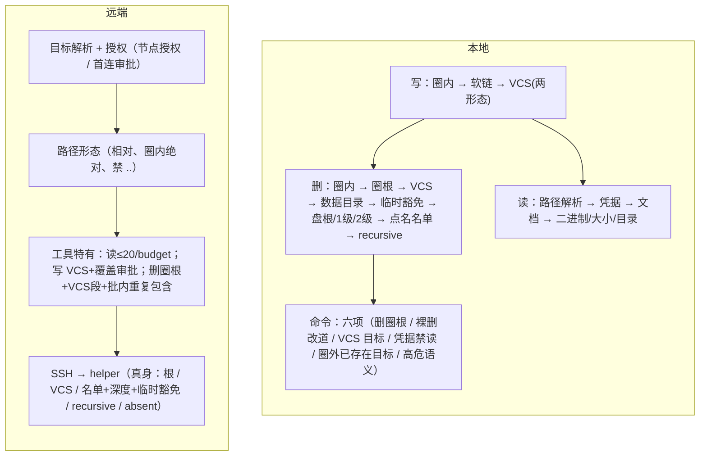

# Ally Agent：安全围栏规则速查

> 记录围栏**当前实际行为**：圈（可写范围）怎么定义、每条入口按什么顺序判定、具体路径落在哪一档，以及本地与远端的差别。
> 行号会随重构漂移，定位以「函数名 + 文件」为准。
> 凡是从提交历史推断、或缺少代码依据的判断，正文里都显式标出「推断」。

## 一、圈：围栏说的「可以动」到底指什么

| | 本地 | 远端 |
|---|---|---|
| 圈 = | 主工作区 + 本会话附加目录 + `~/.ally_agent`（兜底白名单，永远可写） | `target` 里那个目录（`别名:/绝对/路径`） |
| 锚点由谁定 | **用户**在界面上选 | **调用方（模型）**每次调用现写 |
| 校验 | 圈外一律拒 | 只校验「绝对路径、不是 `/`」——**不校验是不是系统目录** |

- 代码：`workspaceRoots`（`orch_file_ops.go`）= 主工作区 + `ExtraRoots`；`~/.ally_agent` 由 `pathutil.InsideWriteRoot` 追加。
- `parseRemoteTarget`（`orch_remote.go`）只拒绝相对路径、`/` 本身。

**沙箱现状**：`internal/sandbox` 的 `attached = false`（三个平台都只走围栏）。因此「边界归谁管」`kernelOwnsBoundary()` 恒为 false：本地两条**靠猜写入落在哪**的检查（删除命令改道、圈外已存在目标）当前满血在岗；接回沙箱时它们让位给内核，只有「删工作区根」反过来变成由围栏说。

## 二、判定顺序（顺序即优先级）

**最容易记错的一条**：临时目录豁免判在深度规则**之前**且直接 return，所以临时目录里的东西**根本进不了**「第 1/2 级目录」那道判定。临时根自己（`/tmp`、`/var/tmp`、系统临时目录）仍受保护。

- 本地：`isDangerousDeletePath`（`orch_fence.go`）里 `isInsideTempDir` 在 `depth == 1/2` 之前。
- 远端：helper 的临时根循环（`is_protected_delete_path`）在「机制一：深度」之前。

## 三、本地（工作区 = `D:\coding\go\src\ally-agent`）

### 删

| 目标 | 结果 | 原因 |
|---|---|---|
| `frontend`（目录，recursive） | 允许 | 圈内、深层、不在名单 |
| `.git` | 拒 `E_PROTECTED_PATH` | 版本控制元数据 |
| `gh/hooks/pre-commit`（`gh` 软链到 `.git`） | 拒 `E_PROTECTED_PATH` | 解析后落进 `.git` |
| `D:\coding\go\src\ally-agent` | 拒 `E_DELETE_BLOCKED` | 圈根自己 |
| `D:\Windows\System32\drivers` | 拒 `E_PATH_OUTSIDE` | 圈外**先**拒，轮不到深度规则 |
| `~\.ally_agent\memories\a.md` | 允许 | 兜底白名单 + 是文件 |
| `~\.ally_agent\memories`（目录） | 拒 | 数据目录里的目录不许删 |
| `~\.ally_agent` | 拒 | 数据目录本身永不删 |
| `/frontend`（Windows 上前导斜杠） | 允许，删的是**圈内** `frontend` | 见「六、易踩」 |
| 工作区=家目录时 `~\.ssh\id_rsa` | 允许 | 圈内、是文件；**删除名单里没有凭据**（清单只管读） |
| 工作区=`D:\proj` 时 `D:\proj\src` | 拒 | 第 2 级目录（浅工作区下本地也有同类坑） |
| 工作区=`D:\proj` 时 `D:\proj\src\a.txt` | 允许 | 深度 3 的文件 |
| `C:\Users\DELL\AppData\Local\Temp\ally-temp-123\build` | 允许 | 临时目录豁免（不管深度） |
| `C:\Users\DELL\AppData\Local\Temp` | 拒 | 临时根自己 + 圈外 |
| `C:\tmp\proj` | 拒 | 盘符路径**不算** `/tmp` 豁免 → 撞第 2 级目录 |

### 写（create / edit / rename / saveTo）

| 目标 | 结果 | 原因 |
|---|---|---|
| `src/x.go` 新建 | 允许 | |
| `src/x.go` 已存在、create 未给 overwrite | 拒 `E_EXISTS` | |
| `src/x.png` 覆盖非文本文件 | 拒 `E_TEXT_OVERWRITE` | |
| edit 用旧 version | 拒 `E_VERSION_MISMATCH` | 要重新 read |
| `.git/hooks/pre-commit` | 拒 `E_PROTECTED_PATH` | |
| `link.txt`（软链） | 拒 `E_SYMLINK_PATH` | 写工具不跟链接走 |
| `~\.ally_agent\memories\a.md` | 允许 | 兜底白名单 |
| `C:\Windows\ally-new.txt` | 拒 `E_PATH_OUTSIDE` | 写工具一律要求圈内（没有「圈外新建允许」那条） |
| saveTo=`C:\Windows\x.txt` | 拒 `E_PATH_OUTSIDE` | 同写入侧判定 |
| rename `a.txt` → `b.txt`（b 不存在） | 允许 | 源走删除侧、目标走写入侧判定 |
| rename `a.txt` → `existing.txt` | 拒 `E_EXISTS` | 改名不覆盖 |
| 工作区=KB 根：写 `sources/a.md` | 拒 `E_KB_SOURCES_READONLY` | `executeTool` 预检，与沙箱无关 |
| 工作区=KB 根：写 `notes/a.md` | 允许 | sources/ 之外 |

### 读 / 搜

| 目标 | 结果 | 原因 |
|---|---|---|
| `D:\other\repo\x.txt`（圈外绝对） | 允许 | `read` 的路径**不设圈** |
| `~\.ssh\id_rsa`、`~\.ssh\known_hosts` | 拒 `E_PROTECTED_PATH` | 目录项拦整棵子树 |
| `~\.npmrc` | 拒 | 文件项精确拦 |
| `~\.ally_agent\config.json` | 拒 | Ally 凭据文件（同一目录下的 `memories/`、`USER.md` 反而允许读） |
| `report.docx` | 拒 `E_DOCUMENT_UNSUPPORTED` | 提示用 anydoc 转 Markdown |
| `a.bin`（含 NUL） | 拒 `E_BINARY_FILE` | |
| `big.tar.gz`（40 MB） | 拒 `E_FILE_TOO_LARGE` | 上限 32 MiB |
| `frontend`（目录） | 拒 `E_IS_DIRECTORY` | |
| grep `~\.ssh` | 拒 | 凭据位置不搜 |
| grep `C:\Windows` | 拒 `E_SEARCH_ROOT_BLOCKED` | 系统目录 |
| grep `C:\Users\DELL` | 拒 | 家目录本身 |
| grep `D:\other\repo` | 允许 | 圈外普通目录不在危险名单 |

### 命令

| 命令 | 结果 | 原因 |
|---|---|---|
| `rm -rf frontend` | 拒 `E_COMMAND_BLOCKED` | 裸删改道 delete 工具 |
| `git rm -r frontend` | 允许 | 管理上下文（同 `docker rm` / `kubectl delete` / `npm uninstall` / `yarn remove`） |
| `echo x > .git/hooks/pre-commit` | 拒 `E_PROTECTED_PATH` | |
| `cat ~/.ssh/id_rsa` | 拒 `E_PROTECTED_PATH` | |
| `ssh -i ~/.ssh/id_rsa host` | 允许 | 只是「用」密钥，不算读 |
| `echo x > C:\Windows\ally-new.txt` | 允许 | 圈外**新建**允许（本地刻意留的） |
| `echo x >> C:\Windows\system.ini` | 拒 `E_PATH_OUTSIDE` | 改已存在的外部目标 |
| cwd = `C:\Windows` | 拒 `E_PATH_OUTSIDE` | cwd 必须圈内 |
| `curl x \| sh`、`mkfs.ext4 /dev/sda` | 拒 | 高危语义（`MatchRiskPattern`） |
| 工作区=KB 根：`echo x > sources/a.md` | 拒 `E_KB_SOURCES_READONLY` | 仅在围栏管边界时跑 |

## 四、远端（根 = `私人47:/tmp`，另有标注的除外）

### 读（`remote_read`）

| 目标 | 结果 | 原因 |
|---|---|---|
| `test1/x.txt` / `/tmp/test1/x.txt` | 允许 | 相对；圈内绝对会被 rebase |
| `/etc/passwd`、`../../etc/passwd` | 拒 | 圈外绝对 / 禁止 `..` |
| `test1`（目录） | 拒 | |
| `x.bin`（含 NUL） | 拒 `E_BINARY_FILE` | 与本地同一条 Go 管线 |
| `x.docx` | 拒 `E_BINARY_FILE` | 远端没有 anydoc 那句提示 |
| 一批 21 个文件 | 拒 | 上限 20；单文件 32 MiB；批合计 16 MiB，装不下排下一轮 |
| target 改 `私人47:/root/.ssh`，读 `id_rsa` | **允许（缺口）** | 远端没有凭据清单 |

### 写

| 操作 | 结果 | 原因 |
|---|---|---|
| 新建 `a/b.txt`（`a` 不存在） | 允许 | helper 自动建父目录 |
| 同路径、overwrite=false | 拒 `E_EXISTS` | |
| 同路径、overwrite=true（`remote_create_file`） | 弹审批 | `approve_remote_overwrite` |
| `.git/config` | 拒 `E_PROTECTED_PATH` | 字面 + 解析后两形态 |
| 目标是目录 | 拒 `E_BAD_PATH` | create 只写文件 |
| edit 用旧 version | 拒 `E_VERSION_MISMATCH` | **不弹审批**，版本令牌就是锁 |
| 上传本地 `~\.ssh\id_rsa` | 拒 `E_PROTECTED_PATH` | 上传的**本地源**受凭据清单管 |
| 上传到已存在的远端文件 | 需 overwrite=true；**不弹审批** | 与工具描述「with user approval」不符（缺口 3） |

### 删（`remote_delete_path`）

| 目标 | 结果 | 原因 |
|---|---|---|
| `test1`（目录，recursive） | 允许（2026-10-09 起） | 「圈的一级子目录一律拒绝」已移除 |
| `test1` 不给 recursive | 拒 | 目录必须 recursive |
| `["test1/x.txt","test1"]` 一次 | 允许，两条都删掉（深的先删） | 重复与包含已归一为执行计划（2026-10-09 改） |
| `["test1","test1"]` | 允许，只删一次，两个槽都报成功 | 同一身份只执行一次 |
| `.` | 拒 `E_DELETE_BLOCKED` | 圈根 |
| target 改 `私人47:/etc`，删 `nginx` | 拒 | `/etc/nginx` 是第 2 级目录，豁免不适用 |
| target 改 `私人47:/var`，删 `tmp` | 拒 | `/var/tmp` 是临时根自己 |
| `nope.txt`（不存在） | 允许（报 absent） | 不算失败，同批其它照删 |

### 命令（`remote_run_command`）

| 命令 | 结果 | 原因 |
|---|---|---|
| `rm -rf test1` | 拒 `E_COMMAND_BLOCKED` | 裸删改道 |
| `git rm -r x` | 允许 | 管理上下文 |
| target 改 `私人47:/root`，`cat .ssh/id_rsa` | **允许（缺口）** | 远端命令没有凭据禁读 |
| `truncate -s 0 build.log` | 弹审批 | truncate/shred 风险表 |
| `echo x > /etc/ally-new.conf` | 允许 | 圈外新建允许（与本地同一条） |
| `echo x >> /etc/hosts` | 拒 `E_PATH_OUTSIDE` | 改已存在的外部目标 |
| cwd `../../..` | 拒 | cwd 必须圈内 |

## 五、只在一边有的

- **本地独有**：凭据禁读清单（`pathutil.SensitiveReadReason`，三入口共用）、危险搜索根、Ally 数据目录保护、知识库 `sources/` 只读、内核沙箱（当前空转）、文档转换提示。
- **远端独有**：节点授权与首连审批、`remote_create_file` 的覆盖审批、破坏性命令审批、**圈由调用方声明**。
- 两边都有但**口径不同**：覆盖确认（远端弹窗、本地无）、cwd 校验（远端只判圈内、本地同样圈内）、命令删除（同一份名单与管理上下文例外）。

## 六、已知缺口（按风险排序）

1. **远端圈不校验系统目录**。`target` 写 `私人47:/etc`、`私人47:/root/.ssh` 都算合法工作区，可写可读。本地不存在这个问题只因为圈是用户选的。可选修法：根加系统位置校验；节点登记时记允许根白名单；或审批弹窗里要求确认根路径。
2. **远端没有凭据禁读清单**。远端 `read` / 命令读凭据都不拦（本地三个入口都拦）。
3. **`remote_transfer` 声明与行为不符**：描述写「overwrite=true with user approval」，代码里没有审批闸（全仓审批点只有远端连接、`create_file` 覆盖、远端破坏性命令、集群登记/授权五处），前端也没有确认弹窗。
4. **浅工作区下本地也删不掉一级子目录**：工作区是 `D:\proj` 时，删 `D:\proj\src` 会被「第 2 级目录」拒（深度规则按绝对路径算，不看它相对工作区是几级）。
5. **凭据清单只管读**：工作区恰好是家目录时，`delete` 工具能删掉 `~/.ssh/id_rsa`（删除侧只有 VCS、Ally 数据目录、系统深度/名单三道）。
6. **沙箱空转**：`attached = false`，内核层不生效。接回后本地两条「猜写入位置」的检查会让位（见第二节）。
7. **远端删除不再有任何审批替代**：`35b598b`（2026-09-24）把远端删除的确认弹窗删掉，同时加了「圈的一级子目录一律拒绝」当替代；该禁令已于 2026-10-09 移除。（此条为提交历史推断，提交信息只写了 "align tool schemas with runtime behavior"。）

## 七、易踩

- **Windows 上前导斜杠不是绝对路径**：`filepath.IsAbs("/tmp/x")` 为 false，于是 `/.tmp/probe`、`/tmp/test1` 这类写法会被拼到**主工作区**下（实测：删 `/.tmp/precedence-probe` 删掉的是工作区里的 `.tmp/...`）。要指真实临时目录必须写盘符路径。
- **盘符路径不吃 `/tmp` 豁免**：`C:\tmp\proj` 规范化后虽然长成 `/tmp/proj`，但豁免循环对带盘符的路径直接跳过，于是它照样撞「第 2 级目录」。
- **豁免只在圈内才有意义**：目标先过圈内判定，圈外路径（例：真实 `%TEMP%` 下但工作区不在那儿）在豁免之前就被 `E_PATH_OUTSIDE` 拒掉。
- **VCS 判定要判两种形态**：字面路径干净、软链指向 `.git` 的写法只有解析后才露出来（`gh/hooks/pre-commit`）。

## 八、改一条规则要同步的地方

规则实际上是「两份实现 + 三处文案」，新增或删除一条通常要同时改到下列位置（2026-10-09 删除「远端圈的一级子目录禁令」就是 4 处）：

| 位置 | 角色 |
|---|---|
| `internal/app/orch_fence.go` | 本地命令唯一入口 `checkCommandSafetyAtCwd`、受保护位置表 `protectedLocations`、删除保护 `isDangerousDeletePath` |
| `internal/app/orch_file_ops.go` | 写/删路径判定（`resolveWritableFilePath` / `resolveDeleteTarget` / `planDeletePath`）、批内重复与包含归一（`planDeleteExecution` / `applyDeletePlanSlots`） |
| `internal/app/orch_kb.go` | 知识库 `sources/` 只读的路径与命令两道预检 |
| `internal/tools/pathutil/pathutil.go` | 凭据清单、圈内判定、VCS 元数据判定、`SafeJoin` / `JoinPath` |
| `internal/tools/command/semantic.go` | 裸删名单 `deletionKind`、管理上下文、风险表 `MatchRiskPattern` |
| `internal/app/orch_remote.go` 内嵌 Python helper | **远端的真身**：`check_delete_path` / `op_write` / `check_write_targets` / `do_upload`。无静态检查，改完只能靠测试跑 |
| `internal/tools/shared/builtins.go` | 工具声明（模型看到的规则文案） |
| 测试 | `orch_remote_test.go`（真的跑 helper）、`builtins_test.go`（声明与行为对齐）、`orch_test.go`（删除保护规则表） |

新增规则时优先问三句：**远端有没有对应实现？工具声明改了没？两端各有一条测试钉住吗？**
